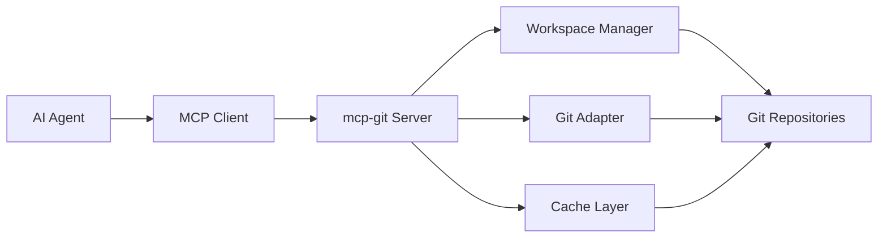

<div align="center">

<h1><a href="#" id="-mcp-git">🚀 mcp-git</a></h1>

<p>
  <!-- 版本 -->
  
  <!-- 许可证 -->
  
  <!-- Python 版本 -->
  
  <!-- 状态 -->
  <a href="#"></a>
</p>

<p align="center">
  <strong>Git operations MCP server for AI Agents</strong>
</p>

<p align="center">
  <a href="#-功能特性">功能特性</a> •
  <a href="#-快速开始">快速开始</a> •
  <a href="#-工具列表">工具列表</a> •
  <a href="#-配置说明">配置说明</a> •
  <a href="#-测试">测试</a> •
  <a href="#-贡献">贡献</a>
</p>

</div>

---

## 📋 目录

<details open>
<summary>点击展开</summary>

- [✨ 功能特性](#-功能特性)
- [🎯 应用场景](#-应用场景)
- [🚀 快速开始](#-快速开始)
  - [安装](#安装)
  - [配置](#配置)
  - [运行](#运行)
- [🛠️ 工具列表](#️-工具列表)
  - [工作空间管理](#工作空间管理)
  - [仓库操作](#仓库操作)
  - [提交操作](#提交操作)
  - [分支操作](#分支操作)
  - [历史记录](#历史记录)
  - [远程操作](#远程操作)
  - [标签操作](#标签操作)
  - [暂存操作](#暂存操作)
  - [Git LFS](#git-lfs)
- [📚 高级功能](#-高级功能)
- [⚙️ 配置说明](#️-配置说明)
- [🧪 测试](#-测试)
- [🔒 安全特性](#-安全特性)
- [📊 性能与监控](#-性能与监控)
- [🤝 贡献](#-贡献)
- [📄 许可证](#-许可证)
- [🙏 致谢](#-致谢)

</details>

---

## ✨ 功能特性

<table>
<tr>
<td width="50%">

### 🎯 核心功能

- ✅ **工作空间管理** - 安全隔离的 Git 操作工作空间
- ✅ **完整 Git 操作** - 支持所有常用 Git 命令
- ✅ **MCP 协议集成** - 符合 Model Context Protocol 规范
- ✅ **AI Agent 优化** -专为 AI Agents 设计的 Git 操作接口

</td>
<td width="50%">

### ⚡ 高级特性

- 🚀 **高性能异步** - 基于 anyio 的异步处理架构
- 🔐 **安全防护** - 路径验证、凭证管理、日志脱敏
- 📦 **速率限制** - 防止资源滥用
- 💾 **智能缓存** - 提升重复操作性能
- 📊 **完整监控** - 指标收集和追踪

</td>
</tr>
</table>

<div align="center">

### 🏗️ 系统架构

</div>



---

## 🎯 应用场景

<details>
<summary><b>🤖 AI Agent 代码仓库管理</b></summary>

<br>

AI Agent 可以通过 mcp-git 安全地操作代码仓库，实现：

- 自动代码审查和提交
- 分支管理和版本控制
- 合并请求自动化
- 代码历史分析

</details>

<details>
<summary><b>🔄 CI/CD 自动化</b></summary>

<br>

集成到自动化流程中：

- 自动构建和测试触发
- 发布版本管理
- 代码同步和部署

</details>

<details>
<summary><b>📊 代码分析工具</b></summary>

<br>

用于代码分析和审计：

- 代码历史追溯
- 贡献者分析
- 代码变更追踪
- 质量指标收集

</details>

---

## 🚀 快速开始

### 安装

从源码安装或使用 pip 安装即可。

### 配置

支持通过环境变量或配置文件进行服务器配置。

### Claude Desktop 配置

在 Claude Desktop 中配置 mcp-git 服务器，需在配置文件中添加以下内容：

```json
{
  "mcpServers": {
    "mcp-git": {
      "command": "uv",
      "args": [
        "--with",
        "git+https://github.com/Kirky-X/mcp-git.git",
        "run",
        "mcp-git"
      ]
    }
  }
}
```

### 运行

支持多种运行方式，包括默认启动、指定配置和开发模式。

---

## 🛠️ 工具列表

### 工作空间管理

| 工具名称 | 描述 |
|---------|------|
| `git_allocate_workspace` | 分配新的工作空间 |
| `git_get_workspace` | 获取工作空间信息 |
| `git_release_workspace` | 释放工作空间 |
| `git_list_workspaces` | 列出所有工作空间 |
| `git_disk_space` | 检查磁盘空间 |

### 仓库操作

| 工具名称 | 描述 |
|---------|------|
| `git_clone` | 克隆仓库（支持浅克隆和分支选择） |
| `git_init` | 初始化新仓库 |
| `git_status` | 查看工作目录状态 |

### 子模块操作

| 工具名称 | 描述 |
|---------|------|
| `git_submodule_add` | 添加子模块 |
| `git_submodule_update` | 更新子模块 |
| `git_submodule_deinit` | 移除子模块 |
| `git_submodule_list` | 列出所有子模块 |

### 提交操作

| 工具名称 | 描述 |
|---------|------|
| `git_stage` | 暂存文件（支持 glob 模式） |
| `git_commit` | 创建提交 |
| `git_push` | 推送到远程仓库 |
| `git_pull` | 拉取远程更改 |
| `git_fetch` | 获取远程更改 |

### 分支操作

| 工具名称 | 描述 |
|---------|------|
| `git_checkout` | 切换分支 |
| `git_list_branches` | 列出分支 |
| `git_create_branch` | 创建分支 |
| `git_delete_branch` | 删除分支 |
| `git_merge` | 合并分支 |
| `git_rebase` | 变基操作 |

### 历史记录

| 工具名称 | 描述 |
|---------|------|
| `git_log` | 查看提交历史 |
| `git_show` | 查看特定提交 |
| `git_diff` | 查看差异 |
| `git_blame` | 查看文件修改历史 |

### 暂存操作

| 工具名称 | 描述 |
|---------|------|
| `git_stash` | 暂存更改 |
| `git_list_stash` | 列出暂存列表 |

### 标签操作

| 工具名称 | 描述 |
|---------|------|
| `git_list_tags` | 列出标签 |
| `git_create_tag` | 创建标签 |
| `git_delete_tag` | 删除标签 |

### 远程操作

| 工具名称 | 描述 |
|---------|------|
| `git_list_remotes` | 列出远程仓库 |
| `git_add_remote` | 添加远程仓库 |
| `git_remove_remote` | 移除远程仓库 |

### 稀疏检出

| 工具名称 | 描述 |
|---------|------|
| `git_sparse_checkout` | 稀疏检出操作 |

### Git LFS

| 工具名称 | 描述 |
|---------|------|
| `git_lfs_init` | 初始化 Git LFS |
| `git_lfs_track` | 跟踪大文件 |
| `git_lfs_untrack` | 取消跟踪大文件 |
| `git_lfs_status` | 查看 LFS 状态 |
| `git_lfs_pull` | 拉取 LFS 文件 |
| `git_lfs_push` | 推送 LFS 文件 |
| `git_lfs_fetch` | 获取 LFS 文件 |
| `git_lfs_install` | 安装 LFS 钩子 |

### 任务管理

| 工具名称 | 描述 |
|---------|------|
| `git_get_task` | 获取任务信息 |
| `git_list_tasks` | 列出任务 |
| `git_cancel_task` | 取消任务 |

---

## 📚 高级功能

<div align="center">

### 🔧 高级特性概览

</div>

<table>
<tr>
<td align="center" width="25%">
<br>
<b>安全防护</b><br>
路径验证、凭证脱敏、访问控制
</td>
<td align="center" width="25%">
<br>
<b>性能优化</b><br>
异步处理、连接管理、查询优化
</td>
<td align="center" width="25%">
<br>
<b>监控追踪</b><br>
指标收集、日志追踪、审计日志
</td>
<td align="center" width="25%">
<br>
<b>错误处理</b><br>
错误分类、建议生成、日志脱敏
</td>
</tr>
</table>

### 错误处理

mcp-git 提供智能错误处理和分类，支持仓库未找到、认证失败、合并冲突等异常情况。

### 日志系统

使用 loguru 实现高性能日志，支持结构化日志记录。

### 指标监控

mcp-git 内置指标收集系统，支持操作统计、缓存命中率和错误率监控。

---

## ⚙️ 配置说明

### 配置文件示例

提供完整的 YAML 配置示例，涵盖服务器、Git、缓存、安全等各项设置。

### 环境变量

| 变量名 | 描述 | 默认值 |
|--------|------|--------|
| `MCP_GIT_HOST` | 服务器绑定地址 | `127.0.0.1` |
| `MCP_GIT_PORT` | 服务器端口 | `8080` |
| `LOG_LEVEL` | 日志级别 | `INFO` |
| `GIT_TOKEN` | Git 访问令牌 | - |
| `GIT_SSH_KEY` | SSH 私钥路径 | - |
| `RATE_LIMIT_REQUESTS` | 速率限制最大请求数 | `100` |
| `RATE_LIMIT_WINDOW` | 速率限制时间窗口（秒） | `60` |
| `CACHE_MAX_SIZE` | 缓存最大条目数 | `1000` |
| `CACHE_TTL` | 缓存过期时间（秒） | `3600` |
| `MAX_WORKSPACE_SIZE` | 工作空间最大大小（字节） | `10737418240` |

---

## 🧪 测试

提供完整的测试套件，包括单元测试、集成测试、性能测试和安全测试。

<details>
<summary><b>📊 测试统计</b></summary>

<br>

| 测试类型 | 覆盖模块 | 状态 |
|---------|---------|------|
| 单元测试 | 核心功能、工具处理 | ✅ 完整 |
| 集成测试 | Git 操作完整流程 | ✅ 完整 |
| 性能测试 | 异步处理、缓存效率 | ✅ 完整 |
| 安全测试 | 路径验证、凭证安全 | ✅ 完整 |
| 并发测试 | 多任务处理 | ✅ 完整 |
| 容错测试 | 错误恢复、重试机制 | ✅ 完整 |

</details>

---

## 🔒 安全特性

<div align="center">

### 🛡️ 安全防护体系

</div>

<table>
<tr>
<td align="center" width="20%">
<br>
<b>路径安全</b><br>
路径遍历防护、访问控制
</td>
<td align="center" width="20%">
<br>
<b>凭证管理</b><br>
安全存储、自动脱敏
</td>
<td align="center" width="20%">
<br>
<b>日志脱敏</b><br>
敏感信息自动清除
</td>
<td align="center" width="20%">
<br>
<b>输入验证</b><br>
参数校验、类型检查
</td>
<td align="center" width="20%">
<br>
<b>审计日志</b><br>
完整操作记录
</td>
</tr>
</table>

### 安全措施

- ✅ **路径遍历防护** - 防止非法路径访问
- ✅ **凭证自动脱敏** - 敏感信息不记录日志
- ✅ **Git Token 安全** - 环境变量和配置文件加密
- ✅ **工作空间隔离** - 每个工作空间独立存储
- ✅ **磁盘空间限制** - 防止磁盘耗尽攻击
- ✅ **速率限制** - 防止拒绝服务攻击

### 报告安全漏洞

请通过以下方式报告安全漏洞：
- GitHub Issues: [Security Advisory](https://github.com/Kirky-X/mcp-git/security/advisories)
- 邮箱: security@example.com

---

## 📊 性能与监控

### 指标收集

mcp-git 内置完整的指标收集系统，支持操作统计、缓存命中率和错误率监控。

### 日志系统

使用 loguru 实现高性能日志，支持结构化日志记录和自动脱敏。

### 追踪集成

支持 OpenTelemetry 分布式追踪，实现完整的请求链路监控。

---

## 🤝 贡献

<div align="center">

### 💖 欢迎贡献！

</div>

<table>
<tr>
<td width="33%" align="center">

### 🐛 报告 Bug

发现问题？<br>
[创建 Issue](../../issues/new?template=bug_report.md)

</td>
<td width="33%" align="center">

### 💡 功能建议

有想法？<br>
[提交 Feature Request](../../issues/new?template=feature_request.md)

</td>
<td width="33%" align="center">

### 🔧 贡献代码

想贡献代码？<br>
[提交 Pull Request](../../pulls)

</td>
</tr>
</table>

<details>
<summary><b>📝 贡献指南</b></summary>

<br>

### 开发环境设置

1. **Fork** 本仓库
2. **克隆** 你的 Fork 仓库
3. **创建** 开发分支
4. **安装** 开发依赖
5. **运行** 测试
6. **提交** 你的更改
7. **推送** 到分支
8. **创建** Pull Request

### 代码规范

遵循 PEP 8 代码规范，使用 type hints，编写完整的 docstring，保持测试覆盖率。

</details>

---

## 📄 许可证

<div align="center">

本项目采用 MIT 许可证。

[](LICENSE)

你可以自由使用、修改和分发本项目，但需要保留版权声明。

</div>

---

## 🙏 致谢

<div align="center">

### 依赖项目

</div>

<table>
<tr>
<td align="center" width="25%">
<a href="https://github.com/anthropics/mcp">
<br>
<b>MCP Protocol</b>
</a>
</td>
<td align="center" width="25%">
<a href="https://gitpython.readthedocs.io">
<br>
<b>GitPython</b>
</a>
</td>
<td align="center" width="25%">
<a href="https://sqlalchemy.org">
<br>
<b>SQLAlchemy</b>
</a>
</td>
<td align="center" width="25%">
<a href="https://pydantic.dev">
<br>
<b>Pydantic</b>
</a>
</td>
</tr>
</table>

### 特别感谢

- 🌟 **GitPython 团队** - 提供优秀的 Python Git 库
- 📦 **MCP 社区** - Model Context Protocol 规范
- 🐍 **Python 社区** - 优秀的开发工具生态
- 💻 **开源贡献者** - 所有的贡献者和用户

---

## 📞 联系方式

<div align="center">

<table>
<tr>
<td align="center" width="33%">
<a href="../../issues">
<br>
<b>Issues</b>
</a><br>
报告问题
</td>
<td align="center" width="33%">
<a href="../../discussions">
<br>
<b>Discussions</b>
</a><br>
讨论交流
</td>
<td align="center" width="33%">
<a href="https://github.com/Kirky-X/mcp-git">
<br>
<b>GitHub</b>
</a><br>
项目主页
</td>
</tr>
</table>

### 关注更新

[](https://github.com/Kirky-X/mcp-git)
[](https://github.com/Kirky-X/mcp-git)

</div>

---

<div align="center">

### ⭐ 如果这个项目对你有帮助，请给它一个星标！

**Built with ❤️ by Kirky.X**

[⬆ 返回顶部](#-mcp-git)

---

<sub>© 2024 mcp-git. All rights reserved.</sub>

</div>
