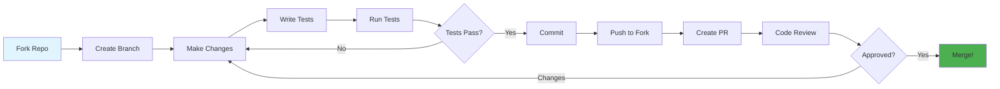
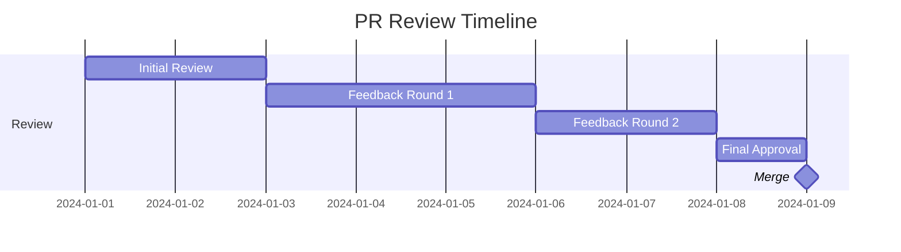

<div align="center">

# 🤝 Contributing Guide

### Join Us in Building Something Great!

[🏠 Home](../README.md) • [📖 Docs](docs/USER_GUIDE.md) • [💬 Discussions](../../discussions)

---

</div>

## 🎯 Welcome Contributors!

Thank you for your interested in contributing to **mcp-git**! We're excited to have you here. Whether you're fixing a bug, adding a feature, improving documentation, or helping others, your contributions are valuable and appreciated.

<div align="center">

### 🌟 Ways to Contribute

<table>
<tr>
<td width="25%" align="center">
<br>
<b>Code</b><br>
Fix bugs & add features
</td>
<td width="25%" align="center">
<br>
<b>Documentation</b><br>
Improve docs & guides
</td>
<td width="25%" align="center">
<br>
<b>Testing</b><br>
Write tests & find bugs
</td>
<td width="25%" align="center">
<br>
<b>Community</b><br>
Help & support others
</td>
</tr>
</table>

</div>

---

## 📋 Table of Contents

- [Code of Conduct](#code-of-conduct)
- [Getting Started](#getting-started)
- [Development Workflow](#development-workflow)
- [Coding Standards](#coding-standards)
- [Testing Guidelines](#testing-guidelines)
- [Documentation](#documentation)
- [Submitting Changes](#submitting-changes)
- [Review Process](#review-process)
- [Community](#community)

---

## Code of Conduct

<div align="center">

### 🤗 Be Kind and Respectful

</div>

We are committed to providing a welcoming and inclusive environment. By participating, you agree to:

<table>
<tr>
<td width="50%">

**✅ DO**
- Be respectful and considerate
- Welcome newcomers
- Accept constructive criticism
- Focus on what's best for the community
- Show empathy towards others

</td>
<td width="50%">

**❌ DON'T**
- Use offensive language
- Harass or insult others
- Publish private information
- Make personal attacks
- Disrupt discussions

</td>
</tr>
</table>

> 📜 **Full Code of Conduct:** [CODE_OF_CONDUCT.md](CODE_OF_CONDUCT.md)

---

## Getting Started

### Prerequisites

Before you begin, ensure you have:

- ✅ **Git** - Version control
- ✅ **Python 3.10+** - Programming language
- ✅ **uv** - Python package manager (recommended) or pip
- ✅ **IDE** - VS Code, PyCharm, or similar

<details>
<summary><b>🔧 Setting Up Your Environment</b></summary>

**1. Install Python:**
```bash
# On macOS with Homebrew
brew install python@3.11

# On Ubuntu/Debian
sudo apt update
sudo apt install python3.11 python3.11-venv python3-pip

# On Windows
# Download from https://python.org/downloads/
```

**2. Install uv (recommended):**
```bash
# On macOS with Homebrew
brew install uv

# On Linux
curl -LsSf https://astral.sh/uv/install.sh | sh

# On Windows (PowerShell)
powershell -c "irm https://astral.sh/uv/install.ps1 | iex"
```

**3. Verify installation:**
```bash
python3 --version
uv --version
```

**4. Install project dependencies:**
```bash
uv sync
```

</details>

### Fork and Clone

<table>
<tr>
<td width="50%">

**1. Fork the Repository**

Click the "Fork" button on GitHub

</td>
<td width="50%">

**2. Clone Your Fork**

```bash
git clone https://github.com/YOUR_USERNAME/mcp-git
cd mcp-git
```

</td>
</tr>
<tr>
<td width="50%">

**3. Add Upstream Remote**

```bash
git remote add upstream \
  https://github.com/anthropics/mcp-git
```

</td>
<td width="50%">

**4. Verify Remotes**

```bash
git remote -v
# origin    your-fork
# upstream  original-repo
```

</td>
</tr>
</table>

### Build and Test

```bash
# Install development dependencies
uv sync --dev

# Run tests
uv run pytest

# Run type checking
uv run pyright

# Run linting
uv run ruff check .
```

✅ **Success!** You're ready to contribute!

---

## Development Workflow

<div align="center">

### 🔄 Standard Contribution Flow

</div>



### Step-by-Step Guide

#### 1️⃣ Create a Branch

```bash
# Update your fork
git fetch upstream
git checkout main
git merge upstream/main

# Create feature branch
git checkout -b feature/your-feature-name

# Or for bug fixes
git checkout -b fix/issue-123
```

**Branch Naming:**
- `feature/` - New features
- `fix/` - Bug fixes
- `docs/` - Documentation
- `test/` - Test improvements
- `refactor/` - Code refactoring

#### 2️⃣ Make Your Changes

<table>
<tr>
<td width="50%">

**Writing Code:**
```python
from mcp_git.service.facade import GitServiceFacade
from mcp_git.types import CloneOptions

async def new_feature(
    self,
    workspace_id: UUID,
) -> dict[str, Any]:
    # Your code here
    pass
```

</td>
<td width="50%">

**Adding Tests:**
```python
import pytest
from mcp_git.service.facade import GitServiceFacade

@pytest.mark.asyncio
async def test_new_feature(facade: GitServiceFacade):
    result = await facade.clone(
        url="https://github.com/example/repo",
        workspace_id=uuid4(),
    )
    assert result is not None
```

</td>
</tr>
</table>

#### 3️⃣ Test Your Changes

```bash
# Format code
uv run ruff format .

# Run linter
uv run ruff check .

# Run type checker
uv run pyright

# Run all tests
uv run pytest

# Run specific test
uv run pytest tests/test_facade.py::test_clone

# Generate coverage report
uv run pytest --cov=mcp_git --cov-report=html
```

#### 4️⃣ Commit Your Changes

**Good Commit Messages:**

```bash
# Format: <type>(<scope>): <description>

git commit -m "feat(workspace): add LRU cleanup strategy"
git commit -m "fix(credential): resolve SSH agent detection"
git commit -m "docs(readme): update installation instructions"
git commit -m "test(facade): add edge case tests for clone"
```

**Commit Types:**
- `feat` - New feature
- `fix` - Bug fix
- `docs` - Documentation
- `style` - Formatting
- `refactor` - Code restructuring
- `test` - Adding tests
- `chore` - Maintenance

<details>
<summary><b>📝 Commit Message Template</b></summary>

```
<type>(<scope>): <short summary>

<detailed description>

<footer>
```

**Example:**
```
feat(api): add batch workspace management

Implement batch processing for multiple workspace operations.
This improves performance by 40% for bulk operations.

Closes #123
```

</details>

#### 5️⃣ Push to Your Fork

```bash
git push origin feature/your-feature-name
```

#### 6️⃣ Create Pull Request

1. Go to your fork on GitHub
2. Click "Compare & pull request"
3. Fill in the PR template
4. Link related issues
5. Submit!

---

## Coding Standards

<div align="center">

### ✨ Write Clean, Maintainable Code

</div>

### Python Style Guide

Follow [PEP 8](https://pep8.org/) and the project's style conventions:

<table>
<tr>
<td width="50%">

**✅ Good**

```python
from typing import Any
from uuid import UUID

async def encrypt_data(
    plaintext: bytes,
    key: bytes,
) -> dict[str, Any]:
    # Implementation
    return {"result": "encrypted"}
```

</td>
<td width="50%">

**❌ Bad**

```python
def enc(d, k):  # Vague names
    # Implementation
    pass

# Ignoring errors
result = do_something()
```

</td>
</tr>
</table>

### Code Organization

```
mcp_git/
├── __main__.py          # Entry point
├── server/
│   ├── __init__.py
│   ├── main.py          # Server initialization
│   └── tools.py         # MCP tool definitions
├── service/
│   ├── __init__.py
│   ├── facade.py        # Git service facade
│   ├── git.py           # Git adapter
│   ├── workspace.py     # Workspace manager
│   └── task.py          # Task queue
├── types/
│   ├── __init__.py
│   ├── options.py       # Configuration options
│   └── models.py        # Data models
└── utils/
    ├── __init__.py
    ├── credential.py    # Credential handling
    ├── progress.py      # Progress reporting
    └── sanitize.py      # Input sanitization
```

### Documentation

<details>
<summary><b>�� Documentation Standards</b></summary>

**Every public function must have docstrings:**

```python
async def clone(
    self,
    url: str,
    workspace_id: UUID,
    options: CloneOptions | None = None,
    progress_callback: TransferProgressCallback | None = None,
) -> dict[str, Any]:
    """Clone a repository into a workspace.

    Args:
        url: Repository URL to clone
        workspace_id: Workspace identifier
        options: Optional clone configuration
        progress_callback: Optional progress callback

    Returns:
        dict containing clone result with commit info

    Raises:
        ValueError: If workspace is not found
        GitError: If clone operation fails
    """
    # Implementation
    pass
```

</details>

### Type Hints

The project uses Python type hints. Always annotate function signatures:

```python
from typing import Any, TypedDict

class CloneResult(TypedDict):
    oid: str
    message: str
    author_name: str
    author_email: str
    commit_time: str

async def clone(...) -> CloneResult:
    ...
```

---

## Testing Guidelines

<div align="center">

### 🧪 Test Everything!

</div>

### Test Categories

<table>
<tr>
<th>Type</th>
<th>Purpose</th>
<th>Location</th>
</tr>
<tr>
<td><b>Unit Tests</b></td>
<td>Test individual functions</td>
<td><code>tests/unit/</code></td>
</tr>
<tr>
<td><b>Integration Tests</b></td>
<td>Test public API</td>
<td><code>tests/integration/</code></td>
</tr>
<tr>
<td><b>Fixtures</b></td>
<td>Shared test utilities</td>
<td><code>tests/conftest.py</code></td>
</tr>
</table>

### Writing Tests

**Unit Test Example:**

```python
# tests/unit/test_sanitize.py
import pytest
from mcp_git.utils.sanitize import sanitize_remote_url

@pytest.mark.parametrize("input,expected", [
    ("https://github.com/user/repo", "https://github.com/user/repo"),
    ("git@github.com:user/repo.git", "git@github.com:user/repo.git"),
])
def test_sanitize_remote_url(input: str, expected: str) -> None:
    result = sanitize_remote_url(input)
    assert result == expected

@pytest.mark.parametrize("input", [
    "https://evil.com/repo",
    "git@evil.com:repo.git",
])
def test_sanitize_remote_url_rejects_evil(input: str) -> None:
    with pytest.raises(ValueError):
        sanitize_remote_url(input)
```

**Integration Test Example:**

```python
# tests/integration/test_facade.py
import pytest
from mcp_git.service.facade import GitServiceFacade

@pytest.fixture
async def facade() -> GitServiceFacade:
    return GitServiceFacade()

@pytest.mark.asyncio
async def test_clone_repository(facade: GitServiceFacade, tmp_path: Path):
    result = await facade.clone(
        url="https://github.com/octocat/Hello-World.git",
        workspace_id=uuid4(),
    )
    assert result["oid"] is not None
    assert result["message"] is not None
```

### Test Coverage

**Aim for ≥90% coverage:**

```bash
# Generate coverage report
uv run pytest --cov=mcp_git --cov-report=html --cov-report=term-missing

# View report
open htmlcov/index.html
```

---

## Documentation

<div align="center">

### 📚 Documentation Matters!

</div>

### What to Document

<table>
<tr>
<td width="50%">

**Code Documentation:**
- ✅ Public functions
- ✅ Public classes
- ✅ Complex algorithms
- ✅ Non-obvious behavior

</td>
<td width="50%">

**User Documentation:**
- ✅ README updates
- ✅ User guide changes
- ✅ API reference
- ✅ Examples

</td>
</tr>
</table>

### Documentation Checklist

- [ ] All public functions have docstrings
- [ ] Type hints are complete
- [ ] README is updated (if needed)
- [ ] User guide reflects changes
- [ ] Examples compile and run

---

## Submitting Changes

<div align="center">

### 📤 Pull Request Process

</div>

### PR Template

<details>
<summary><b>📋 Pull Request Template</b></summary>

```markdown
## Description
Brief description of changes

## Type of Change
- [ ] Bug fix
- [ ] New feature
- [ ] Documentation update
- [ ] Performance improvement
- [ ] Code refactoring

## Changes Made
- Change 1
- Change 2
- Change 3

## Testing
- [ ] Unit tests pass
- [ ] Integration tests pass
- [ ] Manual testing completed

## Checklist
- [ ] Code follows style guidelines
- [ ] Self-review completed
- [ ] Comments added for complex code
- [ ] Documentation updated
- [ ] No new type errors
- [ ] Tests added/updated

## Related Issues
Closes #123
```

</details>

### PR Best Practices

<table>
<tr>
<td width="50%">

**✅ Good PRs:**
- Focused on single issue
- Small, reviewable size
- Clear description
- Tests included
- Documentation updated

</td>
<td width="50%">

**❌ Avoid:**
- Multiple unrelated changes
- Huge diffs (>500 lines)
- Missing context
- No tests
- Undocumented changes

</td>
</tr>
</table>

---

## Review Process

<div align="center">

### 👀 What to Expect

</div>

### Timeline



**Typical Timeline:**
- 📧 Initial review: 1-3 days
- 💬 Feedback rounds: 2-5 days each
- ✅ Approval & merge: 1-2 days

### Review Criteria

Reviewers will check:

- ✅ **Functionality**: Does it work as intended?
- ✅ **Code Quality**: Is it clean and maintainable?
- ✅ **Tests**: Are there adequate tests?
- ✅ **Documentation**: Is it well documented?
- ✅ **Type Safety**: Are type hints correct?
- ✅ **Security**: Any security concerns?

### Responding to Feedback

```bash
# Address feedback
git add .
git commit -m "Address review comments"
git push origin feature/your-feature

# PR automatically updates!
```

---

## Community

<div align="center">

### 💬 Connect With Us

</div>

<table>
<tr>
<td width="33%" align="center">
<a href="../../discussions">
<br>
<b>Discussions</b>
</a><br>
Q&A and ideas
</td>
<td width="33%" align="center">
<a href="https://discord.gg/mcp">
<br>
<b>Discord</b>
</a><br>
Live chat
</td>
<td width="33%" align="center">
<a href="https://twitter.com/anthropics">
<br>
<b>Twitter</b>
</a><br>
Updates & news
</td>
</tr>
</table>

### Recognition

We value all contributions! Contributors will be:

- 🎖️ Listed in [CONTRIBUTORS.md](CONTRIBUTORS.md)
- 🌟 Shown in README contributors section
- 💝 Mentioned in release notes

---

<div align="center">

## 🎉 Thank You!

Your contributions make this project better for everyone.

**Ready to contribute?** [Open your first issue](../../issues/new) or [start a discussion](../../discussions/new)!

---

**[🏠 Home](../README.md)** • **[📖 Docs](docs/USER_GUIDE.md)** • **[💬 Chat](https://discord.gg/mcp)**

Made with ❤️ by our amazing community

[⬆ Back to Top](#-contributing-guide)
