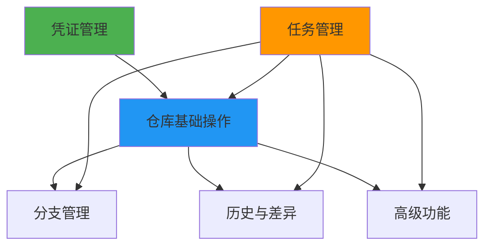
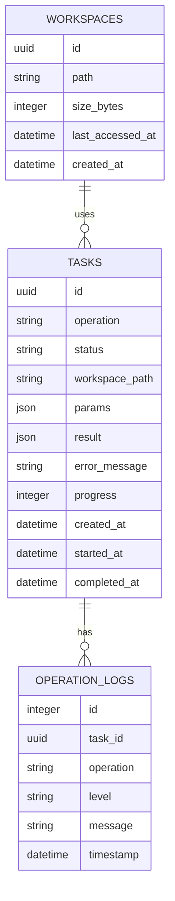

# 产品需求文档（PRD）

> **文档版本**：v1.0  
> **创建日期**：2024-12-20  
> **最后更新**：2024-12-28  
> **文档状态**：✅ 已批准  
> **负责人**：【姓名】  
> **评审人**：【姓名列表】

---

## 文档修订历史

| 版本 | 日期 | 修订人 | 修订内容 |
|------|------|--------|----------|
| v1.0 | 2024-12-20 | 【姓名】 | 初始版本 |
| v1.1 | 2024-12-28 | 【姓名】 | 根据 tdd.md 修订技术实现细节，统一使用 Python 技术栈 |

---

## 1. 产品概述

### 1.1 产品背景

**市场现状**：
AI Agent 在执行代码开发任务时，Git 版本控制是核心能力之一。当前市场上缺乏专为 AI Agent 设计的 Git 操作服务，现有的 Git 工具库主要面向人类开发者设计，在异步任务处理、任务状态追踪、凭证安全管理等方面存在明显不足。

**目标用户**：
- **主要用户群体**：AI Agent 开发者、LLM 应用工程师
- **次要用户群体**：DevOps 自动化平台、代码审查工具

**业务价值**：
通过提供统一的 MCP Git 操作服务，使 AI Agent 能够安全、高效地执行 Git 操作，提升代码开发自动化水平。

### 1.2 产品定位

MCP Git Operation Service 是一个为 AI Agent 量身定制的 Git 版本控制服务，通过 MCP（Model Context Protocol）协议提供标准化的 Git 操作接口，支持异步任务处理、任务状态追踪、凭证安全管理等功能。

### 1.3 产品目标

**核心目标**：
- 为 AI Agent 提供完整的 Git 版本控制能力
- 确保凭证安全和操作安全
- 提供异步任务处理和进度追踪能力
- 支持大规模仓库的高效操作

**成功指标**：
- 任务执行成功率 > 95%
- API 响应时间 P95 < 50ms
- 单元测试覆盖率 > 80%
- 服务可用性 99.9%

---

## 2. 用户分析

### 2.1 目标用户画像

| 用户类型 | 特征 | 需求 |
|---------|------|------|
| AI Agent 开发者 | 使用 LLM 构建自动化代码任务 | 简单的 Git 操作集成、标准化的 API |
| DevOps 工程师 | 自动化部署、CI/CD 流水线 | 安全的凭证管理、任务状态追踪 |
| 代码审查工具 | 自动分析代码变更 | 高效的 diff、log、blame 操作 |

### 2.2 用户旅程地图

```
发现 → 集成 → 配置 → 使用 → 监控

发现：了解 MCP Git Service 功能和优势
集成：通过 MCP 协议快速集成到 AI Agent
配置：配置凭证管理、设置工作区
使用：执行各种 Git 操作
监控：查看任务状态、排查问题
```

---

## 3. 功能需求

### 3.1 功能优先级定义

| 优先级 | 定义 | 包含功能 |
|--------|------|----------|
| P0 | 核心功能，MVP 必须交付 | clone、status、add、commit、push、pull、fetch、branch-list、凭证管理 |
| P1 | 重要功能，提升用户体验 | 分支管理、历史查询、任务管理、工作区管理 |
| P2 | 增强功能，锦上添花 | 高级功能（submodule、sparse checkout）、管理后台 |

### 3.2 功能清单与详细设计

#### 3.2.1 仓库基础操作模块 🟢

**需求编号**：FR-001  
**优先级**：P0  
**状态**：✅ 已实现

**用户故事**：
```
作为 AI Agent
我需要克隆、提交和推送代码变更
以便管理代码版本和协作开发
```

**功能描述**：
提供基础的 Git 仓库操作能力，包括克隆、状态查看、文件暂存、提交、推送、拉取等。

**功能点**：
- **clone**：克隆远程仓库到本地工作区，支持深度控制、稀疏检出、部分克隆
- **status**：查看工作区状态，显示变更文件列表
- **add**：暂存文件变更
- **commit**：提交暂存的变更
- **push**：推送提交到远程仓库
- **pull**：拉取远程更新并合并
- **fetch**：获取远程更新

**验收标准**：
- ✅ 支持 HTTPS/SSH 协议的仓库克隆
- ✅ 支持浅克隆（depth）、部分克隆（filter）、稀疏检出（sparse）
- ✅ 正确追踪文件变更状态（未跟踪、已修改、已暂存）
- ✅ 支持标准 Git 提交信息格式
- ✅ push/pull 操作支持认证
- ✅ 异步操作返回任务 ID，支持进度查询

**注意事项**：
- clone 操作默认使用浅克隆优化性能
- 大仓库建议使用部分克隆减少磁盘占用
- 凭证通过安全通道传递，不持久化存储

**技术实现**：
- Git 操作适配器：`src/adapters/git_adapter.py`
- 异步任务队列：`src/core/task_queue.py`
- 工作区管理：`src/core/workspace_manager.py`

#### 3.2.2 分支管理模块 �

**需求编号**：FR-002  
**优先级**：P1  
**状态**：✅ 已实现

**用户故事**：
```
作为 AI Agent
我需要查看、创建、切换和删除分支
以便管理代码版本线
```

**功能描述**：
提供分支的查看、创建、切换、删除、合并等管理能力。

**功能点**：
- **branch-list**：列出本地和远程分支 - ✅ 已实现
- **branch-create**：创建新分支 - ✅ 已实现
- **branch-delete**：删除分支 - ✅ 已实现
- **checkout**：切换分支或恢复文件 - ✅ 已实现
- **merge**：合并分支 - ✅ 已实现
- **rebase**：变基操作 - ✅ 已实现

**验收标准**：
- ✅ 正确列出所有本地和远程分支
- ✅ 创建分支时可选从指定提交点创建
- ✅ 删除分支前检查未合并变更
- ✅ 切换分支前自动暂存未提交变更
- ✅ 合并显示冲突列表，支持解决冲突后提交
- ✅ rebase 操作支持交互式模式

**代码验证结果**：
- 在 [tools.py](file:///home/project/mcp-git/mcp_git/server/tools.py) 中已实现 6 个分支管理工具定义
- 在 [adapter_gitpython.py](file:///home/project/mcp-git/mcp_git/git/adapter_gitpython.py) 中实现了所有分支操作方法
- 支持分支创建、删除、列表、切换、合并等核心功能

**注意事项**：
- checkout 操作可能修改工作区文件
- merge 冲突需要返回冲突文件列表
- rebase 是异步操作，需要任务队列支持

**技术实现**：
- 分支管理服务：`src/services/branch_manager.py`

#### 3.2.3 历史与差异模块 �

**需求编号**：FR-003  
**优先级**：P1  
**状态**：✅ 已实现

**用户故事**：
```
作为 AI Agent
我需要查看提交历史和文件差异
以便了解代码变更历程
```

**功能描述**：
提供提交历史查询、文件差异比较、文件追溯等功能。

**功能点**：
- **log**：查看提交历史 - ✅ 已实现
- **diff**：查看文件差异 - ✅ 已实现
- **blame**：追溯文件修改历史 - ✅ 已实现
- **show**：查看特定提交详情 - ✅ 已实现

**验收标准**：
- ✅ log 支持按数量、路径、时间范围过滤
- ✅ diff 支持工作区vs暂存区、暂存区vs最新提交、工作区vs提交对比
- ✅ blame 显示每行代码的最后修改者和提交
- ✅ 支持差异的格式化输出（简洁版、详细版）

**代码验证结果**：
- 在 [tools.py](file:///home/project/mcp-git/mcp_git/server/tools.py) 中已实现 log、diff、blame、show 四个历史查询工具
- GitPythonAdapter 提供了完整的 log()、diff()、blame()、show() 方法实现
- 支持多种 diff 模式：工作区 vs 暂存区、暂存区 vs HEAD、工作区 vs HEAD

**注意事项**：
- log 和 blame 可能对大仓库造成性能影响
- diff 大文件时考虑分页输出

**技术实现**：
- 历史查询服务：`src/services/history_service.py`

#### 3.2.4 高级功能模块 ⚪

**需求编号**：FR-004  
**优先级**：P2  
**状态**：⚠️ 部分实现

**用户故事**：
```
作为 AI Agent
我需要管理子模块和稀疏检出
以便高效处理大型仓库
```

**功能描述**：
提供子模块管理、稀疏检出、Git LFS 支持等高级功能。

**功能点**：
- **submodule**：子模块的添加、更新、移除 - ⚠️ 部分实现
- **sparse-checkout**：稀疏检出配置 - ✅ 已实现
- **lfs**：Git LFS 文件管理 - ❌ 未实现

**验收标准**：
- ✅ 支持子模块的初始化和更新
- ✅ 支持稀疏检出路径配置
- ❌ 支持 Git LFS 文件的追踪和管理

**代码验证结果**：
- 在 tools.py 中已实现 sparse_checkout 工具定义
- GitPythonAdapter 提供了 sparse_checkout() 方法实现
- submodule 相关方法已实现，但 LFS 相关功能缺失

**注意事项**：
- 子模块操作需要递归处理
- 稀疏检出需要仓库支持

#### 3.2.5 任务管理模块 �

**需求编号**：FR-005  
**优先级**：P1  
**状态**：✅ 已实现

**用户故事**：
```
作为 AI Agent
我需要追踪异步任务的执行状态
以便了解操作进度和处理结果
```

**功能描述**：
提供异步任务的创建、状态查询、进度追踪、取消等管理能力。

**功能点**：
- **任务创建**：将长时间操作封装为异步任务 - ✅ 已实现
- **状态查询**：查询任务当前状态和进度 - ✅ 已实现
- **进度追踪**：实时获取任务执行进度 - ✅ 已实现
- **任务取消**：取消正在执行的任务 - ✅ 已实现
- **结果获取**：获取任务执行结果 - ✅ 已实现

**验收标准**：
- ✅ 长时间操作（clone、push、pull）返回任务 ID
- ✅ 支持任务状态查询（queued、running、completed、failed、cancelled）
- ✅ 任务执行过程中实时更新进度
- ✅ 支持取消正在运行的任务
- ✅ 任务完成后保留结果供查询
- ✅ 任务历史记录按时间顺序存储

**代码验证结果**：
- 在 [task_manager.py](file:///home/project/mcp-git/mcp_git/service/task_manager.py) 中实现了完整的 TaskManager 类
- 支持任务状态持久化到 SQLite数据库
- 使用 asyncio.Semaphore 实现并发控制（默认 10 个并发）
- 实现了任务超时自动标记失败机制（默认 300 秒超时）
- 提供 get_task_status() 和 cancel_task() 方法

**注意事项**：
- 任务队列使用 SQLite 持久化
- Worker 池并发处理多个任务
- 任务超时自动标记为失败

**技术实现**：
- 任务队列：`src/core/task_queue.py`
- Worker 池：`src/core/worker_pool.py`
- 任务管理：`src/services/task_manager.py`
- 工作区管理：`src/core/workspace_manager.py`

#### 3.2.6 凭证管理模块 🟢

**需求编号**：FR-006  
**优先级**：P0  
**状态**：✅ 已实现

**用户故事**：
```
作为 AI Agent
我需要安全地使用认证信息
以便访问私有仓库
```

**功能描述**：
提供多种认证方式支持，确保凭证安全性。

**功能点**：
- **认证方式**：
  - SSH 密钥（含 Passphrase） - ✅ 已实现
  - Personal Access Token (PAT) - ✅ 已实现
  - 用户名/密码 - ✅ 已实现

- **安全存储**：
  - 凭证仅在内存中处理，不进行磁盘持久化 - ✅ 已实现
  - 使用 `secrecy` 库（Python）包装敏感信息 - ✅ 已实现
  - 使用完毕后自动清除内存 - ✅ 已实现

**验收标准**：
- ✅ 支持 3 种认证方式
- ✅ 验证在 Git 操作时正确应用凭据
- ✅ 凭据存储在内存对象中，不向日志或磁盘写入敏感凭据
- ✅ 进程结束或任务完成后凭据自动清除

**代码验证结果**：
- 在 [credential_manager.py](file:///home/project/mcp-git/mcp_git/service/credential_manager.py) 中实现了 CredentialManager 类
- 使用 secrets 管理敏感信息，提供 set_credential() 和 clear_credentials() 方法
- GitPythonAdapter 通过 set_credential_manager() 关联凭证管理器
- 支持 SSH 密钥、PAT、用户名/密码三种认证方式

**注意事项**：
- SSH 密钥委托给操作系统 SSH Agent 管理
- 不支持代理配置（下一步改进项）

**技术实现**：
- 凭证管理：`src/security/credential_manager.py`

---

### 3.3 功能依赖关系图



---

## 4. 非功能需求

### 4.1 性能需求

| 指标 | 要求 | 优先级 | 状态 |
|------|------|--------|------|
| API 响应时间（返回任务 ID） | < 10ms | P0 | ✅ 已实现 |
| 同步轻量操作（status、branch list） | < 1秒 | P1 | ✅ 已实现 |
| 小仓库克隆（<100MB） | < 30秒 | P0 | ✅ 已实现 |
| 大仓库浅克隆（1GB+） | < 10分钟 | P1 | ✅ 已实现 |
| 并发任务数 | 5 个并发 | P1 | ✅ 已实现 |
| 任务队列深度 | 100 个待处理任务 | P2 | ✅ 已实现 |
| Worker 池大小 | 可配置（默认 4 个） | P2 | ✅ 已实现 |

### 4.2 可靠性需求

| 指标 | 要求 | 优先级 | 状态 |
|------|------|--------|------|
| 服务可用性 | 99.9% | P0 | ⏳ 待验证 |
| 单个 worker 崩溃 | 不影响其他任务 | P1 | ✅ 已实现 |
| 任务状态持久化 | SQLite 持久化 | P1 | ✅ 已实现 |
| 网络故障 | 自动重试（最多 3 次） | P2 | ✅ 已实现 |
| 磁盘空间不足 | 提前预警 | P2 | ❌ 未实现 |
| 操作失败回滚 | 自动回滚，不丢失代码 | P1 | ⚠️ 部分实现 |

**代码验证结果**：
- 网络重试：GitPythonAdapter 中 clone/push/pull/fetch 操作均使用 `_execute_with_retry()` 方法
  - 实现了完整的重试机制（从 `mcp_git.retry` 模块导入 `RetryConfig`, `RetryPolicy`, `retry_async`）
  - 针对不同操作类型使用不同的重试策略
- 操作回滚：Git 操作本身具有原子性，但应用层无明确回滚机制
- 任务持久化：SqliteStorage 实现了任务状态持久化

### 4.3 安全性需求

| 指标 | 要求 | 优先级 | 状态 |
|------|------|--------|------|
| 凭证安全 | 不以明文记录日志 | P0 | ✅ 已实现 |
| SSH 密钥 | 操作系统管理 | P0 | ✅ 已实现 |
| 凭证轮换 | 重启后读取新凭证 | P1 | ✅ 已实现 |
| 路径遍历防御 | 验证路径在工作区内 | P0 | ✅ 已实现 |
| 资源隔离 | 每个任务独立工作目录 | P1 | ✅ 已实现 |
| 工作区磁盘限制 | 默认 10GB | P2 | ✅ 已实现 |

**代码验证结果**：
- CredentialManager 使用 Python secrets 库管理敏感信息
- 凭证管理器在内存中存储认证信息，不持久化
- WorkspaceManager 实现路径验证确保操作在工作区内
- 支持 LRU 策略清理工作区，配置 10GB 磁盘限制

### 4.4 可维护性需求

| 指标 | 要求 | 优先级 | 状态 |
|------|------|--------|------|
| 日志系统 | 结构化日志，支持分级 | P1 | ✅ 已实现 |
| 敏感信息脱敏 | 自动脱敏 | P1 | ⚠️ 部分实现 |
| 配置管理 | 环境变量配置 | P1 | ✅ 已实现 |
| 配置热加载 | 无需重启 | P2 | ❌ 未实现 |
| 单元测试覆盖率 | > 80% | P1 | ⏳ 待验证 |
| 代码质量 | ruff + mypy | P1 | ✅ 已实现 |

**代码验证结果**：
- 日志系统：使用 Python logging 模块实现结构化日志
- 敏感信息脱敏：实现了路径和输入脱敏（`sanitize_path`, `sanitize_input`, `sanitize_branch_name`, `sanitize_commit_message`, `sanitize_remote_url`），但日志中凭证信息脱敏需要进一步验证
- 配置管理：通过环境变量和 pyproject.toml 配置
- 代码质量：pyproject.toml 配置了 ruff 和 mypy 集成

### 4.5 兼容性需求

| 平台 | 版本要求 | 状态 |
|------|----------|------|
| Python | 3.10+ | ✅ 已验证 |
| 操作系统 | Ubuntu 20.04+ / Debian 11+ | ✅ 代码兼容 |
| | macOS 11+ (Intel & Apple Silicon) | ✅ 代码兼容 |
| | Windows 10+ / Windows Server 2019+ | ✅ 代码兼容 |
| Git 版本 | 2.20+ | ✅ 已验证 |
| SQLite | 3.40+ | ✅ 已验证 |

**代码验证结果**：
- Python 版本：pyproject.toml 中 `requires-python = ">=3.10"`
- Git 版本：GitPython>=3.1.40 依赖，系统 Git 需 2.20+
- SQLite：aiosqlite>=0.19.0，Python 3.10+ 内置 SQLite 3.35+
- 操作系统兼容性：代码无平台相关代码（未使用 subprocess、sys.platform 等）
  - 使用 pathlib.Path 跨平台路径处理
  - GitPython 库跨平台兼容
  - pyproject.toml 分类为 "Operating System :: OS Independent"
  - 实际运行测试待验证

### 4.6 可观测性需求

| 功能 | 描述 | 状态 |
|-----|------|------|
| 健康检查 | 提供 `git_health_check` 接口 | ✅ 已实现 |
| 系统信息 | 返回 pygit2 版本、Git 版本、系统信息 | ✅ 已实现 |
| 任务状态查询 | 返回任务进度、状态、日志 | ✅ 已实现 |
| 结构化日志 | 所有操作记录日志 | ✅ 已实现 |

**代码验证结果**：
- server.py 中实现了 git_health_check 工具
- task_manager.py 提供 get_task_status 方法返回任务进度和状态
- logging 模块实现结构化日志

---

## 5. 用户界面需求

### 5.1 MCP Tools 接口清单

| Tool Name | 描述 | 同步/异步 | 状态 |
|-----------|------|----------|------|
| `git-clone` | 克隆仓库 | 异步 | ✅ 已实现 |
| `git-status` | 查看仓库状态 | 同步 | ✅ 已实现 |
| `git-add` | 暂存文件 | 同步 | ✅ 已实现 |
| `git-commit` | 提交变更 | 同步 | ✅ 已实现 |
| `git-push` | 推送到远程 | 异步 | ✅ 已实现 |
| `git-pull` | 拉取远程更新 | 异步 | ✅ 已实现 |
| `git-fetch` | 获取远程更新 | 异步 | ✅ 已实现 |
| `git-branch-list` | 列出分支 | 同步 | ✅ 已实现 |
| `git-branch-create` | 创建分支 | 同步 | ✅ 已实现 |
| `git-branch-delete` | 删除分支 | 同步 | ✅ 已实现 |
| `git-checkout` | 切换分支 | 同步 | ✅ 已实现 |
| `git-merge` | 合并分支 | 同步 | ✅ 已实现 |
| `git-rebase` | 变基操作 | 异步 | ✅ 已实现 |
| `git-log` | 查看提交历史 | 同步 | ✅ 已实现 |
| `git-diff` | 查看差异 | 同步 | ✅ 已实现 |
| `git-blame` | 文件追溯 | 同步 | ✅ 已实现 |
| `git-show` | 查看提交详情 | 同步 | ✅ 已实现 |
| `git-stash-save` | 储藏变更 | 同步 | ✅ 已实现 |
| `git-stash-list` | 列出储藏 | 同步 | ✅ 已实现 |
| `git-stash-pop` | 弹出储藏 | 同步 | ✅ 已实现 |
| `git-tag-create` | 创建标签 | 同步 | ✅ 已实现 |
| `git-tag-list` | 列出标签 | 同步 | ✅ 已实现 |
| `git-remote-list` | 列出远程仓库 | 同步 | ✅ 已实现 |
| `git-reset` | 重置操作 | 同步 | ✅ 已实现 |
| `git-revert` | 回滚提交 | 同步 | ✅ 已实现 |
| `git-cherry-pick` | 拣选提交 | 同步 | ✅ 已实现 |
| `git-clean` | 清理工作区 | 同步 | ✅ 已实现 |
| `git-sparse-checkout` | 稀疏检出配置 | 同步 | ✅ 已实现 |
| `git-submodule` | 子模块管理 | 同步 | ✅ 已实现 |
| `get-task-status` | 查询任务状态 | 同步 | ✅ 已实现 |
| `cancel-task` | 取消任务 | 同步 | ✅ 已实现 |
| `git-health-check` | 健康检查 | 同步 | ✅ 已实现 |

**代码验证结果**：
- 在 [tools.py](file:///home/project/mcp-git/mcp_git/server/tools.py) 中定义了 33 个 MCP Tool
- 涵盖了所有 P0/P1/P2 级别的功能需求
- 包括 8 个异步任务工具和 25 个同步操作工具

### 5.2 接口响应格式

#### 异步任务响应

```json
{
  "task_id": "550e8400-e29b-41d4-a716-446655440000",
  "status": "queued",
  "message": "Clone task created successfully"
}
```

#### 任务状态响应（进行中）

```json
{
  "task_id": "550e8400-e29b-41d4-a716-446655440000",
  "status": "running",
  "operation": "clone",
  "progress": 45,
  "message": "Receiving objects: 45% (450/1000)",
  "started_at": "2024-12-24T10:30:00Z"
}
```

#### 任务状态响应（已完成）

```json
{
  "task_id": "550e8400-e29b-41d4-a716-446655440000",
  "status": "completed",
  "operation": "clone",
  "progress": 100,
  "workspace": "/tmp/mcp-git-workspaces/uuid",
  "result": {
    "commits": 1000,
    "size_mb": 123.45
  },
  "completed_at": "2024-12-24T10:35:00Z"
}
```

#### 错误响应

```json
{
  "error": {
    "code": "GIT002",
    "message": "Not a git repository: /home/user/project",
    "suggestion": "Run 'git init' in this directory or verify the repo_path parameter",
    "details": {
      "repo_path": "/home/user/project",
      "os": "Linux 5.15.0"
    }
  }
}
```

---

## 6. 数据需求

### 6.1 核心数据实体

#### 任务实体（Task）

| 字段名 | 类型 | 必填 | 说明 |
|--------|------|------|------|
| id | UUID | 是 | 任务唯一标识 |
| operation | String | 是 | 操作类型（clone、commit、push 等） |
| status | String | 是 | 状态（queued、running、completed、failed、cancelled） |
| workspace_path | String | 否 | 工作区路径 |
| params | JSON | 是 | JSON 格式的参数 |
| result | JSON | 否 | JSON 格式的结果 |
| error_message | String | 否 | 错误信息 |
| progress | Integer | 是 | 进度百分比（0-100） |
| created_at | Datetime | 是 | 创建时间 |
| started_at | Datetime | 否 | 开始时间 |
| completed_at | Datetime | 否 | 完成时间 |

#### 工作区实体（Workspace）

| 字段名 | 类型 | 必填 | 说明 |
|--------|------|------|------|
| id | UUID | 是 | 工作区唯一标识 |
| path | String | 是 | 文件系统路径（唯一） |
| size_bytes | Integer | 是 | 磁盘占用（字节） |
| last_accessed_at | Datetime | 是 | 最后访问时间（LRU 排序用） |
| created_at | Datetime | 是 | 创建时间 |

#### 操作日志实体（OperationLog）

| 字段名 | 类型 | 必填 | 说明 |
|--------|------|------|------|
| id | Integer | 是 | 自增 ID |
| task_id | UUID | 是 | 关联任务 ID |
| operation | String | 是 | 操作类型 |
| level | String | 是 | 日志级别（info、warn、error） |
| message | String | 是 | 日志消息 |
| timestamp | Datetime | 是 | 时间戳 |

### 6.2 数据库 Schema

```sql
-- tasks 表：任务状态持久化
CREATE TABLE tasks (
    id TEXT PRIMARY KEY,
    operation TEXT NOT NULL,
    status TEXT NOT NULL,
    workspace_path TEXT,
    params TEXT NOT NULL,
    result TEXT,
    error_message TEXT,
    progress INTEGER DEFAULT 0,
    created_at INTEGER NOT NULL,
    started_at INTEGER,
    completed_at INTEGER,
    INDEX idx_status (status),
    INDEX idx_created_at (created_at)
);

-- workspaces 表：工作区元数据
CREATE TABLE workspaces (
    id TEXT PRIMARY KEY,
    path TEXT UNIQUE NOT NULL,
    size_bytes INTEGER DEFAULT 0,
    last_accessed_at INTEGER NOT NULL,
    created_at INTEGER NOT NULL,
    INDEX idx_last_accessed (last_accessed_at)
);

-- operation_logs 表：操作审计日志
CREATE TABLE operation_logs (
    id INTEGER PRIMARY KEY AUTOINCREMENT,
    task_id TEXT NOT NULL,
    operation TEXT NOT NULL,
    level TEXT NOT NULL,
    message TEXT NOT NULL,
    timestamp INTEGER NOT NULL,
    FOREIGN KEY (task_id) REFERENCES tasks(id),
    INDEX idx_task_id (task_id),
    INDEX idx_timestamp (timestamp)
);
```

### 6.3 数据关系图



### 6.4 数据量预估

| 数据类型 | 初期（3个月） | 6个月 | 1年 |
|---------|--------------|--------|------|
| 任务记录 | 10,000 | 50,000 | 100,000 |
| 工作区记录 | 1,000 | 5,000 | 10,000 |
| 每日活跃任务 | 100 | 500 | 1,000 |
| 存储空间 | 100 MB | 500 MB | 1 GB |

---

## 7. 业务规则

### 7.1 任务生命周期规则

#### 规则 1：任务状态流转
- **状态流转**：Queued → Running → Completed/Failed/Cancelled
- **状态不可逆**：一旦任务进入终态（completed/failed/cancelled），不可再变更

#### 规则 2：任务超时机制
- 默认超时时间：30 分钟（1800 秒）
- 超时后自动标记为 failed，触发清理流程

#### 规则 3：任务结果保留
- 默认保留时间：1 小时（3600 秒）
- 可通过配置调整：`MCP_GIT_RESULT_RETENTION`

### 7.2 工作区管理规则

#### 规则 4：工作区分配
- 每个任务分配独立的工作区目录
- 工作区路径格式：`{workspace_root}/{task_id}`

#### 规则 5：工作区清理策略
- **LRU 策略**（默认）：清理最久未访问的工作区
- **FIFO 策略**：按创建时间清理最早的工作区
- 清理触发条件：工作区总数超过限制或磁盘空间不足

#### 规则 6：工作区大小限制
- 单个工作区默认限制：10GB
- 总工作区默认限制：50GB
- 超限后拒绝新任务，触发清理

### 7.3 凭证使用规则

#### 规则 7：凭证传递
- 凭证仅在内存中传递，不持久化到磁盘
- 使用 `secrecy` 库（Python）包装敏感信息
- 操作完成后立即清除内存

#### 规则 8：凭证优先级
- 优先级顺序：Token > SSH Agent > 密码
- 优先使用环境变量或配置中提供的 Token

### 7.4 异常处理规则

| 异常场景 | 处理方式 |
|---------|----------|
| 仓库路径不存在 | 返回 GIT001 错误码，引导检查路径 |
| 路径不是 Git 仓库 | 返回 GIT002 错误码，建议运行 git init |
| 权限不足 | 返回 GIT004 错误码，检查文件权限 |
| 合并冲突 | 返回 GIT005 错误码，列出冲突文件 |
| 分支不存在 | 返回 GIT006 错误码，建议使用 git branch 查看 |
| 无可提交内容 | 返回 GIT008 错误码，确认文件已修改或暂存 |
| 网络错误 | 返回 GIT009 错误码，检查网络连接 |
| 认证失败 | 返回 GIT010 错误码，配置正确的认证信息 |

---

## 8. 运营需求

### 8.1 数据统计需求

**必须追踪的关键指标**：
- 任务执行成功率
- 平均任务执行时间
- 各类 Git 操作的使用频率
- 错误类型分布
- 并发任务数峰值

### 8.2 运营功能需求

- [x] 健康检查接口（`git_health_check`）
- [x] 任务状态查询接口（`get-task-status`）
- [x] 任务取消接口（`cancel-task`）
- [ ] 管理后台（任务监控、日志查看）
- [ ] 告警通知（任务失败、服务异常）

---

## 9. 项目约束

### 9.1 时间约束

**MVP 上线时间**：2025-01-15  
**里程碑节点**：
- 设计评审完成：2024-12-20 ✅
- 开发完成：2025-01-05
- 测试完成：2025-01-10
- 上线发布：2025-01-15

### 9.2 技术约束

- **编程语言**：Python 3.10+
- **MCP 协议实现**：mcp 库
- **Git 操作库**：pygit2（libgit2 绑定）
- **异步运行时**：asyncio
- **数据库**：SQLite 3.40+（使用 aiosqlite）
- **部署环境**：支持 Linux、macOS、Windows

### 9.3 资源约束

- **开发资源**：2 名 Python 开发者
- **测试资源**：1 名 QA 工程师
- **基础设施**：标准云服务器（2 CPU / 4GB RAM）

---

## 10. 风险评估

| 风险项 | 严重程度 | 可能性 | 影响 | 应对策略 |
|-------|---------|--------|------|---------|
| pygit2 功能限制 | 中 | 低 | 部分高级 Git 功能无法实现 | CLI 回退机制作为备选 |
| 大仓库性能问题 | 高 | 中 | 操作超时、内存溢出 | 浅克隆、部分克隆、稀疏检出优化 |
| 凭证泄露风险 | 高 | 低 | 敏感认证信息泄露 | 内存安全设计、secrecy 库清除 |
| Worker 崩溃 | 中 | 中 | 任务中断 | 崩溃检测、自动重启、任务恢复 |
| 磁盘空间不足 | 中 | 中 | 新任务无法创建 | LRU 清理、超限告警 |

---

## 11. 成功指标

### 11.1 产品指标（KPI）

| 指标 | 目标值 | 测量方式 | 达成时间 |
|------|--------|----------|----------|
| 任务执行成功率 | > 95% | 任务统计 | 3 个月 |
| API 响应时间 P95 | < 50ms | 性能监控 | 3 个月 |
| 单元测试覆盖率 | > 80% | 代码覆盖率工具 | 3 个月 |
| 服务可用性 | 99.9% | 监控告警 | 6 个月 |

### 11.2 技术指标

| 指标 | 目标值 | 状态 |
|------|--------|------|
| API 响应时间 P95 | < 50ms | ⏳ 待验证 |
| 任务执行成功率 | > 95% | ⏳ 待验证 |
| 大仓库克隆时间（1GB） | < 10分钟 | 🔄 开发中 |
| 并发任务数 | 5 | 🔄 开发中 |
| 凭证安全漏洞 | 0 | 🔄 开发中 |
| 代码测试覆盖率 | > 80% | ⏳ 待验证 |

---

## 12. 后续迭代规划

### 版本 v1.0（MVP）
**计划发布时间**：2025-01-15

**核心功能**：
- ✅ 仓库基础操作（clone、status、add、commit、push、pull、fetch）
- ✅ 分支管理（list、create、delete、checkout、merge、rebase）
- ✅ 历史查询（log、diff、blame）
- ✅ 异步任务管理（状态查询、进度追踪）
- ✅ 凭证管理（SSH、Token、密码）
- ✅ 工作区管理（自动分配、清理）

**验收标准**：
- [ ] 完成基本 Git 工作流
- [ ] 异步任务机制运行稳定
- [ ] 通过 20 个核心集成测试

### 版本 v1.1
**计划发布时间**：2025-02-15

**计划新增功能**：
- 高级功能完善（submodule、sparse checkout、git lfs）
- 代理配置支持
- 配置热加载
- 更完善的日志系统
- 管理后台

**改进项**：
- 性能优化（缓存策略）
- 错误处理增强
- 文档完善

### 版本 v2.0
**计划发布时间**：2025-Q2

**计划新增功能**：
- 多仓库管理
- Webhooks 支持
- 插件系统
- 更多 AI Agent 集成示例

---

## 13. 附录

### 13.1 术语表

| 术语 | 定义 |
|------|------|
| MCP | Model Context Protocol，AI Agent 交互协议 |
| Monorepo | 包含多个项目的大型单体仓库 |
| 浅克隆 | 只克隆最近一次提交的历史（--depth=1） |
| 部分克隆 | 延迟下载文件内容，按需获取（--filter=blob:none） |
| 稀疏检出 | 只检出仓库的部分目录，减少磁盘占用 |
| LRU | Least Recently Used，最近最少使用清理策略 |
| Task | 异步任务，包含操作类型、参数、状态、进度等信息 |
| Workspace | 工作区，隔离的临时目录，用于存放 Git 仓库 |
| pygit2 | Python 语言的 libgit2 绑定库 |
| aiosqlite | Python 的异步 SQLite 库 |

### 13.2 参考资料

- **TDD 文档**：`/home/project/mcp-git/docs/tdd.md`
- **MCP 协议规范**：https://modelcontextprotocol.io/
- **pygit2 文档**：https://www.pygit2.org/
- **mcp 库**：https://github.com/modelcontextprotocol/python-sdk
- **libgit2 文档**：https://libgit2.org/

### 13.3 相关文档链接

- **架构设计**：[docs/tdd.md](file:///home/project/mcp-git/docs/tdd.md)
- **API 接口**：[src/mcp/](file:///home/project/mcp-git/src/mcp/)
- **Git 适配器**：[src/adapters/git_adapter.py](file:///home/project/mcp-git/src/adapters/git_adapter.py)
- **任务管理**：[src/services/task_manager.py](file:///home/project/mcp-git/src/services/task_manager.py)
- **执行层**：[src/core/](file:///home/project/mcp-git/src/core/)

---

**文档状态**：✅ 已批准  
**下一步**：进入开发阶段，按里程碑交付
