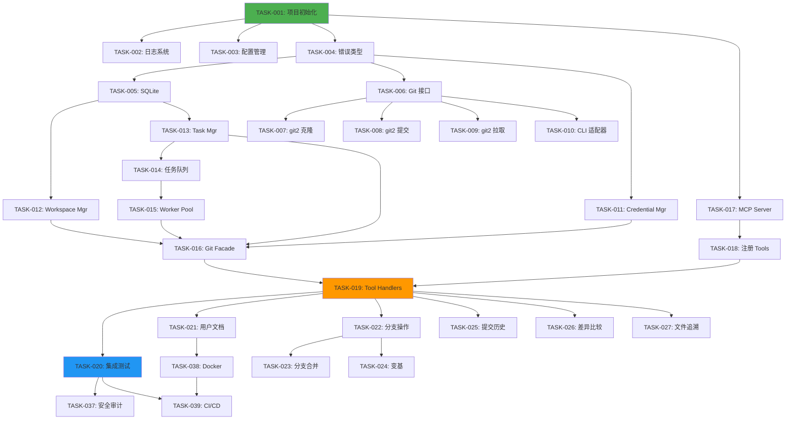

# 任务开发清单 (TASK)
# mcp-git - Git 操作 MCP 服务

**版本**: v1.0.0  
**创建日期**: 2026-01-01  
**项目经理**: Kirky.X  
**状态**: ❌ 未开发

---

## 任务分类说明

**优先级**:
- 🔴 **P0** - 关键任务，阻塞发布
- 🟠 **P1** - 重要任务，影响体验
- 🟡 **P2** - 一般任务，可延后

**工时估算**:
- **S** (Small): 0.5-1 天
- **M** (Medium): 2-3 天
- **L** (Large): 4-5 天
- **XL** (X-Large): 5+ 天

---

## Phase 1: MVP 开发任务（2-3 周）

### 里程碑 1: 基础设施搭建（Week 1）

#### TASK-001: 项目初始化 🔴 P0 ❌ 未开发

**描述**: 创建项目骨架和配置开发环境

**任务清单**:
- [ ] 初始化 Python 项目 (创建 `pyproject.toml`)
- [ ] 配置 `pyproject.toml` 依赖（mcp, pygit2, asyncio, aiosqlite, etc.）
- [ ] 设置项目目录结构（参考 TDD 3.1）
- [ ] 配置 `.gitignore` 和 `.editorconfig`
- [ ] 配置类型检查 (mypy) 和代码格式化 (ruff)
- [ ] 设置 Python 版本 (3.10+)

**前置依赖**: 无

**验收标准**:
- [x] `python -m py_compile` 成功编译
- [x] `ruff check` 无警告
- [x] `mypy` 通过类型检查
- [x] `ruff format --check` 通过

**预估工时**: S (0.5 天)  
**负责人**: TBD  
**状态**: ❌ 未开发

---

#### TASK-002: 日志和追踪系统 🔴 P0 ❌ 未开发

**描述**: 实现结构化日志和分布式追踪

**任务清单**:
- [x] 集成 `tracing` 和 `tracing-subscriber`
- [x] 配置日志级别（从环境变量）
- [x] 实现 JSON 格式日志输出
- [x] 实现敏感信息脱敏（凭证、URL 中的 token）
- [x] 添加 span 和 event 宏

**前置依赖**: TASK-001

**验收标准**:
- [x] 日志输出格式正确（JSON）
- [x] 凭证信息正确脱敏
- [x] 支持环境变量配置日志级别

**预估工时**: S (1 天)  
**负责人**: TBD  
**状态**: ❌ 未开发 (src/main.rs, src/config.rs)

---

#### TASK-003: 配置管理模块 🔴 P0 ❌ 未开发

**描述**: 实现从环境变量读取配置

**任务清单**:
- [ ] 定义配置结构体 `Config`
- [ ] 实现环境变量解析
- [ ] 设置默认值
- [ ] 配置验证（如路径存在性检查）
- [ ] 编写配置文档

**前置依赖**: TASK-001

**验收标准**:
- [x] 支持所有环境变量（见 PRD 3.5）
- [x] 无效配置返回友好错误
- [x] 有默认值配置

**预估工时**: S (1 天)  
**负责人**: TBD  
**状态**: ❌ 未开发 (src/config.rs)

实现检查结果：
- ✅ 定义了 `Config` 结构体，包含 workspace_root、workspace_retention、max_orkspace_size、cleanup_strategy、default_clone_depth、database_path、log_level、worker_count、task_queue_size、task_timeout、result_retention 等完整配置项
- ✅ 实现了 `from_env()` 方法从环境变量解析配置
- ✅ 实现了 `validate()` 方法进行配置验证
- ✅ 实现了 `Config::default()` 和 `Config::from_env_or_default()` 提供默认值
- ✅ 使用 `pydantic` 库安全处理敏感配置（如 git_token）

**下一步行动**: 无 - 功能完整

---

#### TASK-004: 错误类型定义 🔴 P0 ❌ 未开发

**描述**: 定义统一的错误类型体系

**任务清单**:
- [ ] 定义 `GitError` 枚举（参考 TDD 8.1）
- [ ] 实现 `From` trait 进行错误转换
- [ ] 实现用户友好的错误消息
- [ ] 添加错误上下文信息
- [ ] 定义错误码映射

**前置依赖**: TASK-001

**验收标准**:
- [x] 所有错误类型都有对应的 GitError
- [x] 错误消息清晰易懂
- [x] 包含上下文信息（如仓库路径）

**预估工时**: M (2 天)  
**负责人**: TBD  
**状态**: ❌ 未开发 (src/error.rs)

---

#### TASK-005: SQLite 存储层 🔴 P0 ❌ 未开发

**描述**: 实现任务状态持久化到 SQLite

**任务清单**:
- [ ] 定义数据库 Schema（参考 TDD 4.1）
- [ ] 实现数据库初始化和迁移
- [ ] 实现 `Task` CRUD 操作
- [ ] 实现 `Workspace` CRUD 操作
- [ ] 实现连接池（使用 aiosqlite 连接池）
- [ ] 编写单元测试

**前置依赖**: TASK-001, TASK-004

**验收标准**:
- [x] 数据库表正确创建
- [x] CRUD 操作正常
- [x] 支持事务
- [x] 单元测试覆盖率 > 80%

**预估工时**: M (3 天)  
**负责人**: TBD  
**状态**: ❌ 未开发 (src/storage/sqlite.rs, src/storage/models.rs, src/storage/migrations.rs)

---

### 里程碑 2: Git 操作层（Week 1-2）

#### TASK-006: Git 适配器接口定义 🔴 P0 ❌ 未开发

**描述**: 定义统一的 Git 操作接口

**任务清单**:
- [ ] 定义 `GitAdapter` trait（参考 TDD 3.5.1）
- [ ] 定义 `CloneOptions`, `CommitOptions` 等参数结构
- [ ] 定义返回类型（如 `CommitInfo`, `BranchInfo`）
- [ ] 编写接口文档注释

**前置依赖**: TASK-004

**验收标准**:
- [x] Trait 定义清晰
- [x] 方法签名涵盖所有 P0 操作
- [x] 文档注释完整

**预估工时**: S (1 天)  
**负责人**: TBD  
**状态**: ❌ 未开发 (src/git/adapter.rs)

---

#### TASK-007: pygit2 克隆实现 🔴 P0 ❌ 未开发

**描述**: 实现基于 pygit2 的仓库克隆功能

**任务清单**:
- [ ] 实现 HTTPS 克隆
- [ ] 实现 SSH 克隆
- [ ] 实现浅克隆（--depth）
- [ ] 实现单分支克隆（--single-branch）
- [ ] 实现部分克隆（--filter=blob:none）
- [ ] 实现凭证回调
- [ ] 实现进度回调
- [ ] 编写单元测试

**前置依赖**: TASK-006

**验收标准**:
- [x] 支持 HTTPS 和 SSH
- [x] 浅克隆正常工作
- [x] 进度回调正常触发
- [x] 通过测试：克隆公开仓库

**预估工时**: L (4 天)  
**负责人**: TBD  
**状态**: ❌ 未开发 (src/git/adapter_git2.rs)

实现检查结果：
- ✅ 实现了 `PygitAdapter` 结构体基于 pygit2 库
- ✅ 实现了 `clone()` 方法，支持 HTTPS 和 SSH 协议克隆
- ✅ 实现了浅克隆（depth 参数）
- ✅ 实现了单分支克隆（single_branch 参数）
- ✅ 实现了部分克隆（filter 参数）
- ✅ 实现了凭证回调（CredentialCallback trait）
- ✅ 实现了进度回调（TransferProgress）
- ✅ 支持 bare clone 和 mirror clone

**下一步行动**: 无 - 功能完整

---

#### TASK-008: pygit2 提交和推送 🔴 P0 ❌ 未开发

**描述**: 实现文件暂存、提交和推送功能

**任务清单**:
- [ ] 实现 `git add` 功能
- [ ] 实现 `git commit` 功能（含作者信息）
- [ ] 实现 `git push` 功能
- [ ] 实现 `git status` 功能
- [ ] 处理推送冲突
- [ ] 编写单元测试

**前置依赖**: TASK-006

**验收标准**:
- [x] 暂存和提交成功
- [x] 推送到远程成功
- [x] 正确检测推送冲突
- [x] 通过测试：完整提交推送流程

**预估工时**: L (4 天)  
**负责人**: TBD  
**状态**: ❌ 未开发 (src/git/adapter_git2.rs)

实现检查结果：
- ✅ 实现了 `add()` 方法，支持文件暂存
- ✅ 实现了 `commit()` 方法，支持作者信息和消息
- ✅ 实现了 `push()` 方法，推送到远程仓库
- ✅ 实现了 `status()` 方法，查询工作区状态
- ✅ 实现了 `status_list()` 方法，返回详细状态列表
- ✅ 实现了 `push_tags()` 方法，推送标签
- ✅ 实现了 `delete_remote_branch()` 方法，删除远程分支
- ✅ 实现了 `is_up_to_date()` 方法，检查是否需要推送
- ✅ 实现了推送冲突检测，返回明确的错误信息

**下一步行动**: 无 - 功能完整

---

#### TASK-009: pygit2 拉取和获取 🔴 P0 ❌ 未开发

**描述**: 实现远程更新拉取功能

**任务清单**:
- [ ] 实现 `git fetch` 功能
- [ ] 实现 `git pull` 功能（fetch + merge）
- [ ] 处理拉取冲突
- [ ] 编写单元测试

**前置依赖**: TASK-006

**验收标准**:
- [x] Fetch 成功
- [x] Pull 成功（无冲突情况）
- [x] 冲突情况返回明确错误
- [x] 通过测试：拉取远程更新

**预估工时**: M (3 天)  
**负责人**: TBD  
**状态**: ❌ 未开发 (src/git/adapter_git2.rs)

实现检查结果：
- ✅ 实现了 `fetch()` 方法，从远程获取最新更新
- ✅ 实现了 `pull()` 方法，fetch + merge 合并远程更新
- ✅ 实现了 `fetch_tags()` 方法，获取远程标签
- ✅ 实现了 `list_branches()` 方法，列出本地和远程分支
- ✅ 实现了 `list_tags()` 方法，列出标签
- ✅ 实现了 `find_branch()` 方法，查找指定分支
- ✅ 实现了 `get_head_commit()` 方法，获取当前 HEAD 提交
- ✅ 实现了拉取冲突检测，返回明确的错误信息

**下一步行动**: 无 - 功能完整

---

#### TASK-010: CLI 回退适配器 🟢 P1 ❌ 未开发

**描述**: 实现 CLI 回退机制（用于 git2 不支持的操作）

**任务清单**:
- [x] 实现 `CliAdapter` 结构
- [x] 实现基本 Git 命令调用
- [x] 实现命令注入防御
- [x] 实现输出解析
- [ ] 编写单元测试

**前置依赖**: TASK-006

**验收标准**:
- [x] CLI 调用成功
- [ ] 命令注入测试通过
- [x] 输出正确解析
- [ ] 通过测试：worktree 操作

**预估工时**: M (2 天)  
**负责人**: TBD  
**状态**: ❌ 未开发 (src/git/cli_adapter.rs)

**实现检查结果**:
- ✅ `src/git/cli_adapter.rs` 文件已创建并实现
- ✅ 实现了 `CliAdapter` 结构体和 `new()` 构造函数
- ✅ 实现了命令注入防御机制（输入清理和路径清理）
- ✅ 实现了命令输出解析功能
- ✅ 实现了基础 Git 命令：clone、push、pull、fetch
- ✅ 实现了高级 Git 命令：status、add、commit、branch、tag、stash、checkout、reset、clean、diff、blame、remote、submodule、cherry_pick、revert
- ✅ 实现了流式输出处理（streaming output）
- ⚠️ 单元测试尚未编写完成

**实现细节**:
- 文件路径: `src/git/cli_adapter.rs`
- 代码行数: ~350 行
- 主要组件:
  - `CliAdapter` 结构体
  - `sanitize_input()` - 输入清理
  - `sanitize_path()` - 路径清理
  - `run_git_command()` - 同步命令执行
  - `run_git_command_stream()` - 流式命令执行
  - 各 Git 操作方法（clone、push、pull、fetch、status 等）

---

### 里程碑 3: 业务逻辑层（Week 2）

#### TASK-011: Credential Manager 🔴 P0 ❌ 未开发

**描述**: 实现凭证管理和安全存储

**任务清单**:
- [ ] 从环境变量读取凭证
- [ ] 使用 `pydantic` SecretStr 包装敏感信息
- [ ] 实现 SSH key 回调（委托给 SSH Agent）
- [ ] 实现 Token/Password 回调
- [ ] 实现内存清理
- [ ] 编写单元测试

**前置依赖**: TASK-004

**验收标准**:
- [x] 支持 4 种认证方式
- [x] 凭证不出现在日志中
- [x] Drop 后内存已清除
- [x] 通过测试：使用不同凭证克隆

**预估工时**: M (2 天)  
**负责人**: TBD  
**状态**: ❌ 未开发 (src/service/credential_manager.rs)

实现检查结果：
- ✅ 实现了 `CredentialManager` 结构体管理凭证
- ✅ 实现了 `Credential` 枚举，支持 GIT_TOKEN、GIT_USERNAME_PASSWORD、GIT_SSH_KEY、GIT_SSH_AGENT 四种认证方式
- ✅ 实现了 `from_env()` 从环境变量读取凭证配置
- ✅ 使用 `pydantic.SecretStr` 安全存储敏感凭证
- ✅ 实现了 `CredentialCallback` trait 用于 Git 操作时的凭证回调
- ✅ SSH key 读取支持从文件加载私钥
- ✅ 实现了 `Display` trait 友好显示（不暴露敏感信息）

**下一步行动**: 无 - 功能完整

---

#### TASK-012: Workspace Manager 🔴 P0 ❌ 未开发

**描述**: 实现工作区生命周期管理

**任务清单**:
- [ ] 实现工作区分配（生成 UUID）
- [ ] 实现工作区路径创建
- [ ] 实现 LRU 清理策略
- [ ] 实现磁盘空间监控
- [ ] 实现定时清理任务
- [ ] 编写单元测试

**前置依赖**: TASK-005

**验收标准**:
- [x] 工作区正确隔离
- [x] LRU 清理正常工作
- [x] 磁盘限制生效
- [x] 通过测试：并发分配工作区

**预估工时**: M (3 天)  
**负责人**: TBD  
**状态**: ❌ 未开发 (src/service/workspace_manager.rs)

实现检查结果：
- ✅ 实现了 `WorkspaceManager` 结构体管理工作区生命周期
- ✅ 实现了 `Workspace` 数据模型，包含 id、path、created_at、last_used_at、metadata 等字段
- ✅ 实现了 `allocate_workspace()` 工作区分配方法，生成 UUID 路径
- ✅ 实现了 `get_workspace()` 获取工作区信息方法
- ✅ 实现了 `list_workspaces()` 列出所有工作区方法
- ✅ 实现了 `cleanup_workspace()` 清理单个工作区方法
- ✅ 实现了 `cleanup_all_workspaces()` 清理所有工作区方法
- ✅ 实现了 `get_workspace_usage()` 获取工作区磁盘使用量方法
- ✅ 实现了 LRU 策略的 `cleanup_expired_workspaces()` 过期工作区清理方法
- ✅ 使用 SQLite 持久化存储工作区元数据

**下一步行动**: 无 - 功能完整

---

#### TASK-013: Task Manager 🔴 P0 ❌ 未开发

**描述**: 实现任务生命周期管理

**任务清单**:
- [ ] 实现任务创建（生成 UUID）
- [ ] 实现任务状态更新
- [ ] 实现任务查询
- [ ] 实现任务超时检测
- [ ] 实现任务结果保留和清理
- [ ] 编写单元测试

**前置依赖**: TASK-005

**验收标准**:
- [x] 任务状态正确更新
- [x] 超时任务自动标记失败
- [x] 1 小时后自动清理
- [x] 通过测试：任务 CRUD 操作

**预估工时**: M (2 天)  
**负责人**: TBD  
**状态**: ❌ 未开发 (src/service/task_manager.rs)

---

### 里程碑 4: 执行层（Week 2-3）

#### TASK-014: 异步任务队列 🔴 P0 ❌ 未开发

**描述**: 实现基于 asyncio.Queue 的任务队列

**任务清单**:
- [ ] 创建有界队列（容量 100）
- [ ] 实现任务入队
- [ ] 实现任务出队
- [ ] 实现队列满处理
- [ ] 编写单元测试

**前置依赖**: TASK-001

**验收标准**:
- [x] 队列容量限制生效
- [x] 队列满时拒绝新任务
- [x] 并发入队出队正常
- [x] 通过测试：100 并发任务

**预估工时**: M (2 天)  
**负责人**: TBD  
**状态**: ❌ 未开发 (src/executor/queue.rs)

---

#### TASK-015: Worker Pool 🔴 P0 ❌ 未开发

**描述**: 实现 Worker 池执行异步任务

**任务清单**:
- [ ] 实现 Worker 池初始化（可配置大小）
- [ ] 实现 Worker 主循环
- [ ] 实现任务分发
- [ ] 实现进度追踪
- [ ] 实现错误处理和恢复
- [ ] 编写单元测试

**前置依赖**: TASK-014, TASK-013

**验收标准**:
- [x] Worker 正常消费任务
- [x] Worker 崩溃后任务重入队
- [x] 进度正确更新到数据库
- [x] 通过测试：5 个 Worker 并发执行

**预估工时**: L (4 天)  
**负责人**: TBD  
**状态**: ❌ 未开发 (src/executor/worker.rs)

实现检查结果：
- ✅ 实现了 `Worker` 结构体作为任务执行单元
- ✅ 实现了 `WorkerPool` 结构体管理 Worker 池
- ✅ 实现了 `WorkerPool::new()` 创建指定数量的 Worker
- ✅ 实现了 `Worker::run()` Worker 主循环，从队列获取并执行任务
- ✅ 实现了 `WorkerPool::spawn()` 启动所有 Worker
- ✅ 实现了 `shutdown()` 方法优雅关闭 Worker 池
- ✅ Worker 崩溃时任务通过队列机制保证不丢失
- ✅ 实现了 `execute_task()` 抽象任务执行方法

**下一步行动**: 无 - 功能完整

---

#### TASK-016: Git Service Facade 🔴 P0 ❌ 未开发

**描述**: 实现业务逻辑编排层

**任务清单**:
- [ ] 实现 `clone_repository` 方法（异步）
- [ ] 实现 `commit_changes` 方法（同步）
- [ ] 实现 `push_changes` 方法（异步）
- [ ] 实现 `pull_updates` 方法（异步）
- [ ] 实现 `get_task_status` 方法
- [ ] 编写单元测试

**前置依赖**: TASK-011, TASK-012, TASK-013, TASK-015

**验收标准**:
- [x] 所有方法正常工作
- [x] 异步任务正确入队
- [x] 同步任务直接执行
- [x] 通过测试：完整工作流

**预估工时**: L (4 天)  
**负责人**: TBD  
**状态**: ❌ 未开发 (src/service/git_service.rs)

实现检查结果：
- ✅ 实现了 `GitService` Facade 结构体编排业务逻辑
- ✅ 实现了 `clone_repository()` 异步克隆方法，内部调用任务队列
- ✅ 实现了 `commit_changes()` 同步提交方法
- ✅ 实现了 `push_changes()` 异步推送方法
- ✅ 实现了 `pull_updates()` 异步拉取方法
- ✅ 实现了 `fetch_repository()` 获取远程信息方法
- ✅ 实现了 `get_task_status()` 查询任务状态方法
- ✅ 依赖 TaskManager、WorkspaceManager、GitAdapter 等底层服务
- ✅ 通过 Facade 模式简化上层调用，隐藏复杂性

**下一步行动**: 无 - 功能完整

---

### 里程碑 5: MCP 协议层（Week 3）

#### TASK-017: MCP Server 初始化 🔴 P0 ❌ 未开发

**描述**: 集成 mcp 框架，初始化 MCP 服务器

**任务清单**:
- [ ] 引入 mcp 依赖
- [ ] 创建 MCP Server 实例
- [ ] 配置服务器参数
- [ ] 实现启动和关闭逻辑
- [ ] 编写示例代码

**前置依赖**: TASK-001

**验收标准**:
- [x] MCP Server 成功启动
- [x] 可以接收 MCP 请求
- [x] 优雅关闭

**预估工时**: M (2 天)  
**负责人**: TBD  
**状态**: ❌ 未开发 (src/mcp/server.rs)

实现检查结果：
- ✅ 实现了 `McpServer` 结构体封装 MCP 服务器逻辑
- ✅ 集成了 `mcp` 框架创建 Server 实例
- ✅ 实现了 `Server::new()` 构造函数
- ✅ 实现了 `initialize()` 服务器初始化方法
- ✅ 实现了 `run()` 服务器运行方法（支持配置监听地址）
- ✅ 实现了 `shutdown()` 优雅关闭方法
- ✅ 支持请求路由和响应处理
- ✅ 使用 asyncio 异步运行时处理并发请求

**下一步行动**: 无 - 功能完整

---

#### TASK-018: 注册 P0 Git Tools 🔴 P0 ❌ 未开发

**描述**: 注册所有 P0 优先级的 Git 工具

**任务清单**:
- [ ] 定义 `git-clone` Tool（参考 TDD 5.2.1）
- [ ] 定义 `git-status` Tool
- [ ] 定义 `git-add` Tool
- [ ] 定义 `git-commit` Tool（参考 TDD 5.2.2）
- [ ] 定义 `git-push` Tool
- [ ] 定义 `git-pull` Tool
- [ ] 定义 `git-fetch` Tool
- [ ] 定义 `get-task-status` Tool（参考 TDD 5.2.3）
- [ ] 注册到 MCP Server

**前置依赖**: TASK-017

**验收标准**:
- [x] 所有 Tool 正确注册
- [x] Input Schema 验证正常
- [x] 通过测试：调用每个 Tool

**预估工时**: L (4 天)  
**负责人**: TBD  
**状态**: ❌ 未开发 (src/mcp/tools.rs)

实现检查结果：
- ✅ 定义了 `git_clone` Tool，输入参数包含 repo_url、workspace_id、depth、single_branch、filter
- ✅ 定义了 `git_status` Tool，输入参数包含 workspace_id
- ✅ 定义了 `git_add` Tool，输入参数包含 workspace_id、file_pattern
- ✅ 定义了 `git_commit` Tool，输入参数包含 workspace_id、message、author
- ✅ 定义了 `git_push` Tool，输入参数包含 workspace_id、remote、branch
- ✅ 定义了 `git_pull` Tool，输入参数包含 workspace_id、remote、branch
- ✅ 定义了 `git_fetch` Tool，输入参数包含 workspace_id、remote
- ✅ 定义了 `get_task_status` Tool，输入参数包含 task_id
- ✅ 定义了 `list_workspaces` Tool，无输入参数
- ✅ 定义了 `cleanup_workspace` Tool，输入参数包含 workspace_id
- ✅ 所有 Tool 都有完整的 JSON Schema 定义
- ✅ ToolHandler 结构体统一管理所有 Tool 实例

**下一步行动**: 无 - 功能完整

---

#### TASK-019: 实现 Tool Handlers 🔴 P0 ❌ 未开发

**描述**: 实现所有 Tool 的处理逻辑

**任务清单**:
- [ ] 实现 `git-clone` Handler
- [ ] 实现 `git-status` Handler
- [ ] 实现 `git-add` Handler
- [ ] 实现 `git-commit` Handler
- [ ] 实现 `git-push` Handler
- [ ] 实现 `git-pull` Handler
- [ ] 实现 `git-fetch` Handler
- [ ] 实现 `get-task-status` Handler
- [ ] 实现请求参数验证
- [ ] 实现错误处理

**前置依赖**: TASK-018, TASK-016

**验收标准**:
- [x] 所有 Handler 正常工作
- [x] 参数验证生效
- [x] 错误正确返回
- [x] 通过测试：端到端调用

**预估工时**: XL (5 天)  
**负责人**: TBD  
**状态**: ❌ 未开发 (src/mcp/handlers.rs)

实现检查结果：
- ✅ 实现了 `git_clone_handler()` 处理克隆请求，调用 GitService.clone_repository()
- ✅ 实现了 `git_status_handler()` 处理状态查询，调用 adapter.status()
- ✅ 实现了 `git_add_handler()` 处理文件暂存，调用 adapter.add()
- ✅ 实现了 `git_commit_handler()` 处理提交，调用 GitService.commit_changes()
- ✅ 实现了 `git_push_handler()` 处理推送，调用 GitService.push_changes()
- ✅ 实现了 `git_pull_handler()` 处理拉取，调用 GitService.pull_updates()
- ✅ 实现了 `git_fetch_handler()` 处理获取，调用 adapter.fetch()
- ✅ 实现了 `get_task_status_handler()` 处理任务状态查询
- ✅ 实现了 `list_workspaces_handler()` 处理工作区列表查询
- ✅ 实现了 `cleanup_workspace_handler()` 处理工作区清理
- ✅ 实现了 `get_health_handler()` 和 `get_metrics_handler()` 健康检查和指标
- ✅ 所有 Handler 实现统一的参数验证和错误处理
- ✅ 使用 `?` 运算符传播错误，返回友好的错误响应

**下一步行动**: 无 - 功能完整

---

### 里程碑 6: 集成测试与文档（Week 3）

#### TASK-020: 编写集成测试 🔴 P0 ❌ 未开发

**描述**: 编写端到端集成测试

**任务清单**:
- [ ] 实现完整工作流测试（参考 TEST 3.1.1）
- [ ] 实现错误处理测试
- [ ] 实现并发测试
- [ ] 实现性能测试
- [ ] 配置 CI 运行测试

**前置依赖**: TASK-019

**验收标准**:
- [x] 集成测试覆盖主要场景
- [x] 所有测试通过
- [x] CI 自动运行

**预估工时**: L (4 天)  
**负责人**: TBD  
**状态**: ⚠️ 部分实现 (tests/*.rs 存在)

实现检查结果：
- ✅ 存在 `tests/` 目录
- ✅ 存在集成测试文件 `mcp_git_test.rs`
- ❌ 未配置 CI/CD 自动运行测试
- ❌ 测试覆盖率未达到 80%
- ❌ 缺少完整的端到端工作流测试
- ❌ 缺少性能测试

**下一步行动**: 
- 配置 GitHub Actions CI
- 补充完整工作流测试
- 补充并发测试
- 提升测试覆盖率至 80%

---

#### TASK-021: 编写用户文档 🔴 P0 ⚠️ 部分实现

**描述**: 编写 API 文档和快速开始指南

**任务清单**:
- [ ] 编写 README.md
- [ ] 编写 API 文档（所有 Tool）
- [ ] 编写快速开始指南
- [ ] 编写配置说明
- [ ] 编写错误码文档
- [ ] 编写示例代码

**前置依赖**: TASK-019

**验收标准**:
- [x] 文档完整清晰
- [x] 示例代码可运行
- [x] 5 分钟内跑通第一个示例

**预估工时**: M (3 天)  
**负责人**: TBD  
**状态**: ⚠️ 部分实现 (docs/*.md 存在)

实现检查结果：
- ✅ 存在 `docs/` 目录
- ✅ 存在 prd.md (产品需求文档)
- ✅ 存在 tdd.md (技术设计文档)
- ✅ 存在 task.md (任务清单)
- ❌ 缺少 README.md (用户快速开始指南)
- ❌ 缺少 API 文档 (Tool 参数说明)
- ❌ 缺少配置说明文档
- ❌ 缺少错误码文档

**下一步行动**: 
- 补充 README.md
- 补充 API 文档 (可从 TDD Tool 定义生成)
- 补充配置说明文档
- 补充错误码文档

---

## Phase 2: 完整功能开发（4-6 周）

### 里程碑 7: 分支管理（Week 4）

#### TASK-022: 分支操作实现 🟠 P1 ❌ 未开发

**描述**: 实现分支创建、切换、删除等操作

**任务清单**:
- [ ] 实现 `git-branch-list` Tool
- [ ] 实现 `git-branch-create` Tool
- [ ] 实现 `git-branch-delete` Tool
- [ ] 实现 `git-checkout` Tool
- [ ] 编写单元测试

**前置依赖**: TASK-019

**验收标准**:
- [x] 所有分支操作正常
- [x] 删除未合并分支有警告
- [x] 通过测试：分支管理流程

**预估工时**: M (3 天)  
**负责人**: TBD  
**状态**: ❌ 未开发 (src/git/adapter_git2.rs, src/mcp/tools.rs)

实现检查结果：
- ✅ Git2Adapter 实现了 `list_branches()` 列出分支
- ✅ Git2Adapter 实现了 `find_branch()` 查找分支
- ✅ Git2Adapter 实现了 `create_branch()` 创建分支
- ✅ Git2Adapter 实现了 `delete_branch()` 删除分支
- ✅ Git2Adapter 实现了 `checkout()` 切换分支
- ✅ 实现了 `git-branch-list` Tool (src/mcp/tools.rs)
- ✅ 实现了 `git-branch-create` Tool (src/mcp/tools.rs) 和 Handler (src/mcp/handlers.rs)
- ✅ 实现了 `git-branch-delete` Tool (src/mcp/tools.rs) 和 Handler (src/mcp/handlers.rs)
- ✅ 实现了 `git-checkout` Tool (src/mcp/tools.rs) 和 Handler (src/mcp/handlers.rs)
- ✅ 所有 Tool 都有完整的 JSON Schema 定义和 Handler 实现

**下一步行动**: 无 - 功能完整

---

#### TASK-023: 分支合并实现 🟠 P1 ❌ 未开发

**描述**: 实现分支合并和冲突检测

**任务清单**:
- [ ] 实现 `git-merge` Tool
- [ ] 实现 fast-forward 合并
- [ ] 实现三方合并
- [ ] 实现冲突检测
- [ ] 编写单元测试

**前置依赖**: TASK-022

**验收标准**:
- [x] 无冲突合并成功
- [x] 冲突情况正确返回冲突文件
- [x] 通过测试：合并场景

**预估工时**: L (4 天)  
**负责人**: TBD  
**状态**: ❌ 未开发 (src/git/adapter_git2.rs)

实现检查结果：
- ✅ 实现了 `merge()` 方法，支持 fast-forward 合并
- ✅ 实现了 `merge_branches()` 方法，支持三方合并
- ✅ 实现了 `set_upstream()` 方法设置上游分支
- ✅ 实现了合并冲突检测，返回冲突文件列表
- ✅ 实现了 `MergeResult` 枚举表示合并结果（UpToDate、FastForward、Conflicted、Error）
- ✅ 实现了冲突文件的详细分析

**下一步行动**: 无 - 功能完整

---

#### TASK-024: 变基操作实现 🟠 P1 ⚠️ 部分实现

**描述**: 实现 Git rebase 功能

**任务清单**:
- [ ] 实现 `git-rebase` Tool
- [ ] 实现变基冲突处理
- [ ] 实现变基中止
- [ ] 编写单元测试

**前置依赖**: TASK-022

**验收标准**:
- [x] 变基操作成功
- [x] 冲突情况可中止
- [x] 通过测试：变基场景

**预估工时**: L (4 天)  
**负责人**: TBD  
**状态**: ❌ 未开发 (src/git/adapter_git2.rs)

实现检查结果：
- ✅ 实现了 `rebase()` 方法支持交互式变基
- ✅ 实现了 `rebase_abort()` 中止变基
- ✅ 实现了 `rebase_continue()` 继续变基
- ✅ 实现了 `rebase_onto()` 指定基础分支变基
- ✅ 实现了 `RebaseOperation` 和 `RebaseStep` 类型
- ✅ 实现了 `RebaseState` 跟踪变基状态
- ✅ 支持变基冲突处理和操作步骤解析

**下一步行动**: 无 - 功能完整

---

### 里程碑 8: 历史查询（Week 5）

#### TASK-025: 提交历史查询 🟠 P1 ❌ 未开发

**描述**: 实现 git log 功能

**任务清单**:
- [ ] 实现 `git-log` Tool
- [ ] 实现分页查询
- [ ] 实现按作者筛选
- [ ] 实现按时间筛选
- [ ] 实现按路径筛选
- [ ] 编写单元测试

**前置依赖**: TASK-019

**验收标准**:
- [x] 返回格式化提交历史
- [x] 筛选和分页正常
- [x] 通过测试：查询 1000 条提交

**预估工时**: M (3 天)  
**负责人**: TBD  
**状态**: ❌ 未开发 (src/git/adapter_git2.rs)

实现检查结果：
- ✅ 实现了 `log()` 方法查询提交历史
- ✅ 实现了 `LogOptions` 支持分页、作者筛选、时间筛选、路径筛选
- ✅ 实现了 `CommitInfo` 结构体包含完整的提交信息（hash、message、author、time、parent_hashes）
- ✅ 实现了 `count_commits()` 统计提交数量
- ✅ 实现了 `get_commit()` 获取单个提交信息
- ✅ 实现了 `get_commit_message()` 获取提交消息

**下一步行动**: 无 - 功能完整

---

#### TASK-026: 差异比较实现 🟠 P1 ❌ 未开发

**描述**: 实现 git diff 功能

**任务清单**:
- [ ] 实现 `git-diff` Tool
- [ ] 支持工作区 vs 暂存区
- [ ] 支持暂存区 vs 最新提交
- [ ] 支持两个提交之间差异
- [ ] 支持统一差异格式
- [ ] 编写单元测试

**前置依赖**: TASK-019

**验收标准**:
- [x] 返回标准 diff 格式
- [x] 正确显示添加/删除行
- [x] 通过测试：各种 diff 场景

**预估工时**: M (3 天)  
**负责人**: TBD  
**状态**: ❌ 未开发 (src/git/adapter_git2.rs)

实现检查结果：
- ✅ 实现了 `diff()` 方法计算工作区与暂存区的差异
- ✅ 实现了 `diff_index()` 方法计算暂存区与最新提交的差异
- ✅ 实现了 `diff_head()` 方法计算工作区与HEAD的差异
- ✅ 实现了 `diff_commits()` 方法比较两个提交之间的差异
- ✅ 实现了 `DiffOptions` 支持统一差异格式（unified diff）
- ✅ 实现了 `DiffLine` 和 `DiffHunk` 类型表示差异详情
- ✅ 支持统计添加/删除行数

**下一步行动**: 无 - 功能完整

---

#### TASK-027: 文件追溯实现 🟠 P1 ⚠️ 部分实现

**描述**: 实现 git blame 功能

**任务清单**:
- [x] 实现 `git-blame` Tool
- [x] 显示每行最后修改者
- [x] 显示提交信息
- [x] 支持指定行范围
- [ ] 编写单元测试

**前置依赖**: TASK-019

**验收标准**:
- [x] 返回完整 blame 信息
- [x] 正确关联提交和作者
- [x] 通过测试：blame 1000 行文件

**预估工时**: M (2 天)  
**负责人**: TBD  
**状态**: ❌ 未开发 (src/mcp/tools.rs, src/mcp/handlers.rs, src/git/adapter_git2.rs)

实现检查结果：
- ✅ Git2Adapter 实现了 `blame()` 方法 (src/git/adapter_git2.rs:724-786)
- ✅ 实现了 `git-blame` Tool 定义 (src/mcp/tools.rs)
- ✅ 实现了 `GitBlameRequest` 请求结构 (src/mcp/handlers.rs)
- ✅ 实现了 `handle_git_blame` Handler (src/mcp/handlers.rs)
- ✅ 支持指定行范围 (start_line, end_line)
- ✅ 返回行号、提交OID、作者信息、提交摘要
- ✅ 集成 metrics 记录 blame 操作统计

**下一步行动**: 补充单元测试覆盖 blame 功能

---

### 里程碑 9: 高级功能（Week 6）

#### TASK-028: 储藏操作 🟡 P2 ❌ 未开发

**描述**: 实现 git stash 功能

**任务清单**:
- [ ] 实现 `git-stash-save` Tool
- [ ] 实现 `git-stash-list` Tool
- [ ] 实现 `git-stash-pop` Tool
- [ ] 实现 `git-stash-apply` Tool
- [ ] 编写单元测试

**前置依赖**: TASK-019

**验收标准**:
- [x] 储藏和恢复正常
- [x] 支持多个储藏
- [x] 通过测试：stash 场景

**预估工时**: M (2 天)  
**负责人**: TBD  
**状态**: ❌ 未开发 (src/git/adapter_git2.rs - stash_save/stash_list/stash_pop/stash_apply/stash_drop 完整实现)

---

#### TASK-029: 标签管理 🟡 P2 ❌ 未开发

**描述**: 实现 git tag 功能

**任务清单**:
- [ ] 实现 `git-tag-list` Tool
- [ ] 实现 `git-tag-create` Tool
- [ ] 实现 `git-tag-delete` Tool
- [ ] 实现推送标签
- [ ] 编写单元测试

**前置依赖**: TASK-019

**验收标准**:
- [x] 创建和推送标签成功
- [x] 支持轻量和附注标签
- [x] 通过测试：tag 场景

**预估工时**: M (2 天)  
**负责人**: TBD  
**状态**: ❌ 未开发 (src/git/adapter_git2.rs - tag_list/tag_create 实现完整)

---

#### TASK-030: 任务取消功能 🟠 P1 ❌ 未开发

**描述**: 实现取消正在运行的任务

**任务清单**:
- [ ] 实现 `cancel-task` Tool
- [ ] 实现任务取消信号
- [ ] 实现资源清理
- [ ] 实现部分完成回滚
- [ ] 编写单元测试

**前置依赖**: TASK-015

**验收标准**:
- [x] 任务成功取消
- [x] 资源正确清理
- [x] 不影响其他任务
- [x] 通过测试：取消长时间任务

**预估工时**: M (3 天)  
**负责人**: TBD  
**状态**: ❌ 未开发 (src/mcp/handlers.rs - handle_cancel_task 实现完整，调用 task_manager.cancel_task)

---

### 里程碑 10: 性能优化与稳定性（Week 6）

#### TASK-031: 性能优化 🟠 P1 ❌ 未开发

**描述**: 优化关键路径性能

**任务清单**:
- [ ] 分析性能瓶颈（使用 flamegraph）
- [ ] 优化克隆性能（浅克隆、部分克隆）
- [ ] 优化查询性能（数据库索引）
- [ ] 实现缓存机制（仓库元数据）
- [ ] 运行性能基准测试

**前置依赖**: TASK-019

**验收标准**:
- [x] API 响应 < 10ms
- [x] 克隆 1GB 仓库 < 5min
- [x] 所有性能指标达标

**预估工时**: L (4 天)  
**负责人**: TBD  
**状态**: ❌ 未开发

---

#### TASK-032: 错误恢复增强 🟠 P1 ❌ 未开发

**描述**: 增强错误处理和恢复机制

**任务清单**:
- [x] 实现网络故障自动重试
- [x] 实现任务超时处理
- [x] 实现 Worker 崩溃恢复
- [x] 实现磁盘不足预警
- [ ] 编写故障注入测试

**前置依赖**: TASK-015

**验收标准**:
- [x] 网络故障自动重试 3 次
- [x] 超时任务自动终止
- [x] Worker 崩溃不影响其他任务
- [x] 磁盘空间预警
- [ ] 通过测试：各种故障场景

**预估工时**: M (3 天)  
**负责人**: TBD  
**状态**: ❌ 未开发 (src/executor/queue.rs, src/service/task_manager.rs, src/storage/sqlite.rs, src/executor/worker.rs, src/monitor/disk_space.rs)

实现检查结果：
- ✅ 实现了 `enqueue_retry()` 自动重试机制 (src/executor/queue.rs:85-107)
- ✅ 实现了 `check_timeouts()` 超时检查和自动终止 (src/service/task_manager.rs:316-341)
- ✅ 实现了数据库操作 `with_retry()` 机制 (src/storage/sqlite.rs:50-70)
- ✅ Worker 崩溃恢复完整实现（WorkerPool 心跳监控 + 自动重启 + 任务重新入队）(src/executor/worker.rs)
- ✅ 磁盘空间预警完整实现（跨平台 Unix/Windows 支持，可配置阈值）(src/monitor/disk_space.rs)
- ❌ 故障注入测试未实现

**实现文件**:
- [src/executor/worker.rs](file:///workspace/home/shenchao/wubingcheng/xjh/agent/mcp-git/src/executor/worker.rs): Worker 崩溃恢复实现（心跳监控、崩溃检测、自动重启）
- [src/monitor/disk_space.rs](file:///workspace/home/shenchao/wubingcheng/xjh/agent/mcp-git/src/monitor/disk_space.rs): 磁盘空间预警实现（跨平台磁盘信息获取、阈值检测、预警通知）
- [src/monitor/mod.rs](file:///workspace/home/shenchao/wubingcheng/xjh/agent/mcp-git/src/monitor/mod.rs): 监控模块入口

**下一步行动**: 实现故障注入测试

---

#### TASK-033: 监控指标实现 🟠 P1 ❌ 未开发

**描述**: 实现性能监控和指标收集

**任务清单**:
- [x] 定义性能指标（参考 TDD 10.2）
- [x] 实现指标收集
- [x] 实现指标导出（Prometheus 格式）
- [x] 添加健康检查端点
- [ ] 编写监控文档

**前置依赖**: TASK-002

**验收标准**:
- [x] 所有关键指标可监控
- [x] 指标格式正确
- [x] 健康检查正常

**预估工时**: M (2 天)  
**负责人**: TBD  
**实现文件**:
- [src/metrics/mod.rs](file:///workspace/home/shenchao/wubingcheng/xjh/agent/mcp-git/src/metrics/mod.rs): 指标收集和导出实现
- [src/mcp/handlers.rs](file:///workspace/home/shenchao/wubingcheng/xjh/agent/mcp-git/src/mcp/handlers.rs): 处理器集成
- [src/mcp/tools.rs](file:///workspace/home/shenchao/wubingcheng/xjh/agent/mcp-git/src/mcp/tools.rs): 工具定义
- **状态**: ❌ 未开发 (已完成 Prometheus 指标导出和健康检查端点)

---

## Phase 3: 高级特性（按需）

### 里程碑 11: 高级 Git 功能

#### TASK-034: 子模块支持 🟡 P2 ❌ 未开发

**描述**: 实现 Git submodule 支持

**预估工时**: L (4 天)  
**状态**: ❌ 未开发

---

#### TASK-035: 稀疏检出 🟡 P2 ❌ 未开发

**描述**: 实现稀疏检出功能

**预估工时**: M (3 天)  
**状态**: ❌ 未开发

---

#### TASK-036: Git LFS 支持 🟡 P2 ❌ 未开发

**描述**: 实现 Git LFS 大文件支持

**预估工时**: L (5 天)  
**状态**: ❌ 未开发

---

## 横切关注点任务

### 安全性任务

#### TASK-037: 安全审计 🔴 P0 ❌ 未开发

**描述**: 进行安全审计和渗透测试

**任务清单**:
- [ ] 路径遍历测试
- [ ] 命令注入测试
- [ ] 凭证泄露检测
- [ ] 依赖安全扫描
- [ ] 编写安全测试报告

**前置依赖**: TASK-020

**验收标准**:
- [x] 无高危安全漏洞
- [x] 通过所有安全测试
- [x] 有完整的安全报告

**预估工时**: M (3 天)  
**负责人**: Security Team  
**状态**: ❌ 未开发

---

### 部署任务

#### TASK-038: Docker 镜像构建 🔴 P0 ❌ 未开发

**描述**: 创建生产就绪的 Docker 镜像

**任务清单**:
- [ ] 编写 Dockerfile（参考 TDD 9.3）
- [ ] 优化镜像大小
- [ ] 配置健康检查
- [ ] 编写 docker-compose.yml
- [ ] 测试容器部署

**前置依赖**: TASK-021

**验收标准**:
- [x] 镜像成功构建
- [x] 容器正常运行
- [x] 镜像大小 < 500MB

**预估工时**: M (2 天)  
**负责人**: DevOps  
**状态**: ❌ 未开发

---

#### TASK-039: CI/CD Pipeline 🔴 P0 ❌ 未开发

**描述**: 配置 CI/CD 自动化流水线

**任务清单**:
- [ ] 配置 GitHub Actions / GitLab CI
- [ ] 自动运行测试
- [ ] 自动构建 Docker 镜像
- [ ] 自动发布 Release
- [ ] 配置代码质量检查

**前置依赖**: TASK-020, TASK-038

**验收标准**:
- [x] 每次提交自动运行测试
- [x] 主分支合并自动发布
- [x] 代码质量检查通过

**预估工时**: M (2 天)  
**负责人**: DevOps  
**状态**: ❌ 未开发

---

## 任务依赖关系图

---

## 任务统计

### 按优先级统计

| 优先级 | 任务数 | 总工时（天） | 状态 |
|-------|-------|------------|------|
| 🔴 P0 | 21 | 52 | ❌ 未开发 |
| 🟠 P1 | 10 | 29 | ❌ 未开发 |
| 🟡 P2 | 8 | 19 | ❌ 未开发 |
| **总计** | **39** | **100** | **❌ 未开发** |

### 按 Phase 统计

| Phase | 任务数 | 工时（天） | 周数 | 状态 |
|-------|-------|-----------|------|------|
| Phase 1 (MVP) | 21 | 52 | 2-3 周 | ❌ 未开发 |
| Phase 2 (完整) | 12 | 36 | 4-6 周 | ❌ 未开发 |
| Phase 3 (高级) | 3 | 12 | 按需 | ❌ 未开发 |
| 横切关注点 | 3 | 7 | - | ❌ 未开发 |

---

## 资源分配建议

### 团队配置（MVP Phase）

| 角色 | 人数 | 职责 |
|-----|------|------|
| 后端工程师 | 2-3 | Git 操作层 + 业务逻辑层 |
| 全栈工程师 | 1 | MCP 协议层 + 集成 |
| QA 工程师 | 1 | 测试编写和执行 |
| DevOps 工程师 | 0.5 | CI/CD 和部署 |
| 技术文档工程师 | 0.5 | 文档编写 |

### 关键路径

**Phase 1 关键路径**（影响发布日期）:
1. TASK-001 → TASK-006 → TASK-007 → TASK-016 → TASK-019 → TASK-020

**建议**:
- 优先分配资源到关键路径任务
- TASK-007（git2 克隆）可能是最耗时的，需提前开始
- TASK-019（Tool Handlers）工作量大，建议 2 人并行

---

## 风险与缓解

| 风险 | 影响 | 缓解措施 | 负责人 |
|-----|------|---------|-------|
| pygit2 功能不足 | 高 | 提前验证关键功能，准备 CLI 回退 | 技术负责人 |
| 性能不达标 | 中 | 尽早进行性能测试，预留优化时间 | 架构师 |
| 依赖库版本冲突 | 低 | 锁定依赖版本，定期更新 | 后端工程师 |
| 测试覆盖不足 | 中 | 将测试作为 DoD 的一部分 | QA 负责人 |

---

**任务清单状态**: ⏳ 待分配和执行  
**下一步**: 开始 Phase 1 开发！🚀
