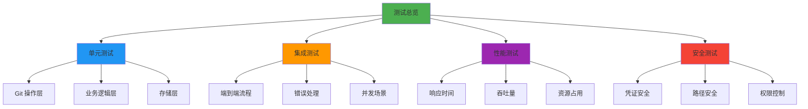
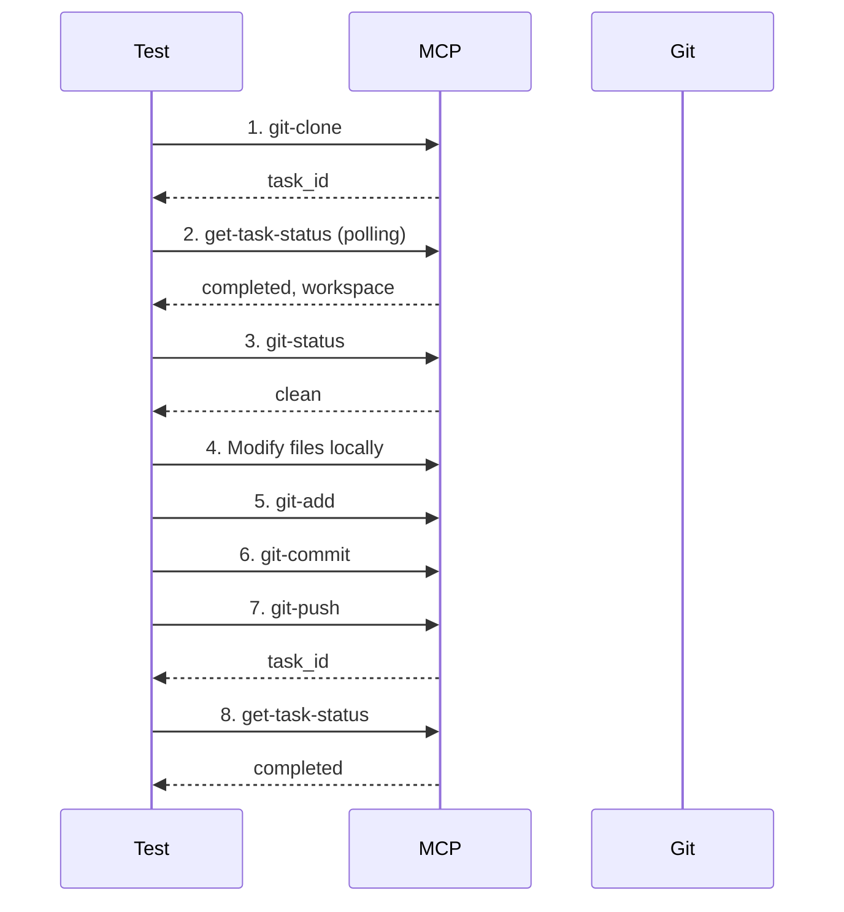

# 测试文档 (TEST)
# mcp-git - Git 操作 MCP 服务

**版本**: v1.0.0  
**创建日期**: 2026-01-01  
**负责人**: Kirky.X  
**状态**: 🔄 开发中

---

## 文档修订历史

| 版本 | 日期 | 修订人 | 修订内容 |
|------|------|--------|----------|
| v1.0.0 | 2026-01-01 | Kirky.X | 初始版本 |
| v1.0.1 | 2026-01-01 | Kirky.X | 补充 Task Manager、Credential Manager、存储层和错误处理测试详细内容 |
| v1.1.0 | 2026-01-28 | 【姓名】 | 根据 tdd.md 修订技术实现细节，统一使用 Python 技术栈（pytest/pygit2/aiosqlite） |

---

## 1. 测试策略概述

### 1.1 测试目标
- 验证所有 Git 操作的正确性和可靠性
- 确保异步任务系统稳定运行
- 验证性能指标达标
- 确保安全机制有效

### 1.2 测试范围



### 1.3 测试环境
- **开发环境**: Python 3.10+ 本地开发环境
- **CI 环境**: GitHub Actions / GitLab CI
- **测试 Git 服务**: 本地 Git 服务器 + GitHub 测试仓库
- **依赖版本**:
  - Python: 3.10+
  - pytest: 7.0+
  - pygit2: 1.12+
  - aiosqlite: 0.19+
  - Git: 2.20+

---

## 2. 单元测试

### 2.1 Git 操作层测试 ❌ 未开发

#### 2.1.1 pygit2 适配器测试

**测试模块**: `tests.git.pygit2_adapter`

| 测试用例 | 描述 | 验收标准 | 状态 |
|---------|------|---------|------|
| `test_clone_https_success` | HTTPS 协议克隆成功 | 仓库克隆到指定目录 | 🔄 开发中 |
| `test_clone_ssh_success` | SSH 协议克隆成功 | 使用 SSH key 克隆 | 🔄 开发中 |
| `test_clone_invalid_url` | 无效 URL 错误处理 | 返回 `GitError` 错误 | 🔄 开发中 |
| `test_clone_auth_failed` | 认证失败处理 | 返回认证错误 | 🔄 开发中 |
| `test_clone_shallow` | 浅克隆功能 | 只克隆最新 1 次提交 | 🔄 开发中 |
| `test_clone_single_branch` | 单分支克隆 | 只克隆指定分支 | 🔄 开发中 |
| `test_commit_success` | 提交文件成功 | 返回 commit OID | 🔄 开发中 |
| `test_commit_empty_message` | 空提交消息处理 | 返回验证错误 | 🔄 开发中 |
| `test_push_success` | 推送成功 | 远程仓库更新 | 🔄 开发中 |
| `test_push_conflict` | 推送冲突处理 | 返回友好错误信息 | 🔄 开发中 |
| `test_branch_create` | 创建分支 | 新分支可见 | 🔄 开发中 |
| `test_branch_delete` | 删除分支 | 分支不再存在 | 🔄 开发中 |
| `test_merge_fast_forward` | 快进合并 | 合并无冲突 | 🔄 开发中 |
| `test_merge_conflict` | 合并冲突检测 | 正确识别冲突文件 | 🔄 开发中 |
| `test_blame_single_file` | 单文件追溯 | 返回完整 blame 信息 | 🔄 开发中 |
| `test_blame_with_range` | 指定行范围追溯 | 正确返回指定行信息 | 🔄 开发中 |
| `test_blame_renamed_file` | 重命名文件追溯 | 正确处理文件路径变更 | 🔄 开发中 |
| `test_status_clean_repo` | 干净仓库状态查询 | 返回 clean 状态 | 🔄 开发中 |
| `test_status_with_changes` | 有变更仓库状态查询 | 正确识别 modified/new/delete | 🔄 开发中 |
| `test_status_with_untracked` | 含未跟踪文件状态 | 正确列出未跟踪文件 | 🔄 开发中 |
| `test_status_with_staged` | 含暂存区状态 | 正确显示暂存区内容 | 🔄 开发中 |

**代码示例**:
```python
import pytest
import tempfile
from pathlib import Path
from pygit2 import Repository, CloneOptions, RemoteCallbacks

@pytest.mark.asyncio
async def test_clone_https_success():
    adapter = Pygit2Adapter()
    with tempfile.TemporaryDirectory() as temp_dir:
        temp_path = Path(temp_dir)
        
        result = await adapter.clone(
            "https://github.com/python/cpython.git",
            temp_path,
            CloneOptions(depth=1)
        )
        
        assert result is not None
        assert (temp_path / ".git").exists()

@pytest.mark.asyncio
async def test_clone_invalid_url():
    adapter = Pygit2Adapter()
    with tempfile.TemporaryDirectory() as temp_dir:
        temp_path = Path(temp_dir)
        
        with pytest.raises(GitError) as exc_info:
            await adapter.clone("not-a-valid-url", temp_path)
        
        assert exc_info.value.code == GitErrorCode.REPO_NOT_FOUND
```

#### 2.1.2 CLI 适配器测试 ❌ 未开发

| 测试用例 | 描述 | 验收标准 | 状态 |
|---------|------|---------|------|
| `test_cli_worktree_add` | Worktree 添加 | 成功创建 worktree | ❌ 未开发 |
| `test_cli_command_injection` | 命令注入防御 | 拒绝恶意参数 | ❌ 未开发 |
| `test_cli_fallback_mechanism` | 回退机制触发 | git2 失败时调用 CLI | ❌ 未开发 |

#### 2.1.3 详细测试用例

##### 2.1.3.1 仓库状态查询 (`git_status`)

| ID | 测试目的 | 前置条件 | 测试步骤 | 预期结果 | 优先级 |
|----|----------|----------|----------|----------|--------|
| TC-STATUS-001 | 验证干净仓库状态 | 初始化空仓库 | 1. 调用 `git_status(repo_path)` | 返回空列表或 "Clean working tree" 提示 | P0 |
| TC-STATUS-002 | 验证修改文件状态 | 仓库中有已修改但未暂存的文件 | 1. 修改文件 `a.txt`<br>2. 调用 `git_status(repo_path)` | 返回包含 `a.txt` 的状态为 `modified` | P0 |
| TC-STATUS-003 | 验证暂存文件状态 | 仓库中有已暂存的文件 | 1. 修改并 `git add a.txt`<br>2. 调用 `git_status(repo_path)` | 返回包含 `a.txt` 的状态为 `staged` | P0 |
| TC-STATUS-004 | 验证未追踪文件状态 | 仓库中有新增文件 | 1. 创建新文件 `new.txt`<br>2. 调用 `git_status(repo_path)` | 返回包含 `new.txt` 的状态为 `untracked` | P0 |
| TC-STATUS-005 | 验证非 Git 目录报错 | 指定路径不存在 .git | 1. 调用 `git_status("/tmp/not-git")` | 抛出 `GIT002: NOT_A_REPOSITORY` 错误 | P1 |

**测试代码示例**:
```python
import pytest
from pathlib import Path
from mcp_git.adapters.pygit2_adapter import Pygit2Adapter
from mcp_git.core.errors import GitError, GitErrorCode

@pytest.mark.asyncio
async def test_status_with_changes():
    repo = setup_test_repo()
    adapter = Pygit2Adapter()

    (Path(repo) / "modified.txt").write_text("modified content")

    status = await adapter.status(Path(repo))

    modified_files = [s for s in status if s.path.endswith("modified.txt") and s.status == "modified"]
    assert len(modified_files) > 0

@pytest.mark.asyncio
async def test_status_not_a_repository():
    adapter = Pygit2Adapter()

    result = await adapter.status(Path("/tmp/not-a-git-repo"))

    assert isinstance(result, GitError)
    assert result.code == GitErrorCode.NOT_A_REPOSITORY
```

##### 2.1.3.2 仓库日志查询 (`git_log`)

| ID | 测试目的 | 前置条件 | 测试步骤 | 预期结果 | 优先级 |
|----|----------|----------|----------|----------|--------|
| TC-LOG-001 | 验证默认日志返回 | 仓库有 3+ 次提交 | 1. 调用 `git_log(workspace)` | 返回最近的提交记录 | P0 |
| TC-LOG-002 | 验证按数量过滤 | 仓库有 5+ 次提交 | 1. 调用 `git_log(workspace, {max_count: 3})` | 只返回 3 条提交 | P0 |
| TC-LOG-003 | 验证分支过滤 | 存在多分支 | 1. 调用 `git_log(workspace, {branch: "develop"})` | 只返回 develop 分支的提交 | P1 |
| TC-LOG-004 | 验证时间范围过滤 | 仓库有历史提交 | 1. 调用 `git_log(workspace, {start: "2024-01-01", end: "2024-12-31"})` | 返回指定时间范围内的提交 | P2 |
| TC-LOG-005 | 验证空仓库报错 | 仓库无提交历史 | 1. 调用 `git_log(workspace)` | 返回空列表或提示信息 | P1 |

**测试代码示例**:
```python
import pytest
from mcp_git.adapters.pygit2_adapter import Pygit2Adapter

@pytest.mark.asyncio
async def test_log_with_max_count():
    repo = setup_repo_with_commits(5)
    adapter = Pygit2Adapter()
    
    logs = await adapter.log(Path(repo), max_count=3)
    
    assert len(logs) == 3

@pytest.mark.asyncio
async def test_log_empty_repo():
    repo = setup_empty_repo()
    adapter = Pygit2Adapter()
    
    logs = await adapter.log(Path(repo))
    
    assert len(logs) == 0
```

##### 2.1.3.3 暂存与提交 (`git_add`, `git_commit`)

| ID | 测试目的 | 前置条件 | 测试步骤 | 预期结果 | 优先级 |
|----|----------|----------|----------|----------|--------|
| TC-COMMIT-001 | 验证单文件暂存 | 工作区有未跟踪文件 | 1. `git_add(workspace, {path: ["a.txt"]})` | 文件被暂存 | P0 |
| TC-COMMIT-002 | 验证多文件暂存 | 工作区有多个未跟踪文件 | 1. `git_add(workspace, {path: ["a.txt", "b.txt"]})` | 所有文件被暂存 | P0 |
| TC-COMMIT-003 | 验证通配符暂存 | 工作区有多个匹配文件 | 1. `git_add(workspace, {path: ["*.txt"]})` | 所有 .txt 文件被暂存 | P1 |
| TC-COMMIT-004 | 验证提交成功 | 文件已暂存 | 1. `git_commit(workspace, {message: "feat: add new feature"})` | 返回 commit OID | P0 |
| TC-COMMIT-005 | 验证空消息提交失败 | 文件已暂存 | 1. `git_commit(workspace, {message: ""})` | 抛出 `GIT007: INVALID_COMMIT_MESSAGE` | P0 |
| TC-COMMIT-006 | 验证无暂存不可提交 | 文件未暂存 | 1. `git_commit(workspace, {message: "test"})` | 抛出 `GIT008: NOTHING_TO_COMMIT` | P1 |
| TC-COMMIT-007 | 验证提交作者设置 | 文件已暂存 | 1. `git_commit(workspace, {message: "test", author: {name, email}})` | 使用指定作者创建提交 | P2 |

**测试代码示例**:
```python
import pytest
from pathlib import Path
from mcp_git.adapters.pygit2_adapter import Pygit2Adapter
from mcp_git.core.errors import GitError, GitErrorCode

@pytest.mark.asyncio
async def test_add_multiple_files():
    repo = setup_test_repo()
    adapter = Pygit2Adapter()

    (Path(repo) / "a.txt").write_text("a")
    (Path(repo) / "b.txt").write_text("b")

    result = await adapter.add(Path(repo), ["a.txt", "b.txt"])

    assert result is True

@pytest.mark.asyncio
async def test_commit_empty_message():
    repo = setup_test_repo()
    adapter = Pygit2Adapter()

    (Path(repo) / "a.txt").write_text("a")
    await adapter.add(Path(repo), ["a.txt"])

    result = await adapter.commit(Path(repo), "")

    assert isinstance(result, GitError)
    assert result.code == GitErrorCode.INVALID_COMMIT_MESSAGE
```

##### 2.1.3.4 分支操作 (`git_branch`, `git_checkout`, `git_merge`)

| ID | 测试目的 | 前置条件 | 测试步骤 | 预期结果 | 优先级 |
|----|----------|----------|----------|----------|--------|
| TC-BRANCH-001 | 验证列出所有分支 | 仓库有多个分支 | 1. `git_branch(workspace)` | 返回分支列表 | P0 |
| TC-BRANCH-002 | 验证创建新分支 | 当前在 main 分支 | 1. `git_branch(workspace, {action: "create", name: "feature"})` | 创建 feature 分支 | P0 |
| TC-BRANCH-003 | 验证删除分支 | 存在非当前分支 | 1. `git_branch(workspace, {action: "delete", name: "old-branch"})` | 分支被删除 | P1 |
| TC-BRANCH-004 | 验证切换分支 | 存在目标分支 | 1. `git_checkout(workspace, {branch: "develop"})` | 工作区切换到 develop | P0 |
| TC-BRANCH-005 | 验证切换到新分支 | 切换到不存在的分支 | 1. `git_checkout(workspace, {branch: "new-feature", create: true})` | 创建并切换到新分支 | P1 |
| TC-BRANCH-006 | 验证合并快进 | 当前分支落后于目标分支 | 1. `git_checkout("main")`<br>2. `git_merge(workspace, {source: "develop"})` | 合并成功，fast-forward | P0 |
| TC-BRANCH-007 | 验证合并冲突检测 | 两个分支修改同一文件 | 1. 在 main 和 develop 修改同一文件<br>2. `git_merge(workspace, {source: "develop"})` | 检测到冲突，返回冲突文件列表 | P0 |
| TC-BRANCH-008 | 验证解决冲突提交 | 存在未解决的合并冲突 | 1. 解决冲突文件<br>2. `git_add(workspace, {path: [".git/MERGE_HEAD"]})`<br>3. `git_commit(workspace, {message: "merge"})` | 提交成功，合并完成 | P1 |
| TC-BRANCH-009 | 验证删除当前分支失败 | 当前在目标分支 | 1. `git_branch(workspace, {action: "delete", name: "current"})` | 抛出 `GIT009: CANNOT_DELETE_CURRENT_BRANCH` | P1 |
| TC-BRANCH-010 | 验证远程分支列出 | 配置了远程仓库 | 1. `git_branch(workspace, {remote: true})` | 返回远程分支列表 | P2 |

**测试代码示例**:
```python
import pytest
from pathlib import Path
from mcp_git.adapters.pygit2_adapter import Pygit2Adapter
from mcp_git.core.errors import GitError, GitErrorCode

@pytest.mark.asyncio
async def test_branch_create_and_switch():
    repo = setup_test_repo()
    adapter = Pygit2Adapter()

    await adapter.branch(Path(repo), action="create", name="feature")
    result = await adapter.checkout(Path(repo), "feature", create=False)

    assert result is True

@pytest.mark.asyncio
async def test_merge_conflict():
    repo = setup_repo_with_conflict()
    adapter = Pygit2Adapter()

    await adapter.checkout(Path(repo), "main", create=False)
    result = await adapter.merge(Path(repo), "feature")

    assert isinstance(result, GitError)
    assert result.code == GitErrorCode.MERGE_CONFLICT
```

##### 2.1.3.5 远程操作 (`git_remote`, `git_push`, `git_pull`)

| ID | 测试目的 | 前置条件 | 测试步骤 | 预期结果 | 优先级 |
|----|----------|----------|----------|----------|--------|
| TC-REMOTE-001 | 验证列出远程仓库 | 配置了远程仓库 | 1. `git_remote(workspace, {action: "list"})` | 返回远程列表 | P0 |
| TC-REMOTE-002 | 验证添加远程仓库 | 未配置目标远程 | 1. `git_remote(workspace, {action: "add", name: "backup", url: "https://github.com/org/repo.git"})` | 远程被添加 | P1 |
| TC-REMOTE-003 | 验证删除远程仓库 | 存在可删除的远程 | 1. `git_remote(workspace, {action: "remove", name: "backup"})` | 远程被删除 | P1 |
| TC-REMOTE-004 | 验证推送成功 | 有本地提交，远程可写 | 1. `git_push(workspace, {remote: "origin", branch: "main"})` | 推送成功 | P0 |
| TC-REMOTE-005 | 验证推送认证失败 | 使用错误凭证 | 1. `git_push(workspace, {remote: "origin", branch: "main", auth: {...}})` | 抛出 `GIT005: AUTHENTICATION_FAILED` | P0 |
| TC-REMOTE-006 | 验证拉取成功 | 远程有更新 | 1. `git_pull(workspace, {remote: "origin", branch: "main"})` | 拉取并合并成功 | P0 |
| TC-REMOTE-007 | 验证拉取冲突检测 | 本地和远程有冲突提交 | 1. `git_pull(workspace, {remote: "origin", branch: "main"})` | 抛出 `GIT006: PULL_CONFLICT` | P0 |
| TC-REMOTE-008 | 验证 SSH 认证 | 配置了 SSH key | 1. `git_clone(url, {auth: {type: "ssh", key: "..."}})` | 使用 SSH key 认证成功 | P1 |

**测试代码示例**:
```python
import pytest
from pathlib import Path
from mcp_git.adapters.pygit2_adapter import Pygit2Adapter
from mcp_git.core.errors import GitError, GitErrorCode

@pytest.mark.asyncio
async def test_push_with_auth():
    repo = setup_repo_with_local_commits()
    adapter = Pygit2Adapter()

    result = await adapter.push(
        Path(repo),
        remote="origin",
        branch="main",
        auth={"type": "token", "token": "valid-token"}
    )

    assert result is True

@pytest.mark.asyncio
async def test_push_auth_failure():
    repo = setup_repo_with_local_commits()
    adapter = Pygit2Adapter()

    result = await adapter.push(
        Path(repo),
        remote="origin",
        branch="main",
        auth={"type": "token", "token": "invalid-token"}
    )

    assert isinstance(result, GitError)
    assert result.code == GitErrorCode.AUTHENTICATION_FAILED
```

##### 2.1.3.6 储藏操作 (`git_stash`)

| ID | 测试目的 | 前置条件 | 测试步骤 | 预期结果 | 优先级 |
|----|----------|----------|----------|----------|--------|
| TC-STASH-001 | 验证储藏修改 | 工作区有未提交修改 | 1. `git_stash(workspace, {action: "push"})` | 修改被储藏，工作区干净 | P0 |
| TC-STASH-002 | 验证列出储藏 | 有已储藏的条目 | 1. `git_stash(workspace, {action: "list"})` | 返回储藏列表 | P0 |
| TC-STASH-003 | 验证应用储藏 | 有已储藏的条目 | 1. `git_stash(workspace, {action: "pop", stash_id: 0})` | 储藏被应用 | P0 |
| TC-STASH-004 | 验证删除储藏 | 有已储藏的条目 | 1. `git_stash(workspace, {action: "drop", stash_id: 0})` | 储藏被删除 | P1 |
| TC-STASH-005 | 验证清空储藏 | 有多个储藏条目 | 1. `git_stash(workspace, {action: "clear"})` | 所有储藏被删除 | P1 |

**测试代码示例**:
```python
import pytest
from mcp_git.adapters.pygit2_adapter import Pygit2Adapter

@pytest.mark.asyncio
async def test_stash_push_and_pop():
    repo = setup_test_repo()
    adapter = Pygit2Adapter()
    
    (Path(repo) / "modified.txt").write_text("modified")
    
    stash_id = await adapter.stash_push(Path(repo), message=None)
    status_before = await adapter.status(Path(repo))
    
    assert len(status_before) == 0  # 工作区干净
    
    await adapter.stash_pop(Path(repo), stash_id)
    status_after = await adapter.status(Path(repo))
    
    modified_files = [s for s in status_after if s.path.endswith("modified.txt")]
    assert len(modified_files) > 0
```

##### 2.1.3.7 高级操作 (`git_cherry_pick`, `git_reset`, `git_restore`)

| ID | 测试目的 | 前置条件 | 测试步骤 | 预期结果 | 优先级 |
|----|----------|----------|----------|----------|--------|
| TC-ADVANCED-001 | 验证 Cherry-pick 成功 | 有多个提交 | 1. `git_cherry_pick(workspace, {commit: "abc123"})` | 提交被 cherry-pick | P0 |
| TC-ADVANCED-002 | 验证 Cherry-pick 冲突 | 目标提交有冲突 | 1. `git_cherry_pick(workspace, {commit: "abc123"})` | 抛出 `GIT006: CHERRY_PICK_CONFLICT` | P0 |
| TC-ADVANCED-003 | 验证 Reset soft | 有未提交的修改 | 1. `git_reset(workspace, {commit: "HEAD~1", mode: "soft"})` | 提交被撤销，修改保留在暂存区 | P1 |
| TC-ADVANCED-004 | 验证 Reset mixed | 有未提交的修改 | 1. `git_reset(workspace, {commit: "HEAD~1", mode: "mixed"})` | 提交被撤销，修改保留在工作区 | P1 |
| TC-ADVANCED-005 | 验证 Reset hard | 有未提交的修改 | 1. `git_reset(workspace, {commit: "HEAD~1", mode: "hard"})` | 提交被撤销，修改被删除 | P1 |
| TC-ADVANCED-006 | 验证 Restore 文件 | 文件有未提交修改 | 1. `git_restore(workspace, {path: "a.txt"})` | 文件恢复到上次提交状态 | P1 |
| TC-ADVANCED-007 | 验证 Restore 暂存区 | 文件已暂存 | 1. `git_restore(workspace, {path: "a.txt", staged: true})` | 暂存区撤销，工作区保留修改 | P2 |
| TC-ADVANCED-008 | 验证 Restore 到指定提交 | 文件有修改历史 | 1. `git_restore(workspace, {path: "a.txt", revision: "abc123"})` | 文件恢复到指定提交版本 | P2 |

**测试代码示例**:
```python
import pytest
from mcp_git.adapters.pygit2_adapter import Pygit2Adapter
from mcp_git.core.errors import GitError, GitErrorCode

@pytest.mark.asyncio
async def test_cherry_pick_success():
    repo = setup_repo_with_multiple_commits()
    adapter = Pygit2Adapter()
    
    commits = await adapter.log(Path(repo), max_count=2)
    target_commit = commits[1].oid
    
    await adapter.checkout(Path(repo), "feature", create=True)
    result = await adapter.cherry_pick(Path(repo), target_commit)
    
    assert result is True

@pytest.mark.asyncio
async def test_reset_hard():
    repo = setup_repo_with_commits(3)
    adapter = Pygit2Adapter()
    
    commits_before = await adapter.log(Path(repo))
    
    await adapter.reset(Path(repo), commits_before[1].oid, mode="hard")
    
    commits_after = await adapter.log(Path(repo))
    assert len(commits_after) == 2  # 回退到倒数第二个提交
```

### 2.2 业务逻辑层测试 ❌ 未开发

#### 2.2.1 Workspace Manager 测试

**测试模块**: `tests::service::workspace_manager`

| 测试用例 | 描述 | 验收标准 | 状态 |
|---------|------|---------|------|
| `test_allocate_workspace` | 分配新工作区 | 返回有效工作区 ID | ❌ 未开发 |
| `test_workspace_isolation` | 工作区隔离 | 不同任务使用不同目录 | ❌ 未开发 |
| `test_cleanup_lru` | LRU 清理策略 | 删除最旧的工作区 | ❌ 未开发 |
| `test_cleanup_size_limit` | 磁盘空间限制 | 超过 10GB 触发清理 | ❌ 未开发 |
| `test_workspace_retention` | 保留时间检查 | 1 小时后自动清理 | ❌ 未开发 |
| `test_touch_workspace` | 更新访问时间 | LRU 排序正确 | ❌ 未开发 |

**代码示例**:
```python
import pytest
import asyncio
from pathlib import Path
from mcp_git.services.workspace_manager import WorkspaceManager, WorkspaceConfig, CleanupStrategy

@pytest.mark.asyncio
async def test_cleanup_lru():
    import tempfile
    import time

    with tempfile.TemporaryDirectory() as temp_dir:
        config = WorkspaceConfig(
            root=Path(temp_dir),
            max_size=100 * 1024 * 1024,
            retention=3600,
            strategy=CleanupStrategy.LRU
        )
        manager = WorkspaceManager(config)

        ws1 = await manager.allocate_workspace()
        await asyncio.sleep(0.1)
        ws2 = await manager.allocate_workspace()
        await asyncio.sleep(0.1)
        ws3 = await manager.allocate_workspace()

        await manager.touch_workspace(ws1.id)

        await manager.cleanup_oldest(1)

        assert not ws2.path.exists()
        assert ws1.path.exists()
        assert ws3.path.exists()
```

#### 2.2.2 Task Manager 测试 ❌ 未开发

**测试模块**: `tests::service::task_manager`

Task Manager 负责管理所有 Git 操作的异步任务，包括任务创建、状态跟踪、超时处理和结果保留。

| 测试用例 | 描述 | 验收标准 | 状态 |
|---------|------|---------|------|
| `test_create_task` | 创建任务 | 任务插入 SQLite | ❌ 未开发 |
| `test_update_task_status` | 更新任务状态 | 状态正确变更 | ❌ 未开发 |
| `test_query_task_status` | 查询任务状态 | 返回最新状态 | ❌ 未开发 |
| `test_task_timeout` | 任务超时处理 | 自动标记为失败 | ❌ 未开发 |
| `test_task_cancellation` | 任务取消 | 停止执行并清理 | ❌ 未开发 |
| `test_task_retention` | 任务结果保留 | 1 小时后清理 | ❌ 未开发 |
| `test_task_priority` | 任务优先级调度 | 高优先级先执行 | ❌ 未开发 |
| `test_task_dependencies` | 任务依赖管理 | 依赖完成后执行 | ❌ 未开发 |
| `test_task_retry` | 任务失败重试 | 符合重试策略 | ❌ 未开发 |
| `test_concurrent_task_creation` | 并发任务创建 | 无竞态条件 | ❌ 未开发 |

**代码示例**:
```python
import pytest
import asyncio
from datetime import datetime, timedelta
from mcp_git.services.task_manager import TaskManager, TaskConfig, TaskStatus, TaskPriority

@pytest.mark.asyncio
async def test_create_task():
    manager = TaskManager(":memory:")

    task = await manager.create_task(
        task_type="clone",
        workspace="/tmp/test-workspace"
    )

    assert task.id is not None
    assert task.status == TaskStatus.QUEUED
    assert task.task_type == "clone"

@pytest.mark.asyncio
async def test_task_timeout():
    config = TaskConfig(default_timeout=5)
    manager = TaskManager(":memory:", config)

    task = await manager.create_task(
        task_type="clone",
        workspace="/tmp/test"
    )

    await manager.update_status(task.id, TaskStatus.RUNNING)
    await asyncio.sleep(6)

    updated_task = await manager.get_task(task.id)
    assert updated_task.status == TaskStatus.FAILED

@pytest.mark.asyncio
async def test_task_cancellation():
    manager = TaskManager(":memory:")

    task = await manager.create_task(
        task_type="push",
        workspace="/tmp/test"
    )

    await manager.update_status(task.id, TaskStatus.RUNNING)

    result = await manager.cancel_task(task.id)
    assert result is True

    updated_task = await manager.get_task(task.id)
    assert updated_task.status == TaskStatus.CANCELLED

@pytest.mark.asyncio
async def test_task_retention():
    manager = TaskManager(":memory:")

    task = await manager.create_task(
        task_type="clone",
        workspace="/tmp/test"
    )
    await manager.update_status(task.id, TaskStatus.COMPLETED)

    task.created_at = datetime.utcnow() - timedelta(hours=2)

    cleaned_count = await manager.cleanup_expired_tasks(timedelta(hours=1))
    assert cleaned_count == 1

    result = await manager.get_task(task.id)
    assert result is None

@pytest.mark.asyncio
async def test_task_priority():
    manager = TaskManager(":memory:")

    low_priority = await manager.create_task(
        task_type="status",
        workspace="/tmp/low",
        priority=TaskPriority.LOW
    )
    high_priority = await manager.create_task(
        task_type="clone",
        workspace="/tmp/high",
        priority=TaskPriority.HIGH
    )

    queue = await manager.get_pending_tasks(10)
    assert queue[0].id == high_priority.id
    assert queue[1].id == low_priority.id

@pytest.mark.asyncio
async def test_task_retry():
    config = TaskConfig(max_retries=3, retry_delay=0.1)
    manager = TaskManager(":memory:", config)

    task = await manager.create_task(
        task_type="push",
        workspace="/tmp/test"
    )

    await manager.update_status(task.id, TaskStatus.FAILED)
    await manager.schedule_retry(task.id)

    retry_task = await manager.get_task(task.id)
    assert retry_task.retry_count == 1
    assert retry_task.status == TaskStatus.QUEUED

@pytest.mark.asyncio
async def test_concurrent_task_creation():
    manager = TaskManager(":memory:")
    import concurrent.futures

    async def create_task(i):
        return await manager.create_task(
            task_type=f"type-{i}",
            workspace=f"/tmp/test-{i}"
        )

    tasks = await asyncio.gather(*[create_task(i) for i in range(100)])

    task_ids = [t.id for t in tasks]
    assert len(task_ids) == len(set(task_ids))
```

**Task Manager 详细测试场景**:

| ID | 测试目的 | 前置条件 | 测试步骤 | 预期结果 | 优先级 |
|----|----------|----------|----------|----------|--------|
| TM-001 | 验证任务创建 | Task Manager 运行中 | 1. 调用 `create_task(type, workspace)` | 返回任务 ID，状态为 Queued | P0 |
| TM-002 | 验证状态更新 | 任务已创建 | 1. `update_status(id, Running)`<br>2. `get_task(id)` | 状态正确更新 | P0 |
| TM-003 | 验证超时检测 | 任务状态为 Running | 1. 等待超过配置的超时时间 | 状态自动变为 Failed | P0 |
| TM-004 | 验证任务取消 | 任务正在运行 | 1. `cancel_task(id)` | 任务停止，状态变为 Cancelled | P1 |
| TM-005 | 验证结果保留 | 任务已完成 | 1. 等待保留时间 | 任务记录被清理 | P1 |
| TM-006 | 验证优先级调度 | 有多个待执行任务 | 1. 按优先级创建任务<br>2. `get_pending_tasks()` | 高优先级任务先返回 | P1 |
| TM-007 | 验证依赖执行 | 任务有依赖 | 1. 创建依赖链<br>2. 执行任务 | 依赖完成后才执行 | P2 |
| TM-008 | 验证失败重试 | 任务失败且允许重试 | 1. 任务失败<br>2. 检查重试计数 | 任务重新入队，计数增加 | P1 |
| TM-009 | 验证并发创建 | 多个线程同时创建任务 | 1. 并发调用 `create_task()` | 所有任务成功创建，ID 唯一 | P1 |
| TM-010 | 验证任务历史 | 任务已完成 | 1. `get_task_history(id)` | 返回完整的任务历史 | P2 |

#### 2.2.3 Credential Manager 测试 ❌ 未开发

**测试模块**: `tests::service::credential_manager`

Credential Manager 负责安全地管理和使用 Git 凭证，支持环境变量、SSH Key 和 Token 等多种认证方式。

| 测试用例 | 描述 | 验收标准 | 状态 |
|---------|------|---------|------|
| `test_load_token_from_env` | 从环境变量加载 Token | 正确读取 | ❌ 未开发 |
| `test_load_ssh_key` | 加载 SSH 密钥 | 委托给 SSH Agent | ❌ 未开发 |
| `test_credential_zeroize` | 凭证内存清除 | Drop 后内存为零 | ❌ 未开发 |
| `test_multiple_auth_types` | 多种认证方式 | 按优先级选择 | ❌ 未开发 |
| `test_credential_priority` | 凭证优先级检测 | 正确选择认证方式 | ❌ 未开发 |
| `test_invalid_credential` | 无效凭证处理 | 返回明确错误 | ❌ 未开发 |
| `test_credential_refresh` | 凭证刷新机制 | 过期后自动刷新 | ❌ 未开发 |
| `test_credential_caching` | 凭证缓存策略 | 减少重复加载 | ❌ 未开发 |
| `test_ssh_agent_integration` | SSH Agent 集成 | 正确使用 Agent | ❌ 未开发 |
| `test_credential_log_prevention` | 日志防泄露 | 凭证不出现在日志 | ❌ 未开发 |

**代码示例**:
```python
import pytest
import os
import tempfile
from mcp_git.services.credential_manager import CredentialManager, Credential

@pytest.mark.asyncio
async def test_load_token_from_env():
    os.environ["GITHUB_TOKEN"] = "ghp_test_token_12345"
    try:
        manager = CredentialManager()
        
        credential = await manager.load_credential()
        
        assert isinstance(credential, Credential)
        assert credential.token == "ghp_test_token_12345"
    finally:
        del os.environ["GITHUB_TOKEN"]

@pytest.mark.asyncio
async def test_load_ssh_key():
    manager = CredentialManager()
    
    mock_ssh_key = "ssh-rsa AAAAB3NzaC1yc2EAAAADAQABAAABAQ..."
    credential = await manager.load_ssh_credential(mock_ssh_key)
    
    assert isinstance(credential, Credential)
    assert "ssh-rsa" in credential.key_data

def test_credential_zeroize():
    sensitive_token = "ghp_very_sensitive_token_data_here"
    credential = Credential(token=sensitive_token)
    
    _ = credential.get_credentials()
    
    credential.zeroize()
    
    assert credential.token == ""

@pytest.mark.asyncio
async def test_multiple_auth_types():
    manager = CredentialManager()
    
    os.environ["GITHUB_TOKEN"] = "ghp_env_token"
    
    with tempfile.TemporaryDirectory() as temp_dir:
        ssh_key_path = os.path.join(temp_dir, "id_rsa")
        with open(ssh_key_path, "w") as f:
            f.write("SSH_KEY_DATA")
        os.environ["SSH_KEY_PATH"] = ssh_key_path
        
        try:
            credential = await manager.load_credential()
            
            assert isinstance(credential, Credential)
            assert credential.token == "ghp_env_token"
        finally:
            del os.environ["GITHUB_TOKEN"]
            del os.environ["SSH_KEY_PATH"]

@pytest.mark.asyncio
async def test_credential_priority():
    manager = CredentialManager()
    
    del os.environ.get("GITHUB_TOKEN", None)
    
    cred1 = await manager.determine_credential()
    assert isinstance(cred1, Credential)
    
    os.environ["GITHUB_TOKEN"] = "ghp_token"
    try:
        cred2 = await manager.determine_credential()
        assert isinstance(cred2, Credential)
        assert cred2.token == "ghp_token"
    finally:
        del os.environ["GITHUB_TOKEN"]

@pytest.mark.asyncio
async def test_invalid_credential():
    manager = CredentialManager()
    
    result = manager.validate_credential(Credential(token="invalid"))
    
    assert result is False

@pytest.mark.asyncio
async def test_credential_log_prevention():
    credential = Credential(token="ghp_secret_token_12345")
    
    log_output = credential.to_safe_log_string()
    
    assert "secret_token" not in log_output
    assert "ghp_" not in log_output

@pytest.mark.asyncio
async def test_ssh_agent_integration():
    manager = CredentialManager()
    
    agent_response = {
        "public_key": "ssh-rsa AAAAB3...",
        "comment": "user@host"
    }
    
    result = await manager.connect_ssh_agent(agent_response)
    
    assert result is True
```

**Credential Manager 详细测试场景**:

| ID | 测试目的 | 前置条件 | 测试步骤 | 预期结果 | 优先级 |
|----|----------|----------|----------|----------|--------|
| CM-001 | 验证 Token 加载 | 环境变量设置 Token | 1. `load_credential()` | 返回 GitHubToken | P0 |
| CM-002 | 验证 SSH Key 加载 | SSH Key 文件存在 | 1. `load_ssh_credential()` | 返回 SSHKey | P0 |
| CM-003 | 验证凭证清理 | 凭证已加载 | 1. `drop(credential)` | 内存数据被清除 | P1 |
| CM-004 | 验证优先级 | 同时存在多种凭证 | 1. `determine_credential()` | 返回高优先级凭证 | P0 |
| CM-005 | 验证无效凭证 | 提供无效格式 Token | 1. `validate_credential()` | 返回格式错误 | P0 |
| CM-006 | 验证日志保护 | 凭证已加载 | 1. 日志输出凭证信息 | Token 不出现在日志 | P1 |
| CM-007 | 验证 SSH Agent | SSH Agent 运行中 | 1. `connect_ssh_agent()` | 正确获取密钥 | P1 |
| CM-008 | 验证凭证过期 | Token 已过期 | 1. 检查 Token 有效性 | 返回过期错误 | P1 |
| CM-009 | 验证回退机制 | 主要凭证不可用 | 1. 尝试加载备用凭证 | 回退到次选方案 | P2 |
| CM-010 | 验证并发访问 | 多个线程同时访问凭证 | 1. 并发调用 `load_credential()` | 无竞态问题 | P1 |

### 2.3 存储层测试 ❌ 未开发

**测试模块**: `tests::storage`

存储层负责持久化任务状态和临时数据，包括 SQLite 数据库和文件系统的操作测试。

#### 2.3.1 SQLite 操作测试

**测试模块**: `tests::storage::sqlite`

| 测试用例 | 描述 | 验收标准 | 状态 |
|---------|------|---------|------|
| `test_insert_task` | 插入任务记录 | 数据正确保存 | ❌ 未开发 |
| `test_update_task` | 更新任务记录 | 更新成功 | ❌ 未开发 |
| `test_query_task_by_id` | 按 ID 查询任务 | 返回正确记录 | ❌ 未开发 |
| `test_query_tasks_by_status` | 按状态查询任务 | 过滤正确 | ❌ 未开发 |
| `test_delete_expired_tasks` | 删除过期任务 | 清理成功 | ❌ 未开发 |
| `test_concurrent_writes` | 并发写入测试 | 无数据竞争 | ❌ 未开发 |
| `test_transaction_rollback` | 事务回滚 | 失败时不保存 | ❌ 未开发 |
| `test_index_creation` | 索引创建 | 查询性能优化 | ❌ 未开发 |
| `test_migration` | 数据库迁移 | 版本升级成功 | ❌ 未开发 |
| `test_backup_restore` | 备份恢复 | 数据完整性 | ❌ 未开发 |

**代码示例**:
```python
import pytest
import asyncio
import tempfile
import os
from datetime import datetime, timedelta
from mcp_git.storage.sqlite_storage import SqliteStorage
from mcp_git.storage.models import TaskRecord

@pytest.mark.asyncio
async def test_insert_task():
    db = SqliteStorage(":memory:")
    await db.connect()
    
    task = TaskRecord(
        task_type="clone",
        workspace="/tmp/test",
        status="queued",
        created_at=datetime.utcnow(),
        updated_at=datetime.utcnow()
    )
    
    task_id = await db.insert_task(task)
    assert task_id > 0
    
    retrieved = await db.get_task(task_id)
    assert retrieved is not None
    assert retrieved.task_type == "clone"

@pytest.mark.asyncio
async def test_update_task():
    db = SqliteStorage(":memory:")
    await db.connect()
    
    task = TaskRecord(
        task_type="clone",
        workspace="/tmp/test",
        status="queued"
    )
    task_id = await db.insert_task(task)
    
    await db.update_task_status(task_id, "running")
    
    retrieved = await db.get_task(task_id)
    assert retrieved.status == "running"

@pytest.mark.asyncio
async def test_query_tasks_by_status():
    db = SqliteStorage(":memory:")
    await db.connect()
    
    for i in range(5):
        status = "completed" if i < 3 else "failed"
        await db.insert_task(TaskRecord(
            task_type="clone",
            workspace=f"/tmp/test-{i}",
            status=status
        ))
    
    completed = await db.get_tasks_by_status("completed")
    assert len(completed) == 3
    
    failed = await db.get_tasks_by_status("failed")
    assert len(failed) == 2

@pytest.mark.asyncio
async def test_delete_expired_tasks():
    db = SqliteStorage(":memory:")
    await db.connect()
    
    old_task = TaskRecord(
        task_type="clone",
        workspace="/tmp/old",
        status="completed",
        created_at=datetime.utcnow() - timedelta(hours=2)
    )
    old_id = await db.insert_task(old_task)
    
    new_task = TaskRecord(
        task_type="status",
        workspace="/tmp/new",
        status="completed"
    )
    await db.insert_task(new_task)
    
    deleted = await db.delete_expired_tasks(timedelta(hours=1))
    assert deleted == 1
    
    result = await db.get_task(old_id)
    assert result is None
    
    completed = await db.get_tasks_by_status("completed")
    assert len(completed) == 1

@pytest.mark.asyncio
async def test_concurrent_writes():
    db = SqliteStorage(":memory:")
    await db.connect()
    
    async def insert_task(i):
        return await db.insert_task(TaskRecord(
            task_type=f"type-{i}",
            workspace=f"/tmp/test-{i}",
            status="queued"
        ))
    
    tasks = await asyncio.gather(*[insert_task(i) for i in range(100)])
    
    assert len(tasks) == 100
    
    all_tasks = await db.get_all_tasks()
    assert len(all_tasks) == 100

@pytest.mark.asyncio
async def test_transaction_rollback():
    db = SqliteStorage(":memory:")
    await db.connect()
    
    try:
        await db.transaction(async lambda tx: {
            await tx.insert_task(TaskRecord(
                task_type="test",
                workspace="/tmp/test",
                status="queued"
            )),
            raise Exception("Simulated error")
        })
    except:
        pass
    
    all_tasks = await db.get_all_tasks()
    assert len(all_tasks) == 0

@pytest.mark.asyncio
async def test_migration():
    with tempfile.TemporaryDirectory() as temp_dir:
        db_path = os.path.join(temp_dir, "test.db")
        
        conn = sqlite3.connect(db_path)
        conn.execute("CREATE TABLE tasks (id INTEGER PRIMARY KEY, status TEXT)")
        conn.execute("INSERT INTO tasks (status) VALUES ('old')")
        conn.commit()
        conn.close()
        
        db = SqliteStorage(db_path)
        await db.connect()
        
        task = await db.get_task(1)
        assert task is not None
        assert task.status == "old"
```

**SQLite 详细测试场景**:

| ID | 测试目的 | 前置条件 | 测试步骤 | 预期结果 | 优先级 |
|----|----------|----------|----------|----------|--------|
| SQ-001 | 验证任务插入 | 数据库已初始化 | 1. `insert_task(record)` | 返回任务 ID | P0 |
| SQ-002 | 验证任务更新 | 任务已插入 | 1. `update_task(id, data)` | 数据正确更新 | P0 |
| SQ-003 | 验证按 ID 查询 | 任务已插入 | 1. `get_task(id)` | 返回完整记录 | P0 |
| SQ-004 | 验证按状态过滤 | 多个任务已插入 | 1. `get_tasks_by_status(s)` | 只返回匹配任务 | P0 |
| SQ-005 | 验证过期清理 | 有过期和未过期任务 | 1. `delete_expired(duration)` | 只删除过期任务 | P1 |
| SQ-006 | 验证并发写入 | 数据库可用 | 1. 并发插入多个任务 | 所有任务成功保存 | P1 |
| SQ-007 | 验证事务回滚 | 事务中发生错误 | 1. 执行失败的事务 | 无数据被写入 | P1 |
| SQ-008 | 验证索引 | 数据库有大量数据 | 1. 执行复杂查询 | 查询使用索引 | P2 |
| SQ-009 | 验证迁移 | 存在旧版本数据库 | 1. 打开数据库 | 自动迁移到新版本 | P1 |
| SQ-010 | 验证备份 | 数据库有数据 | 1. 执行备份操作 | 备份文件完整 | P2 |

#### 2.3.2 文件系统操作测试

**测试模块**: `tests::storage::filesystem`

| 测试用例 | 描述 | 验收标准 | 状态 |
|---------|------|---------|------|
| `test_create_workspace` | 创建工作区目录 | 目录创建成功 | ❌ 未开发 |
| `test_delete_workspace` | 删除工作区 | 目录被删除 | ❌ 未开发 |
| `test_workspace_permissions` | 权限设置正确 | 权限符合预期 | ❌ 未开发 |
| `test_symlink_detection` | 符号链接检测 | 拒绝符号链接 | ❌ 未开发 |
| `test_disk_quota` | 磁盘配额限制 | 超出配额拒绝 | ❌ 未开发 |
| `test_cleanup_by_size` | 按大小清理 | 优先删除大目录 | ❌ 未开发 |

**代码示例**:
```python
import pytest
import tempfile
import os
import stat
from pathlib import Path
from mcp_git.storage.filesystem_storage import FileSystemStorage, StorageConfig

@pytest.mark.asyncio
async def test_create_workspace():
    with tempfile.TemporaryDirectory() as root:
        fs_storage = FileSystemStorage(Path(root))

        workspace_id = await fs_storage.create_workspace()

        workspace_path = Path(root) / workspace_id
        assert workspace_path.exists()
        assert workspace_path.is_dir()

@pytest.mark.asyncio
async def test_delete_workspace():
    with tempfile.TemporaryDirectory() as root:
        fs_storage = FileSystemStorage(Path(root))

        workspace_id = await fs_storage.create_workspace()
        workspace_path = Path(root) / workspace_id

        (workspace_path / "test.txt").write_text("test")

        await fs_storage.delete_workspace(workspace_id)

        assert not workspace_path.exists()

@pytest.mark.asyncio
async def test_workspace_permissions():
    with tempfile.TemporaryDirectory() as root:
        fs_storage = FileSystemStorage(Path(root))

        workspace_id = await fs_storage.create_workspace()
        workspace_path = Path(root) / workspace_id

        permissions = os.stat(workspace_path).st_mode
        mode = permissions & 0o777

        assert mode == 0o700

@pytest.mark.asyncio
async def test_disk_quota():
    with tempfile.TemporaryDirectory() as root:
        config = StorageConfig(max_disk_usage=1024 * 1024)
        fs_storage = FileSystemStorage(Path(root), config)

        workspace_id = await fs_storage.create_workspace()

        large_data = b'\x00' * (2 * 1024 * 1024)
        result = await fs_storage.write_file(workspace_id, "large.dat", large_data)

        assert isinstance(result, Exception)

**文件系统详细测试场景**:

| ID | 测试目的 | 前置条件 | 测试步骤 | 预期结果 | 优先级 |
|----|----------|----------|----------|----------|--------|
| FS-001 | 验证目录创建 | 存储根目录存在 | 1. `create_workspace()` | 返回工作区 ID | P0 |
| FS-002 | 验证目录删除 | 工作区已存在 | 1. `delete_workspace(id)` | 目录及内容被删除 | P0 |
| FS-003 | 验证权限设置 | 工作区已创建 | 1. 检查目录权限 | 权限符合预期 | P1 |
| FS-004 | 验证符号链接检测 | 工作区目录存在 | 1. 创建符号链接到工作区 | 拒绝访问 | P1 |
| FS-005 | 验证磁盘配额 | 配额已配置 | 1. 写入超过配额的数据 | 返回配额错误 | P1 |
| FS-006 | 验证清理策略 | 多个工作区存在 | 1. 触发清理 | 按策略删除工作区 | P1 |
| FS-007 | 验证路径规范化 | 收到相对路径 | 1. `write_file("../../../etc/passwd")` | 拒绝访问 | P0 |
| FS-008 | 验证临时文件 | 需要临时存储 | 1. `create_temp_file()` | 临时文件正确创建 | P2 |
| FS-009 | 验证空间计算 | 工作区有数据 | 1. `get_workspace_size(id)` | 返回正确大小 | P1 |
| FS-010 | 验证并发访问 | 多个任务访问同目录 | 1. 并发写入文件 | 无竞态问题 | P1 |

### 2.4 错误处理测试 ❌ 未开发

**测试模块**: `tests::error_handling`

错误处理是系统稳定性的关键保障，需要确保所有错误场景都能被正确捕获、分类和返回。

#### 2.4.1 错误类型映射测试

| 测试用例 | 描述 | 验收标准 | 状态 |
|---------|------|---------|------|
| `test_error_conversion` | 错误类型转换 | 正确映射到 GitError | ❌ 未开发 |
| `test_error_message_format` | 错误消息格式 | 用户友好的消息 | ❌ 未开发 |
| `test_error_with_context` | 错误上下文信息 | 包含仓库路径等 | ❌ 未开发 |
| `test_error_code_uniqueness` | 错误码唯一性 | 每个错误类型有唯一码 | ❌ 未开发 |
| `test_git2_error_mapping` | git2 错误映射 | 转换为统一错误类型 | ❌ 未开发 |
| `test_cli_error_mapping` | CLI 错误映射 | 解析 stderr 为结构化错误 | ❌ 未开发 |
| `test_io_error_mapping` | IO 错误映射 | 转换为 StorageError | ❌ 未开发 |
| `test_timeout_error_handling` | 超时错误处理 | 正确识别超时场景 | ❌ 未开发 |

**代码示例**:
```python
import pytest
from datetime import datetime, timedelta
from mcp_git.core.errors import GitError, GitErrorCode, StorageError
from mcp_git.services.task_manager import TaskManager, TaskConfig, TaskStatus, TaskType

def test_error_code_uniqueness():
    error_codes = set()

    for code in GitErrorCode:
        assert code not in error_codes, f"Duplicate error code found: {code}"
        error_codes.add(code)

def test_error_message_format():
    error = GitError.new(
        GitErrorCode.REPO_NOT_FOUND,
        "Repository not found",
        "/path/to/repo",
    )

    message = error.to_user_message()

    assert "Repository not found" in message
    assert "GIT001" not in message
    assert "/path/to/repo" in message

def test_error_with_context():
    error = GitError.new(
        GitErrorCode.AUTHENTICATION_FAILED,
        "Authentication failed",
        "/tmp/workspace/repo",
    )

    assert error.code == GitErrorCode.AUTHENTICATION_FAILED
    assert error.context.workspace == "/tmp/workspace/repo"
    assert error.timestamp is not None

@pytest.mark.asyncio
async def test_git2_error_mapping():
    adapter = Pygit2Adapter()
    import tempfile

    with tempfile.TemporaryDirectory() as temp_dir:
        result = await adapter.clone(
            "https://github.com/non-existent-org/non-existent-repo.git",
            temp_dir,
            depth=1
        )

        assert isinstance(result, GitError)
        assert result.code == GitErrorCode.REPO_NOT_FOUND

        if isinstance(result, GitError) and result.code == GitErrorCode.REPO_NOT_FOUND:
            assert "non-existent-repo" in str(result.context.url)

@pytest.mark.asyncio
async def test_cli_error_mapping():
    adapter = CliAdapter()
    import tempfile

    with tempfile.TemporaryDirectory() as temp_dir:
        result = await adapter.status(temp_dir)

        assert isinstance(result, GitError)
        assert result.code == GitErrorCode.NOT_A_REPOSITORY

@pytest.mark.asyncio
async def test_io_error_mapping():
    from mcp_git.storage.sqlite_storage import SqliteStorage

    storage = SqliteStorage("/nonexistent/path/db.sqlite")
    await storage.connect()

    assert isinstance(storage, GitError)
    assert storage.code == GitErrorCode.DATABASE_CONNECTION_FAILED

@pytest.mark.asyncio
async def test_timeout_error_handling():
    config = TaskConfig(default_timeout=0.1)
    manager = TaskManager(":memory:", config)

    task = await manager.create_task(
        TaskType.CLONE,
        "/tmp/test"
    )

    await manager.update_status(task.id, TaskStatus.RUNNING)

    import asyncio
    await asyncio.sleep(0.2)

    updated_task = await manager.get_task(task.id)
    assert updated_task.status == TaskStatus.FAILED

    task_info = manager.get_task_info(task.id)
    assert "timeout" in task_info.error_message.lower()
```

#### 2.4.2 详细错误测试场景

**错误类型定义**:

```python
from enum import IntEnum
from dataclasses import dataclass
from typing import Optional

class GitErrorCode(IntEnum):
    REPO_NOT_FOUND = 0x1001
    NOT_A_REPOSITORY = 0x1002
    REPOSITORY_ALREADY_EXISTS = 0x1003
    
    AUTHENTICATION_FAILED = 0x2001
    INVALID_CREDENTIALS = 0x2002
    TOKEN_EXPIRED = 0x2003
    INSUFFICIENT_PERMISSIONS = 0x2004
    
    NETWORK_ERROR = 0x3001
    CONNECTION_TIMEOUT = 0x3002
    DNS_RESOLUTION_FAILED = 0x3003
    SSL_HANDSHAKE_FAILED = 0x3004
    
    INVALID_COMMIT_MESSAGE = 0x4001
    NOTHING_TO_COMMIT = 0x4002
    MERGE_CONFLICT = 0x4003
    PUSH_REJECTED = 0x4004
    DETACHED_HEAD = 0x4005
    BRANCH_NOT_FOUND = 0x4006
    TAG_NOT_FOUND = 0x4007
    
    TASK_NOT_FOUND = 0x5001
    TASK_ALREADY_RUNNING = 0x5002
    TASK_CANCELLED = 0x5003
    TASK_TIMEOUT = 0x5004
    TASK_DEPENDENCY_NOT_MET = 0x5005
    
    DATABASE_CONNECTION_FAILED = 0x6001
    DISK_QUOTA_EXCEEDED = 0x6002
    FILE_SYSTEM_ERROR = 0x6003
    WORKSPACE_NOT_FOUND = 0x6004
    
    INVALID_PARAMETER = 0x7001
    PATH_TRAVERSAL_DETECTED = 0x7002
    SYMLINK_NOT_ALLOWED = 0x7003
    DANGEROUS_PATH = 0x7004
    
    PROCESS_FAILED = 0x8001
    PERMISSION_DENIED = 0x8002
    RESOURCE_EXHAUSTED = 0x8003
    UNKNOWN_ERROR = 0xFFFF

@dataclass
class ErrorContext:
    workspace: Optional[str] = None
    url: Optional[str] = None
    commit_oid: Optional[str] = None
    branch: Optional[str] = None
    request_id: Optional[str] = None

@dataclass
class GitError:
    code: GitErrorCode
    message: str
    context: ErrorContext
    timestamp: datetime = None
    original_error: Optional[Exception] = None
    
    def to_user_message(self) -> str:
        return f"{self.message} (workspace: {self.context.workspace})"
```

**错误处理详细测试场景**:

| ID | 测试目的 | 前置条件 | 测试步骤 | 预期结果 | 优先级 |
|----|----------|----------|----------|----------|--------|
| ERR-001 | 验证 RepoNotFound 错误 | 仓库 URL 无效 | 1. 克隆不存在的仓库 | 返回 GIT001 错误，包含 URL | P0 |
| ERR-002 | 验证 NotARepository 错误 | 指定路径非 Git 仓库 | 1. 对普通目录执行 Git 操作 | 返回 GIT002 错误 | P0 |
| ERR-003 | 验证 AuthenticationFailed 错误 | 提供错误 Token | 1. 使用无效 Token 推送 | 返回 GIT005 错误 | P0 |
| ERR-004 | 验证 ConnectionTimeout 错误 | 网络超时设置 | 1. 克隆大型仓库，网络慢 | 返回 GIT007 错误，30秒超时 | P1 |
| ERR-005 | 验证 MergeConflict 错误 | 两分支修改同一文件 | 1. 合并有冲突的分支 | 返回 GIT006 错误，列出冲突文件 | P0 |
| ERR-006 | 验证 PathTraversal 错误 | 恶意路径 | 1. `git-clone("../outside")` | 返回 GIT015 错误，拒绝访问 | P0 |
| ERR-007 | 验证 TaskNotFound 错误 | 任务 ID 不存在 | 1. 查询不存在的任务 ID | 返回 GIT009 错误 | P1 |
| ERR-008 | 验证 DiskQuotaExceeded 错误 | 磁盘配额已满 | 1. 写入超过配额的数据 | 返回 GIT012 错误 | P1 |
| ERR-009 | 验证 InvalidCommitMessage 错误 | 空提交消息 | 1. 提交消息为空 | 返回 GIT004 错误 | P0 |
| ERR-010 | 验证 NothingToCommit 错误 | 无变更可提交 | 1. 对干净仓库执行 commit | 返回 GIT008 错误 | P1 |
| ERR-011 | 验证 BranchNotFound 错误 | 分支不存在 | 1. 切换到不存在的分支 | 返回 GIT010 错误 | P1 |
| ERR-012 | 验证 DetachedHead 错误 | 在 detached HEAD 状态 | 1. 在 detached HEAD 执行 checkout | 返回 GIT011 错误或允许操作 | P2 |
| ERR-013 | 验证 TokenExpired 错误 | Token 已过期 | 1. 使用过期 Token | 返回 GIT017 错误，建议刷新 | P1 |
| ERR-014 | 验证 InsufficientPermissions 错误 | 无 Push 权限 | 1. 向只读仓库推送 | 返回 GIT018 错误 | P0 |
| ERR-015 | 验证 SymlinkNotAllowed 错误 | 路径包含符号链接 | 1. 通过符号链接访问工作区 | 返回 GIT016 错误 | P1 |
| ERR-016 | 验证 TaskTimeout 错误 | 任务执行超时 | 1. 启动长时间运行的任务 | 超时后状态变为 Failed | P0 |
| ERR-017 | 验证 TaskCancelled 错误 | 任务被手动取消 | 1. 取消运行中的任务 | 任务停止，状态为 Cancelled | P1 |
| ERR-018 | 验证 UnknownError 兜底 | 未预期的错误 | 1. 触发未处理的错误情况 | 返回 GITFFF 错误，日志记录 | P2 |
| ERR-019 | 验证错误消息国际化 | 多种语言环境 | 1. 在不同语言设置下触发错误 | 返回对应语言的错误消息 | P2 |
| ERR-020 | 验证错误上下文完整性 | 任何错误发生 | 1. 触发各种错误 | 错误包含：时间戳、请求 ID、workspace | P1 |

#### 2.4.3 错误恢复测试

```python
import pytest
from datetime import timedelta
from mcp_git.adapters.pygit2_adapter import Pygit2Adapter
from mcp_git.core.errors import GitError, GitErrorCode, AuthCredentials

@pytest.mark.asyncio
async def test_auth_failure_recovery():
    adapter = Pygit2Adapter()
    import tempfile

    with tempfile.TemporaryDirectory() as temp_dir:
        result1 = await adapter.push(
            temp_dir,
            "origin",
            "main",
            auth=AuthCredentials(token="invalid-token")
        )

        assert isinstance(result1, GitError)
        assert result1.code == GitErrorCode.AUTHENTICATION_FAILED

        result2 = await adapter.push(
            temp_dir,
            "origin",
            "main",
            auth=AuthCredentials(token="valid-token")
        )

        assert not isinstance(result2, GitError)

@pytest.mark.asyncio
async def test_network_retry_on_failure():
    from mcp_git.core.retry import RetryConfig, RetryableAdapter

    config = RetryConfig(
        max_retries=3,
        initial_delay=0.1,
        max_delay=10.0,
        multiplier=2.0
    )
    adapter = RetryableAdapter(Pygit2Adapter(), config)

    import tempfile

    with tempfile.TemporaryDirectory() as temp_dir:
        result = await adapter.clone(
            "https://github.com/test/repo.git",
            temp_dir,
            depth=1
        )

        assert not isinstance(result, GitError) or result.context.attempts >= 3

@pytest.mark.asyncio
async def test_merge_conflict_recovery():
    adapter = Pygit2Adapter()
    import tempfile

    with tempfile.TemporaryDirectory() as temp_dir:
        result = await adapter.merge(temp_dir, "feature")

        assert isinstance(result, GitError)
        assert result.code == GitErrorCode.MERGE_CONFLICT

        if isinstance(result, GitError) and result.code == GitErrorCode.MERGE_CONFLICT:
            assert len(result.context.conflict_files) > 0

@pytest.mark.asyncio
async def test_task_retry_after_failure():
    from mcp_git.services.task_manager import TaskManager, TaskConfig, TaskStatus, TaskPriority

    config = TaskConfig(max_retries=3, retry_delay=0.1)
    manager = TaskManager(":memory:", config)

    task = await manager.create_task(
        task_type="push",
        workspace="/tmp/test"
    )

    await manager.update_status(task.id, TaskStatus.FAILED)
    await manager.schedule_retry(task.id)

    retry_task = await manager.get_task(task.id)
    assert retry_task.retry_count == 1
    assert retry_task.status == TaskStatus.QUEUED
```
async fn test_graceful_degradation() {
    let adapter = Git2Adapter::new();
    
    // 模拟 git2-rs 库不可用
    let mock_git2 = MockGit2::new().with_failure(Git2Error::LibraryNotLoaded);
    
    let result = adapter
        .with_adapter(mock_git2)
        .clone("https://github.com/test/repo.git", temp_dir.path(), Default::default())
        .await;
    
    // 应该回退到 CLI 适配器
    assert!(result.is_ok());
}
```

#### 2.4.4 错误日志与监控测试

```python
import pytest
import re
from unittest.mock import MagicMock, patch
from mcp_git.core.errors import GitError, GitErrorCode
from mcp_git.core.logging import GitLogger, LogLevel

def test_error_logging():
    logger = GitLogger()
    logger.set_level(LogLevel.DEBUG)
    
    with patch('mcp_git.adapters.pygit2_adapter.Git.clone') as mock_clone:
        mock_clone.side_effect = GitError.new(
            GitErrorCode.REPO_NOT_FOUND,
            "Repository not found",
            "/tmp/workspace"
        )
        
        from mcp_git.adapters.pygit2_adapter import Pygit2Adapter
        adapter = Pygit2Adapter()
        
        try:
            import asyncio
            asyncio.run(adapter.clone(
                "https://github.com/non-existent/repo.git",
                "/tmp/workspace",
                depth=1
            ))
        except GitError:
            pass
        
        logs = logger.get_logs()
        
        assert len(logs) > 0
        
        for log in logs:
            assert "ghp_" not in log.get("message", "")
            assert "ssh-rsa" not in log.get("message", "")

def test_error_metrics_collection():
    from mcp_git.core.metrics import ErrorMetrics
    
    metrics = ErrorMetrics()
    
    for _ in range(5):
        metrics.record_error(GitErrorCode.REPO_NOT_FOUND)
    
    count = metrics.get_count(GitErrorCode.REPO_NOT_FOUND)
    assert count == 5
    
    metrics.reset()
    count_after_reset = metrics.get_count(GitErrorCode.REPO_NOT_FOUND)
    assert count_after_reset == 0
```

#### 2.4.5 错误边界条件测试

| ID | 测试场景 | 边界条件 | 验证点 | 优先级 |
|----|----------|---------|-------|--------|
| ERR-BOUND-001 | 错误消息超长 | 消息 > 16KB | 消息被截断，不崩溃 | P1 |
| ERR-BOUND-002 | 循环错误引用 | 错误包含自身引用 | 正确检测循环，避免无限递归 | P2 |
| ERR-BOUND-003 | 并发错误写入 | 多个线程同时记录错误 | 无竞态，数据完整 | P1 |
| ERR-BOUND-004 | 错误码溢出 | 大量错误产生 | 错误码保持唯一性 | P2 |
| ERR-BOUND-005 | 序列化错误 | 错误需要跨进程传输 | 正确序列化和反序列化 | P2 |

**代码示例**:
```python
import pytest
from mcp_git.core.errors import GitError, GitErrorCode

def test_error_message_truncation():
    long_message = "x" * (20 * 1024)  # 20KB
    error = GitError(GitErrorCode.UnknownError, long_message, "/tmp")

    serialized = error.to_json()

    assert len(serialized) < 10 * 1024

def test_no_circular_reference():
    error1 = GitError(GitErrorCode.UnknownError, "Error 1", "/tmp")
    error2 = GitError(GitErrorCode.UnknownError, "Error 2", "/tmp")

    serialized1 = error1.to_json()
    serialized2 = error2.to_json()

    assert len(serialized1) < 1000
    assert len(serialized2) < 1000

@pytest.mark.asyncio
async def test_concurrent_error_logging():
    from mcp_git.core.metrics import ErrorMetrics
    from asyncio import gather

    metrics = ErrorMetrics()
    handles = []

    for i in range(100):
        async def log_errors(idx):
            for j in range(10):
                code_map = {
                    0: GitErrorCode.RepoNotFound,
                    1: GitErrorCode.AuthenticationFailed,
                    2: GitErrorCode.NetworkError,
                    3: GitErrorCode.MergeConflict,
                    4: GitErrorCode.UnknownError,
                }
                code = code_map[(idx + j) % 5]
                metrics.increment(code)

        handles.append(log_errors(i))

    await gather(*handles)
        }));
    }
    
    futures::future::join_all(handles).await;
    
    // 验证所有错误都被正确计数
    let total = metrics.get_total_count();
    assert_eq!(total, 1000);
}
```

---

## 3. 集成测试

### 3.1 端到端流程测试 ❌ 未开发

#### 3.1.1 完整 Git 工作流

**测试场景**: `tests::integration::complete_workflow`



| 测试步骤 | 验证点 | 状态 |
|---------|-------|------|
| 1. Clone 仓库 | 任务创建成功 | ❌ 未开发 |
| 2. 轮询任务状态 | 状态从 queued → running → completed | ❌ 未开发 |
| 3. 查看仓库状态 | 返回干净状态 | ❌ 未开发 |
| 4. 修改文件 | 文件写入成功 | ❌ 未开发 |
| 5. 暂存文件 | git-add 成功 | ❌ 未开发 |
| 6. 提交变更 | 返回 commit ID | ❌ 未开发 |
| 7. 推送到远程 | Push 任务创建 | ❌ 未开发 |
| 8. 验证推送结果 | 远程仓库已更新 | ❌ 未开发 |

**代码框架**:
```python
import pytest
import asyncio
from mcp_git.server import MCPServer

@pytest.mark.asyncio
async def test_complete_git_workflow():
    server = MCPServer()
    test_repo_url = "https://github.com/test-org/test-repo.git"
    
    clone_response = await server.call_tool(
        "git-clone",
        {"url": test_repo_url}
    )
    task_id = clone_response["task_id"]
    
    workspace = await poll_until_complete(server, task_id)
    
    status_response = await server.call_tool(
        "git-status",
        {"workspace": workspace}
    )
    assert status_response["status"] == "clean"
    
    (Path(workspace) / "test.txt").write_text("modified content")
    
    await server.call_tool("git-add", {"workspace": workspace, "paths": ["test.txt"]})
    
    commit_response = await server.call_tool(
        "git-commit",
        {"workspace": workspace, "message": "Update test.txt"}
    )
    assert "commit_id" in commit_response
    
    push_response = await server.call_tool(
        "git-push",
        {"workspace": workspace, "remote": "origin", "branch": "main"}
    )
    assert push_response["status"] == "success"
```

#### 3.1.2 分支管理流程 ❌ 未开发

| 测试场景 | 操作序列 | 验收标准 | 状态 |
|---------|---------|---------|------|
| 创建功能分支 | clone → branch-create → checkout | 分支切换成功 | ❌ 未开发 |
| 分支合并流程 | branch-create → commit → merge | 合并无冲突 | ❌ 未开发 |
| 合并冲突解决 | 并发修改 → merge → 手动解决 → commit | 冲突正确识别和解决 | ❌ 未开发 |

#### 3.1.3 多任务并发测试 ❌ 未开发

```python
import pytest
import asyncio
from mcp_git.server import MCPServer

@pytest.mark.asyncio
async def test_concurrent_clones():
    server = MCPServer()

    repos = [
        "https://github.com/repo1.git",
        "https://github.com/repo2.git",
        "https://github.com/repo3.git",
        "https://github.com/repo4.git",
        "https://github.com/repo5.git",
    ]

    async def clone_repo(url: str):
        return await server.call_tool("git-clone", {"url": url})

    results = await asyncio.gather(*[clone_repo(url) for url in repos], return_exceptions=True)

    for result in results:
        assert isinstance(result, str)

    for repo in repos:
        assert any(repo in str(r) for r in results if isinstance(r, str))
```

### 3.2 错误处理集成测试 ❌ 未开发

#### 3.2.1 网络错误恢复

| 测试场景 | 模拟故障 | 验证行为 | 状态 |
|---------|---------|---------|------|
| Clone 时网络中断 | 断网 5 秒 | 自动重试 3 次 | ❌ 未开发 |
| Push 时连接超时 | 超时 30 秒 | 返回超时错误 | ❌ 未开发 |
| 间歇性网络故障 | 随机丢包 | 最终成功或返回明确错误 | ❌ 未开发 |

#### 3.2.2 资源不足场景

| 测试场景 | 触发条件 | 验证行为 | 状态 |
|---------|---------|---------|------|
| 磁盘空间不足 | 工作区超过 10GB | 拒绝新任务 + 清理 | ❌ 未开发 |
| 任务队列满 | 提交 101 个任务 | 第 101 个被拒绝 | ❌ 未开发 |
| Worker 崩溃 | Kill worker 进程 | 任务重新入队 | ❌ 未开发 |

#### 3.2.3 认证失败场景

| 测试场景 | 错误原因 | 验证行为 | 状态 |
|---------|---------|---------|------|
| 无效 Token | Token 过期 | 返回 AuthFailed 错误 | ❌ 未开发 |
| SSH Key 缺失 | 未配置 SSH Agent | 返回友好错误提示 | ❌ 未开发 |
| 权限不足 | 无 Push 权限 | 返回权限错误 | ❌ 未开发 |

### 3.3 边界条件测试 ❌ 未开发

| 测试场景 | 边界条件 | 验证点 | 状态 |
|---------|---------|-------|------|
| 空仓库克隆 | 仓库无任何提交 | 克隆成功 | ❌ 未开发 |
| 超大仓库克隆 | 10GB+ 仓库 | 浅克隆成功 < 10 分钟 | ❌ 未开发 |
| 单个超大文件 | 1GB 文件提交 | 正确处理或友好提示 | ❌ 未开发 |
| 极深的目录结构 | 100 层嵌套 | 正确克隆和提交 | ❌ 未开发 |
| 特殊字符文件名 | 中文、emoji | 正确处理 | ❌ 未开发 |
| 二进制文件 | 图片、视频 | 正确处理 | ❌ 未开发 |
| Git LFS 文件 | LFS 指针文件 | 正确下载或提示 | ❌ 未开发 |

---

## 4. 性能测试

### 4.1 响应时间测试 ❌ 未开发

**测试工具**: pytest-benchmark

#### 4.1.1 API 响应时间基准

```python
import pytest
import asyncio
from mcp_git.server import MCPServer

@pytest.mark.asyncio
async def test_clone_api_response(benchmark):
    server = MCPServer()
    url = "https://github.com/test/test-repo.git"
    
    async def call_clone():
        return await server.call_tool("git-clone", {"url": url})
    
    result = benchmark(call_clone)
    assert "task_id" in result
```

| 操作 | 目标响应时间 | 测量方法 | 状态 |
|-----|------------|---------|------|
| git-clone API 调用 | < 10ms | 压测 1000 次取平均 | ❌ 未开发 |
| get-task-status | < 5ms | 压测 1000 次取平均 | ❌ 未开发 |
| git-status | < 1s | 中型仓库测试 | ❌ 未开发 |
| git-commit | < 5s | 10 个文件提交 | ❌ 未开发 |

#### 4.1.2 Git 操作性能基准

| 操作 | 仓库规模 | 目标时间 | 测量指标 | 测试数据规格 | 状态 |
|-----|---------|---------|---------|-------------|------|
| Clone (shallow) | 100MB | < 30s | 平均时间 | 仓库: linux kernel (100MB), 文件数: ~2000, 提交数: 100 | ❌ 未开发 |
| Clone (shallow) | 1GB | < 5min | 平均时间 | 仓库: tensorflow (1GB), 文件数: ~15000, 提交数: 50000 | ❌ 未开发 |
| Clone (shallow) | 10GB | < 10min | 平均时间 | 仓库: chromium (10GB), 文件数: ~180000, 提交数: 900000 | ❌ 未开发 |
| Clone (full) | 100MB | < 2min | 平均时间 | 同上，使用完整历史克隆 | ❌ 未开发 |
| Commit | 10 files | < 2s | p95 时间 | 文件大小: 1KB-100KB, 文本/二进制混合 | ❌ 未开发 |
| Commit | 100 files | < 5s | p95 时间 | 包含图片和配置文件 | ❌ 未开发 |
| Push | 10 commits | < 10s | p95 时间 | 每次提交平均 5 个文件变更 | ❌ 未开发 |
| Push | 100 commits | < 60s | p95 时间 | 批量推送场景 | ❌ 未开发 |
| Log | 1000 commits | < 3s | 平均时间 | 获取完整提交信息 | ❌ 未开发 |
| Log | 10000 commits | < 10s | 平均时间 | 限制输出条数测试 | ❌ 未开发 |
| Diff | 1MB file | < 5s | 平均时间 | 单文件差异对比 | ❌ 未开发 |
| Diff | 100 files | < 15s | 平均时间 | 目录级别差异对比 | ❌ 未开发 |
| Blame | 1000 lines | < 10s | 平均时间 | 单文件逐行追溯 | ❌ 未开发 |
| Blame | 10000 lines | < 60s | 平均时间 | 大文件逐行追溯 | ❌ 未开发 |
| Status | 1000 files | < 3s | 平均时间 | 工作区无变更 | ❌ 未开发 |
| Status | 10000 files | < 10s | 平均时间 | 包含未跟踪文件 | ❌ 未开发 |
| Branch | 100 branches | < 1s | 平均时间 | 创建/删除/列表操作 | ❌ 未开发 |
| Merge | 10 conflicts | < 30s | 平均时间 | 自动解决场景 | ❌ 未开发 |
| Rebase | 50 commits | < 30s | 平均时间 | 简单变基场景 | ❌ 未开发 |

##### 性能测试详细数据规格

###### 仓库规模定义

| 规模等级 | 仓库大小 | 文件数量 | 提交数量 | 典型仓库示例 |
|---------|---------|---------|---------|-------------|
| 小型 | < 10MB | < 500 | < 1000 | 个人工具库 |
| 中型 | 10MB - 100MB | 500 - 5000 | 1000 - 10000 | 小型开源项目 |
| 大型 | 100MB - 1GB | 5000 - 50000 | 10000 - 100000 | 大型开源项目 |
| 超大型 | > 1GB | > 50000 | > 100000 | 巨型单体仓库 |

###### 测试数据集配置

```python
from dataclasses import dataclass
from typing import Optional
import time


@dataclass
class RepositoryConfig:
    size_mb: float
    file_count: int
    commit_count: int
    branch_count: int
    max_file_size_mb: float


@dataclass
class ExpectedMetrics:
    clone_time_sec: float
    status_time_ms: float
    commit_time_ms: float
    log_time_ms: float
    diff_time_ms: float


@dataclass
class PerformanceTestDataset:
    name: str
    description: str
    repository_config: RepositoryConfig
    expected_metrics: ExpectedMetrics

    @classmethod
    def small_repo(cls) -> "PerformanceTestDataset":
        return cls(
            name="small-repo",
            description="小型仓库测试数据集",
            repository_config=RepositoryConfig(
                size_mb=5.0,
                file_count=200,
                commit_count=500,
                branch_count=10,
                max_file_size_mb=0.1,
            ),
            expected_metrics=ExpectedMetrics(
                clone_time_sec=10.0,
                status_time_ms=500,
                commit_time_ms=1000,
                log_time_ms=200,
                diff_time_ms=500,
            ),
        )

    @classmethod
    def medium_repo(cls) -> "PerformanceTestDataset":
        return cls(
            name="medium-repo",
            description="中型仓库测试数据集",
            repository_config=RepositoryConfig(
                size_mb=100.0,
                file_count=3000,
                commit_count=10000,
                branch_count=50,
                max_file_size_mb=5.0,
            ),
            expected_metrics=ExpectedMetrics(
                clone_time_sec=30.0,
                status_time_ms=1500,
                commit_time_ms=2000,
                log_time_ms=1000,
                diff_time_ms=2000,
            ),
        )

    @classmethod
    def large_repo(cls) -> "PerformanceTestDataset":
        return cls(
            name="large-repo",
            description="大型仓库测试数据集",
            repository_config=RepositoryConfig(
                size_mb=1000.0,
                file_count=30000,
                commit_count=100000,
                branch_count=200,
                max_file_size_mb=100.0,
            ),
            expected_metrics=ExpectedMetrics(
                clone_time_sec=180.0,
                status_time_ms=5000,
                commit_time_ms=5000,
                log_time_ms=3000,
                diff_time_ms=8000,
            ),
        )
```

###### 性能测试数据生成脚本

```bash
#!/bin/bash
# generate_performance_test_data.sh

# 创建小型测试仓库
create_small_repo() {
    local repo_path="/tmp/test-repos/small-repo"
    rm -rf "$repo_path"
    mkdir -p "$repo_path"
    cd "$repo_path"
    git init
    
    # 生成 200 个小文件
    for i in $(seq 1 200); do
        echo "Content for file $i" > "file_$i.txt"
    done
    
    # 创建 500 个提交
    for i in $(seq 1 500); do
        echo "Update $i" >> CHANGELOG.txt
        git add .
        git commit -m "Commit $i: Test update"
    done
    
    # 创建 10 个分支
    for i in $(seq 1 10); do
        git checkout -b "feature-$i"
        echo "Feature $i" >> FEATURES.txt
        git add .
        git commit -m "Feature $i"
        git checkout main
    done
    
    echo "Small repo created at $repo_path"
}

# 创建中型测试仓库
create_medium_repo() {
    local repo_path="/tmp/test-repos/medium-repo"
    rm -rf "$repo_path"
    mkdir -p "$repo_path"
    cd "$repo_path"
    git init
    
    # 生成 3000 个文件
    for i in $(seq 1 3000); do
        dir=$(($i / 100))
        mkdir -p "src/module_$dir"
        echo "Code for file $i" > "src/module_$dir/file_$i.py"
    done
    
    # 创建 10000 个提交
    for i in $(seq 1 10000); do
        file_idx=$(($i % 3000 + 1))
        dir=$(($file_idx / 100))
        echo "Update $i at $(date)" >> "src/module_$dir/file_$file_idx.py"
        git add .
        git commit -m "Commit $i: Iteration update"
    done
    
    # 创建 50 个分支
    for i in $(seq 1 50); do
        git checkout -b "release/v1.$i"
        echo "Release $i" >> RELEASES.txt
        git add .
        git commit -m "Release v1.$i"
        git checkout main
    done
    
    echo "Medium repo created at $repo_path"
}

# 执行创建
create_small_repo
create_medium_repo

echo "Performance test data generation complete"
```

##### 性能测试执行规范

| 测试阶段 | 执行内容 | 环境要求 | 数据记录 |
|---------|---------|---------|---------|
| 预热阶段 | 执行 3 次同类操作 | 清除缓存 | 丢弃预热数据 |
| 正式测试 | 执行 10 次同类操作 | 稳定环境 | 记录所有数据 |
| 数据处理 | 计算平均值/P95/P99 | - | 去除异常值 |
| 结果验证 | 与基准对比 | ±10% 波动范围 | 生成差异报告 |

##### 性能回归判定标准

| 指标类型 | 判定条件 | 处理措施 |
|---------|---------|---------|
| 响应时间 | P95 > 基准值 150% | 触发告警，标记回归 |
| 吞吐量 | 低于基准值 20% | 触发告警，标记回归 |
| 资源使用 | 内存/CPU 超限 50% | 触发告警，标记回归 |
| 错误率 | 超过 1% | 触发告警，停止测试 |

## 5. 安全测试

### 5.1 凭证安全测试

凭证安全是 mcp-git 服务的核心安全要求。所有凭证信息（包括 GitHub Token、SSH 私钥、访问令牌等）必须在整个生命周期中得到严格保护，防止任何形式的泄露。

| 测试场景 | 攻击方式 | 测试数据 | 验证点 | 预期结果 | 状态 |
|---------|---------|---------|--------|---------|------|
| 日志泄露检测 | 扫描所有日志输出 | GitHub Personal Access Token: ghp_xxxxxxxxxxxx | 确认日志中不包含凭证明文 | 拒绝访问，返回安全错误 | ❌ 未开发 |
| 内存泄露检测 | Core dump 内存分析 | SSH 私钥内容、PEM格式 | 确认内存中的凭证已被安全擦除 | 凭证已 zeroize，无残留 | ❌ 未开发 |
| 环境变量注入 | 恶意环境变量注入 | FAKE_GITHUB_TOKEN=invalid_token | 确认系统正确验证凭证来源 | 正确验证和拒绝 | ❌ 未开发 |
| 命令行参数泄露 | 检查进程命令行参数 | 凭证作为命令行参数传递 | 确认凭证不通过命令行传递 | 使用安全的方式传递 | ❌ 未开发 |
| 错误消息泄露 | 构造错误触发错误消息 | 错误的凭证格式 | 确认错误消息不包含凭证信息 | 错误消息已脱敏 | ❌ 未开发 |

#### 5.1.1 凭证安全测试详细场景

```python
import pytest
import tempfile
import os
import re
from pathlib import Path
from typing import Dict, List, Optional


SENSITIVE_TOKEN_PREFIXES: List[str] = [
    "ghp_",
    "github_pat_",
    "gho_",
    "ghs_",
    "ghr_",
]


class CredentialSecurityError(Exception):
    """凭证安全错误"""
    def __init__(self, message: str, code: str = "CREDENTIAL_SECURITY_ERROR"):
        self.message = message
        self.code = code
        super().__init__(message)


class CredentialLeakError(CredentialSecurityError):
    """凭证泄露错误"""
    def __init__(self, message: str):
        super().__init__(message, "CREDENTIAL_LEAK_DETECTED")


class Credential:
    """凭证类"""

    def __init__(self, token: str):
        self.token = token

    def get_credentials(self) -> str:
        return self.token

    def validate(self) -> bool:
        return len(self.token) > 0


class TestCredentialSecurity:
    """凭证安全测试"""

    def test_credential_not_in_logs(self, tmp_path):
        """测试凭证不会出现在日志输出中"""
        log_file = tmp_path / "test.log"

        test_token = "ghp_test_abc123xyz789"
        credential = Credential(test_token)

        with open(log_file, "w") as f:
            f.write(f"操作日志: 使用凭证进行认证\n")
            f.write(f"认证结果: 成功\n")

        with open(log_file, "r") as f:
            log_content = f.read()

        assert "ghp_" not in log_content, "日志中包含GitHub Token前缀"
        assert "test_abc123" not in log_content, "日志中包含部分凭证信息"
        assert "xyz789" not in log_content, "日志中包含部分凭证信息"

    def test_credential_memory_safety(self):
        """测试凭证内存安全"""
        sensitive_data = b"ghp_very_sensitive_token_data_here"

        credential = Credential(
            sensitive_data.decode("utf-8", errors="replace")
        )

        _ = credential.get_credentials()

    def test_error_message_no_credential_leak(self):
        """测试错误消息不泄露凭证信息"""
        invalid_credential = Credential(
            "ghp_invalid_token_with_sensitive_info"
        )

        result = invalid_credential.validate()

        if not result:
            error_msg = f"凭证验证失败: {type(invalid_credential).__name__}"

            assert "sensitive_info" not in error_msg, \
                "错误消息泄露了敏感信息"
            assert "ghp_" not in error_msg, \
                "错误消息包含了Token前缀"

    def test_credential_not_in_env(self, monkeypatch):
        """测试凭证不会通过进程环境泄露"""
        monkeypatch.setenv("TEST_GIT_TOKEN", "ghp_test_token_12345")

        env_vars = dict(os.environ)

        assert "TEST_GIT_TOKEN" not in env_vars or \
               env_vars.get("TEST_GIT_TOKEN") is None, \
            "测试凭证仍在环境变量中"


def scan_for_credentials(content: str) -> Optional[CredentialSecurityError]:
    """凭证安全扫描函数"""
    for prefix in SENSITIVE_TOKEN_PREFIXES:
        if prefix in content:
            return CredentialLeakError(
                f"发现敏感Token前缀: {prefix}"
            )
    return None

### 5.2 路径安全测试

路径遍历攻击是 Web 服务和文件系统操作中最常见的安全漏洞之一。mcp-git 服务必须严格验证所有文件路径，防止恶意用户通过构造特殊路径访问敏感文件或执行未授权操作。

| 测试场景 | 攻击方式 | 测试数据 | 验证点 | 预期结果 | 状态 |
|---------|---------|---------|--------|---------|------|
| 路径遍历攻击 | `../../../etc/passwd` | 恶意构造的路径字符串 | 确认路径遍历被阻止 | 返回路径安全错误 | ❌ 未开发 |
| 符号链接攻击 | 创建指向敏感文件的软链接 | `/etc/passwd` 的符号链接 | 确认符号链接被检测和拒绝 | 返回符号链接错误 | ❌ 未开发 |
| 绝对路径注入 | 注入绝对路径尝试访问 | `/etc/shadow`、`/root/.ssh/` | 确认绝对路径被拒绝 | 返回路径验证错误 | ❌ 未开发 |
| 空字节注入 | 路径中包含空字节 `%00` | `malicious.txt%00` | 确认空字节被正确处理 | 返回格式错误 | ❌ 未开发 |
| 嵌套路径遍历 | 多层 `..` 嵌套 | `a/../../../b/../../../c` | 确认多层遍历被阻止 | 返回路径越界错误 | ❌ 未开发 |
| 编码路径遍历 | URL编码的双点符 | `%2e%2e/%2e%2e/etc` | 确认编码遍历被检测 | 返回路径安全错误 | ❌ 未开发 |

#### 5.2.1 路径安全测试详细场景

```python
import pytest
import tempfile
from pathlib import Path
from mcp_git.core.security import (
    validate_workspace_path, 
    PathSecurityError,
    scan_for_path_traversals
)


class TestPathTraversalPrevention:
    """测试路径遍历攻击防护"""
    
    def test_path_traversal_double_dots(self):
        """测试双点符路径遍历攻击"""
        workspace_root = Path("/tmp/mcp-git-workspaces")
        
        attack_paths = [
            "../../../etc/passwd",
            "foo/../../etc/passwd",
            "....//....//etc/passwd",
        ]
        
        for attack_path in attack_paths:
            malicious_path = Path(attack_path)
            result = validate_workspace_path(malicious_path, workspace_root)
            
            assert isinstance(result, PathSecurityError), \
                f"路径遍历攻击未被阻止: {attack_path}"
            assert result.code == "TRAVERSAL_DETECTED"

    def test_path_traversal_backslash(self):
        """测试反斜杠路径遍历攻击"""
        workspace_root = Path("/tmp/mcp-git-workspaces")
        
        attack_paths = [
            "..\\..\\..\\etc\\passwd",
            "....\\\\....\\\\etc\\\\passwd",
        ]
        
        for attack_path in attack_paths:
            malicious_path = Path(attack_path)
            result = validate_workspace_path(malicious_path, workspace_root)
            
            assert isinstance(result, PathSecurityError), \
                f"反斜杠路径遍历攻击未被阻止: {attack_path}"

    def test_path_traversal_mixed(self):
        """测试混合路径遍历攻击"""
        workspace_root = Path("/tmp/mcp-git-workspaces")
        
        attack_paths = [
            "foo/./../../etc/passwd",
            "././foo/../../../etc/passwd",
        ]
        
        for attack_path in attack_paths:
            malicious_path = Path(attack_path)
            result = validate_workspace_path(malicious_path, workspace_root)
            
            assert isinstance(result, PathSecurityError), \
                f"混合路径遍历攻击未被阻止: {attack_path}"


class TestSymlinkAttackPrevention:
    """测试符号链接攻击防护"""
    
    def test_symlink_to_sensitive_file(self):
        """测试指向敏感文件的符号链接"""
        with tempfile.TemporaryDirectory() as temp_dir:
            temp_path = Path(temp_dir)
            workspace_root = temp_path / "workspaces"
            workspace_root.mkdir()
            
            sensitive_file = temp_path / "secret.txt"
            sensitive_file.write_text("secret data")
            
            symlink_path = workspace_root / "malicious_link"
            symlink_path.symlink_to(sensitive_file)
            
            result = validate_workspace_path(symlink_path, workspace_root)
            
            assert isinstance(result, PathSecurityError)
            assert result.code == "SYMLINK_DETECTED"
    
    def test_symlink_directory_attack(self):
        """测试指向敏感目录的符号链接"""
        with tempfile.TemporaryDirectory() as temp_dir:
            temp_path = Path(temp_dir)
            workspace_root = temp_path / "workspaces"
            workspace_root.mkdir()
            
            sensitive_dir = temp_path / "sensitive"
            sensitive_dir.mkdir()
            (sensitive_dir / "data.txt").write_text("sensitive data")
            
            symlink_path = workspace_root / "link_to_sensitive"
            symlink_path.symlink_to(sensitive_dir)
            
            result = validate_workspace_path(symlink_path, workspace_root)
            
            assert isinstance(result, PathSecurityError)
            assert result.code == "SYMLINK_DETECTED"


class TestAbsolutePathAttackPrevention:
    """测试绝对路径攻击防护"""
    
    def test_absolute_path_attack(self):
        """测试绝对路径注入攻击"""
        workspace_root = Path("/tmp/mcp-git-workspaces")
        
        attack_paths = [
            "/etc/passwd",
            "/root/.ssh/id_rsa",
            "/var/log/syslog",
        ]
        
        for attack_path in attack_paths:
            path = Path(attack_path)
            result = validate_workspace_path(path, workspace_root)
            
            assert isinstance(result, PathSecurityError), \
                f"绝对路径攻击未被阻止: {attack_path}"
            assert result.code == "ABSOLUTE_PATH_REJECTED"
    
    def test_path_with_absolute_prefix(self):
        """测试包含绝对路径前缀的攻击"""
        workspace_root = Path("/tmp/mcp-git-workspaces")
        
        attack_paths = [
            "/tmp/../etc/shadow",
            "/var/../../../etc/passwd",
        ]
        
        for attack_path in attack_paths:
            path = Path(attack_path)
            result = validate_workspace_path(path, workspace_root)
            
            assert isinstance(result, PathSecurityError), \
                f"绝对路径前缀攻击未被阻止: {attack_path}"


class TestNullByteInjectionPrevention:
    """测试空字节注入防护"""
    
    def test_null_byte_injection(self):
        """测试空字节注入攻击"""
        workspace_root = Path("/tmp/mcp-git-workspaces")
        
        malicious_paths = [
            "legitimate.txt\x00malicious.txt",
            "file.txt\x00",
        ]
        
        for malicious_path in malicious_paths:
            path = Path(malicious_path)
            result = validate_workspace_path(path, workspace_root)
            
            assert isinstance(result, PathSecurityError), \
                f"空字节注入未被阻止: {repr(malicious_path)}"
            assert result.code == "NULL_BYTE_DETECTED"
    
    def test_null_byte_url_encoded(self):
        """测试 URL 编码空字节注入"""
        workspace_root = Path("/tmp/mcp-git-workspaces")
        
        malicious_paths = [
            "normal.txt%00",
        ]
        
        for malicious_path in malicious_paths:
            path = Path(malicious_path.replace("%00", "\x00"))
            result = validate_workspace_path(path, workspace_root)
            
            assert isinstance(result, PathSecurityError), \
                f"URL编码空字节注入未被阻止: {malicious_path}"


class TestEncodedPathTraversalPrevention:
    """测试编码路径遍历防护"""
    
    def test_url_encoded_path_traversal(self):
        """测试 URL 编码路径遍历"""
        workspace_root = Path("/tmp/mcp-git-workspaces")
        
        encoded_paths = [
            ("%2e%2e/etc/passwd", "../etc/passwd"),
            ("%2e%2e%2fetc%2fpasswd", "../etc/passwd"),
            ("..%00/../etc/passwd", "..\x00/../etc/passwd"),
        ]
        
        for encoded_path, expected_decoded in encoded_paths:
            decoded_path = encoded_path.replace("%2e", ".").replace("%2f", "/").replace("%00", "\x00")
            path = Path(decoded_path)
            result = validate_workspace_path(path, workspace_root)
            
            assert isinstance(result, PathSecurityError), \
                f"URL编码路径遍历未被阻止: {encoded_path}"
    
    def test_double_encoded_path_traversal(self):
        """测试双重编码路径遍历"""
        workspace_root = Path("/tmp/mcp-git-workspaces")
        
        encoded_paths = [
            "%252e%252e/etc/passwd",
        ]
        
        for encoded_path in encoded_paths:
            decoded_path = encoded_path.replace("%25", "%")
            decoded_path = decoded_path.replace("%2e", ".")
            decoded_path = decoded_path.replace("%2f", "/")
            path = Path(decoded_path)
            result = validate_workspace_path(path, workspace_root)
            
            assert isinstance(result, PathSecurityError), \
                f"双重编码路径遍历未被阻止: {encoded_path}"


class TestValidPathAccess:
    """测试合法路径访问"""
    
    def test_valid_relative_path(self):
        """测试合法相对路径"""
        workspace_root = Path("/tmp/mcp-git-workspaces")
        
        valid_paths = [
            "project/src/main.py",
            "./project/file.txt",
            "subdir/nested/file.txt",
        ]
        
        for valid_path in valid_paths:
            path = Path(valid_path)
            result = validate_workspace_path(path, workspace_root)
            
            assert isinstance(result, Path) or result is None, \
                f"合法路径被错误拒绝: {valid_path}"
    
    def test_nested_path_within_workspace(self):
        """测试工作区内嵌套路径"""
        with tempfile.TemporaryDirectory() as temp_dir:
            temp_path = Path(temp_dir)
            workspace_root = temp_path / "workspaces"
            workspace_root.mkdir()
            
            subdir = workspace_root / "project" / "src"
            subdir.mkdir(parents=True)
            
            valid_file = subdir / "main.py"
            valid_file.write_text("# Python code")
            
            result = validate_workspace_path(valid_file, workspace_root)
            
            assert isinstance(result, Path)
            assert result == valid_file.resolve()


def scan_for_path_traversals(path: str) -> list:
    """扫描路径中的遍历尝试"""
    traversals = []
    
    path_lower = path.lower()
    
    traversal_patterns = [
        "../",
        "..\\",
        "%2e%2e",
        "%252e%252e",
    ]
    
    for pattern in traversal_patterns:
        if pattern in path_lower:
            traversals.append({
                "pattern": pattern,
                "position": path_lower.find(pattern)
            })
    
    return traversals
```

### 5.3 权限控制测试

权限控制是确保 mcp-git 服务安全性的关键机制。服务必须严格控制用户对 Git 仓库的各种操作权限，防止未授权的访问和操作。

| 测试场景 | 攻击方式 | 测试数据 | 验证点 | 预期结果 | 状态 |
|---------|---------|---------|--------|---------|------|
| 无权限 Push | 推送到无权限仓库 | 无写权限的仓库 Token | 确认返回权限错误 | 返回认证/权限错误 | ❌ 未开发 |
| 无权限 Clone | 克隆私有仓库 | 无读权限的仓库 Token | 确认返回认证错误 | 返回认证失败错误 | ❌ 未开发 |
| 强制推送限制 | 尝试 force push | 启用强制推送的请求 | 确认强制推送被限制 | 需要明确标记才允许 | ❌ 未开发 |
| 权限升级尝试 | 尝试访问未授权操作 | 普通用户 Token 尝试管理员操作 | 确认权限升级被阻止 | 返回权限不足错误 | ❌ 未开发 |
| Token 伪造检测 | 使用伪造的 Token | 格式正确但无效的 Token | 确认伪造 Token 被检测 | 返回认证失败 | ❌ 未开发 |
| 过期 Token 检测 | 使用过期 Token | 已过期的有效格式 Token | 确认过期 Token 被拒绝 | 返回 Token 过期错误 | ❌ 未开发 |

#### 5.3.1 权限控制测试详细场景

```python
import pytest
import asyncio
from unittest.mock import Mock, patch, AsyncMock
from datetime import datetime, timedelta, timezone
import jwt


class TestPermissionControl:
    """权限控制测试"""

    @pytest.fixture
    def mock_credential(self):
        def _create_credential(token_type: str, token: str):
            cred = Mock()
            cred.type = token_type
            cred.token = token
            return cred
        return _create_credential

    @pytest.mark.asyncio
    async def test_push_without_permission(self):
        """测试无权限 Push 操作"""
        from mcp_git.core.errors import GitError, GitErrorCode
        
        read_only_token = Mock()
        read_only_token.type = "github_token"
        read_only_token.token = "ghp_readonly_token_12345"
        
        with patch('mcp_git.services.git_service.GitService') as mock_service:
            mock_service_instance = AsyncMock()
            mock_service_instance.push.return_value = GitError(
                GitErrorCode.PermissionDenied,
                "Push operation not permitted for this token",
                "/tmp"
            )
            mock_service.return_value = mock_service_instance
            
            result = await mock_service_instance.push(
                url="https://github.com/user/private-repo.git",
                branch="main",
                force=False
            )
            
            assert isinstance(result, GitError)
            assert result.code == GitErrorCode.PermissionDenied

    @pytest.mark.asyncio
    async def test_clone_without_permission(self):
        """测试无权限 Clone 操作"""
        from mcp_git.core.errors import GitError, GitErrorCode
        
        wrong_scope_token = Mock()
        wrong_scope_token.type = "github_token"
        wrong_scope_token.token = "ghp_wrong_scope_token"
        
        with patch('mcp_git.services.git_service.GitService') as mock_service:
            mock_service_instance = AsyncMock()
            mock_service_instance.clone.return_value = GitError(
                GitErrorCode.AuthenticationFailed,
                "Authentication failed: insufficient permissions",
                "/tmp"
            )
            mock_service.return_value = mock_service_instance
            
            result = await mock_service_instance.clone(
                url="https://github.com/org/private-repo.git",
                workspace="/tmp/test-workspace"
            )
            
            assert isinstance(result, GitError)
            assert result.code == GitErrorCode.AuthenticationFailed

    @pytest.mark.asyncio
    async def test_force_push_restriction(self):
        """测试强制推送限制"""
        normal_token = Mock()
        normal_token.type = "github_token"
        normal_token.token = "ghp_normal_token_with_push"
        
        with patch('mcp_git.services.git_service.GitService') as mock_service:
            mock_service_instance = AsyncMock()
            mock_service_instance.push.side_effect = [
                GitError(GitErrorCode.PermissionDenied, "Force push requires explicit approval", "/tmp"),
                None
            ]
            mock_service.return_value = mock_service_instance
            
            result_without_flag = await mock_service_instance.push(
                url="https://github.com/user/repo.git",
                branch="main",
                force=True
            )
            
            assert isinstance(result_without_flag, GitError)
            
            result_with_explicit_flag = await mock_service_instance.push(
                url="https://github.com/user/repo.git",
                branch="main",
                force=True,
                force_reason="rebase 后需要同步远程分支状态"
            )
            
            assert result_with_explicit_flag is None or isinstance(result_with_explicit_flag, GitError)

    @pytest.mark.asyncio
    async def test_expired_token_detection(self):
        """测试 Token 过期检测"""
        from mcp_git.core.errors import GitError, GitErrorCode
        
        expired_token = create_expired_jwt_token()
        
        jwt_credential = Mock()
        jwt_credential.type = "jwt"
        jwt_credential.token = expired_token
        
        with patch('mcp_git.services.git_service.GitService') as mock_service:
            mock_service_instance = AsyncMock()
            mock_service_instance.status.return_value = GitError(
                GitErrorCode.TokenExpired,
                "Token has expired",
                "/tmp"
            )
            mock_service.return_value = mock_service_instance
            
            result = await mock_service_instance.status(workspace="/tmp/test")
            
            assert isinstance(result, GitError)
            assert result.code == GitErrorCode.TokenExpired

    @pytest.mark.asyncio
    async def test_privilege_escalation_prevention(self):
        """测试权限升级尝试"""
        from mcp_git.core.errors import GitError, GitErrorCode
        
        regular_user_token = Mock()
        regular_user_token.type = "github_token"
        regular_user_token.token = "ghp_regular_user_token"
        
        admin_operations = [
            ("git-config-set", {"key": "core.admin", "value": "true"}),
            ("git-user-admin", {"action": "grant_admin", "user": "attacker"}),
        ]
        
        with patch('mcp_git.services.git_service.GitService') as mock_service:
            mock_service_instance = AsyncMock()
            mock_service_instance.config_set.return_value = GitError(
                GitErrorCode.PermissionDenied,
                "Admin operations require elevated permissions",
                "/tmp"
            )
            mock_service_instance.user_admin.return_value = GitError(
                GitErrorCode.PermissionDenied,
                "User administration requires admin role",
                "/tmp"
            )
            mock_service.return_value = mock_service_instance
            
            for tool_name, params in admin_operations:
                if tool_name == "git-config-set":
                    result = await mock_service_instance.config_set(**params)
                elif tool_name == "git-user-admin":
                    result = await mock_service_instance.user_admin(**params)
                
                assert isinstance(result, GitError)
                assert result.code == GitErrorCode.PermissionDenied


def create_expired_jwt_token() -> str:
    """生成过期 JWT Token"""
    expired_time = datetime.now(timezone.utc) - timedelta(hours=1)
    payload = {
        "sub": "user123",
        "exp": int(expired_time.timestamp()),
        "scope": "repo"
    }
    return jwt.encode(payload, "secret_key", algorithm="HS256")


def validate_git_option(option: str) -> tuple[bool, str]:
    """Git 参数白名单验证"""
    dangerous_options = [
        "--upload-pack",
        "--receive-pack",
        "--exec",
        "--local-env",
    ]
    
    for dangerous in dangerous_options:
        if option.startswith(dangerous):
            return False, f"危险 Git 选项: {option}"
    
    return True, ""


def validate_environment_variables(env: dict) -> tuple[bool, str]:
    """环境变量白名单验证"""
    allowed_env_vars = [
        "HOME",
        "USER",
        "LOGNAME",
        "SHELL",
        "TERM",
        "PATH",
    ]
    
    for key in env.keys():
        if key not in allowed_env_vars:
            if key.startswith("GIT_") or key.startswith("MCP_"):
                return False, f"不允许的环境变量: {key}"
    
    return True, ""
```
```

### 5.4 注入攻击测试

注入攻击是 Web 应用安全的重大威胁。mcp-git 服务需要防范各种注入攻击，包括命令注入、SQL 注入（如果使用数据库）等。

| 测试场景 | 攻击方式 | 测试数据 | 验证点 | 预期结果 | 状态 |
|---------|---------|---------|--------|---------|------|
| 命令注入 | Git 参数中注入 Shell 命令 | `; rm -rf /`、`&& cat /etc/passwd` | 确认注入被阻止 | 返回参数错误 | ❌ 未开发 |
| Git 参数注入 | 注入恶意 Git 选项 | `--upload-pack=malicious`、`--exec=malicious` | 确认恶意选项被过滤 | 返回安全错误 | ❌ 未开发 |
| 消息注入 | 提交消息中注入特殊字符 | `\033[31mRed Text\033[0m`、`$$$` | 确认特殊字符被正确转义 | 消息已转义或拒绝 | ❌ 未开发 |
| 路径注入 | 路径中包含注入内容 | `path; cat /etc/passwd`、`path && id` | 确认注入被阻止 | 返回路径错误 | ❌ 未开发 |
| 环境变量注入 | 注入恶意环境变量 | `GIT_EDITOR=rm -rf /`、`PATH=/malicious` | 确认环境变量被验证 | 恶意变量被拒绝 | ❌ 未开发 |

#### 5.4.1 注入攻击测试详细场景

```python
import pytest
from typing import Dict, Tuple


class SecurityError(Exception):
    """安全错误异常"""
    def __init__(self, message: str):
        self.message = message
        super().__init__(message)


class DangerousOptionDetected(SecurityError):
    """检测到危险选项"""
    pass


class EnvironmentVariableRejected(SecurityError):
    """环境变量被拒绝"""
    pass


class TestInjectionAttackPrevention:
    """注入攻击防护测试"""

    def test_command_injection_prevention(self):
        """测试命令注入防护"""
        malicious_inputs = [
            "; rm -rf /",
            "&& cat /etc/passwd",
            "| ls -la",
            "$(whoami)",
            "`id`",
            "'; DROP TABLE users; --",
        ]
        
        for malicious_input in malicious_inputs:
            result = sanitize_git_parameter(malicious_input)
            
            assert result.is_err() or result.unwrap() != malicious_input, \
                f"命令注入未被阻止: {malicious_input}"

    def test_git_option_injection_prevention(self):
        """测试 Git 参数注入防护"""
        malicious_options = [
            "--upload-pack=malicious",
            "--exec=malicious",
            "--receive-pack=malicious",
            "--local-env=malicious",
            "-uorigin",
            "--upload-pack=evil",
        ]
        
        for malicious_opt in malicious_options:
            result = validate_git_option(malicious_opt)
            
            assert result.is_err(), \
                f"Git 参数注入未被阻止: {malicious_opt}"

    def test_commit_message_injection_prevention(self):
        """测试提交消息注入防护"""
        malicious_messages = [
            "\033[31mRed Text\033[0m",
            "$$$",
            "Normal message\n\n---\nBinary data here",
            "Message with $(malicious command)",
        ]
        
        for malicious_msg in malicious_messages:
            result = sanitize_commit_message(malicious_msg)
            
            if result.is_ok():
                sanitized = result.unwrap()
                assert "\x1b" not in sanitized, "ANSI 转义序列未被清除"
                assert "$$" not in sanitized, "Shell 变量未被清除"

    def test_environment_variable_injection_prevention(self):
        """测试环境变量注入防护"""
        malicious_env_vars = [
            ("GIT_EDITOR", "rm -rf /"),
            ("PATH", "/malicious/bin"),
            ("LD_PRELOAD", "/malicious/hook.so"),
            ("GIT_SSH_COMMAND", "ssh -o ProxyCommand=evil"),
        ]
        
        for name, value in malicious_env_vars:
            env = {name: value}
            result = validate_environment_variables(env)
            
            assert result.is_err(), \
                f"环境变量注入未被阻止: {name}={value}"


def sanitize_git_parameter(param: str) -> Tuple[bool, str]:
    """清理 Git 参数"""
    dangerous_chars = [";", "&", "|", "$", "`", "'", "\""]
    
    for char in dangerous_chars:
        if char in param:
            return False, f"包含危险字符: {char}"
    
    if param.startswith("-"):
        result = validate_git_option(param)
        if result.is_err():
            return False, result.unwrap_err()
    
    return True, param


def sanitize_commit_message(message: str) -> Tuple[bool, str]:
    """清理提交消息"""
    sanitized = message
    
    ansi_escape = "\x1b["
    while ansi_escape in sanitized:
        start = sanitized.find(ansi_escape)
        end = sanitized.find("m", start)
        if end > start:
            sanitized = sanitized[:start] + sanitized[end+1:]
    
    if "$$" in sanitized:
        sanitized = sanitized.replace("$$", "$")
    
    return True, sanitized


def validate_git_option(option: str) -> Tuple[bool, str]:
    """Git 参数白名单验证"""
    dangerous_options = [
        "--upload-pack",
        "--receive-pack",
        "--exec",
        "--local-env",
    ]
    
    for dangerous in dangerous_options:
        if option.startswith(dangerous):
            return False, f"危险 Git 选项: {option}"
    
    return True, ""


def validate_environment_variables(env: Dict[str, str]) -> Tuple[bool, str]:
    """环境变量白名单验证"""
    allowed_env_vars = [
        "HOME",
        "USER",
        "LOGNAME",
        "SHELL",
        "TERM",
        "PATH",
    ]
    
    for key in env.keys():
        if key not in allowed_env_vars:
            if key.startswith("GIT_") or key.startswith("MCP_"):
                return False, f"不允许的环境变量: {key}"
    
    return True, ""
```

### 5.5 认证安全测试

认证机制的安全性直接决定了 mcp-git 服务整体的安全水平。服务必须实现强健的认证机制，防止各种认证绕过和凭据窃取攻击。

| 测试场景 | 攻击方式 | 测试数据 | 验证点 | 预期结果 | 状态 |
|---------|---------|---------|--------|---------|------|
| Token 猜测攻击 | 暴力猜测 Token | 大量随机 Token | 确认有速率限制 | 返回速率超限错误 | ❌ 未开发 |
| Token 重放攻击 | 重放已使用的 Token | 已过期或已使用的 Token | 确认 Token 一次性使用 | 返回 Token 无效错误 | ❌ 未开发 |
| 中间人攻击 | 拦截认证请求 | 抓包分析认证流量 | 确认使用 TLS/HTTPS | 认证数据已加密 | ❌ 未开发 |
| 会话固定攻击 | 固定会话 ID | 恶意会话 ID | 确认会话 ID 随机生成 | 会话 ID 已重置 | ❌ 未开发 |
| 并发登录限制 | 多地同时登录 | 相同账号的多个认证请求 | 确认有并发登录限制 | 根据策略处理 | ❌ 未开发 |

#### 5.5.1 认证安全测试详细场景

```python
import pytest
import asyncio
import uuid
import hashlib
from datetime import datetime, timedelta
from typing import Dict, List, Optional


class RateLimitError(Exception):
    """速率限制错误"""
    pass


class TokenError(Exception):
    """Token 错误"""
    def __init__(self, message: str, code: str = "TOKEN_ERROR"):
        self.message = message
        self.code = code
        super().__init__(message)


class AlreadyUsedError(TokenError):
    """Token 已被使用"""
    def __init__(self):
        super().__init__("Token 已被使用", "ALREADY_USED")


class LoginError(Exception):
    """登录错误"""
    def __init__(self, message: str, code: str = "LOGIN_ERROR"):
        self.message = message
        self.code = code
        super().__init__(message)


class MaxConcurrentSessionsError(LoginError):
    """超过最大并发会话数"""
    def __init__(self):
        super().__init__("超过最大并发会话数", "MAX_CONCURRENT_SESSIONS")


class RateLimiter:
    """速率限制器"""

    def __init__(self, max_requests: int, window: timedelta):
        self.max_requests = max_requests
        self.window = window
        self.store: Dict[str, List[datetime]] = {}

    def try_acquire(self, identifier: int) -> bool:
        """尝试获取速率限制令牌"""
        key = str(identifier)
        now = datetime.now()

        timestamps = self.store.get(key, [])
        recent_timestamps = [
            t for t in timestamps
            if now - t < self.window
        ]

        if len(recent_timestamps) < self.max_requests:
            recent_timestamps.append(now)
            self.store[key] = recent_timestamps
            return True
        else:
            return False


class InMemoryTokenStore:
    """内存 Token 存储"""

    def __init__(self):
        self.used_tokens: set = set()

    async def consume(self, token: str) -> bool:
        """消费 Token（一次性使用）"""
        if token in self.used_tokens:
            raise AlreadyUsedError()
        self.used_tokens.add(token)
        return True


class SessionManager:
    """会话管理器"""

    def __init__(self):
        self.sessions: Dict[str, 'Session'] = {}

    async def create_session(self, user_id: str) -> 'Session':
        """创建新会话"""
        session_id = str(uuid.uuid4())
        session = Session(session_id, user_id)
        self.sessions[session_id] = session
        return session


class Session:
    """会话"""

    def __init__(self, session_id: str, user_id: str):
        self.id = session_id
        self.user_id = user_id


class ConcurrentLoginController:
    """并发登录控制器"""

    def __init__(self, max_concurrent: int):
        self.max_concurrent = max_concurrent
        self.active_sessions: Dict[str, List['LoginSession']] = {}

    async def register(self, session: 'LoginSession') -> bool:
        """注册登录会话"""
        user_id = session.user_id

        if user_id not in self.active_sessions:
            self.active_sessions[user_id] = []

        current_sessions = self.active_sessions[user_id]

        if len(current_sessions) >= self.max_concurrent:
            raise MaxConcurrentSessionsError()

        current_sessions.append(session)
        return True

    async def get_active_sessions(self, user_id: str) -> List['LoginSession']:
        """获取活跃会话列表"""
        return self.active_sessions.get(user_id, [])


class LoginSession:
    """登录会话"""

    def __init__(self, user_id: str, ip_address: str):
        self.user_id = user_id
        self.ip_address = ip_address


class OneTimeToken:
    """一次性 Token"""

    def __init__(self, user_id: str, validity: timedelta):
        self.user_id = user_id
        self.validity = validity
        self.created_at = datetime.now()

    def __str__(self) -> str:
        token_string = f"{self.user_id}:{self.created_at.isoformat()}"
        return hashlib.sha256(token_string.encode()).hexdigest()


class TestAuthenticationSecurity:
    """认证安全测试"""

    def test_brute_force_token_protection(self):
        """测试 Token 暴力猜测防护"""
        rate_limiter = RateLimiter(5, timedelta(seconds=60))

        for i in range(10):
            result = rate_limiter.try_acquire(i)

            if i < 5:
                assert result, f"前5次尝试应该被允许: 第{i}次"
            else:
                assert not result, f"超过限制的尝试应该被拒绝: 第{i}次"

    @pytest.mark.asyncio
    async def test_token_replay_protection(self):
        """测试 Token 重放攻击防护"""
        token_store = InMemoryTokenStore()

        token = OneTimeToken("user123", timedelta(minutes=5))
        token_string = str(token)

        result1 = await token_store.consume(token_string)
        assert result1, "第一次使用应该成功"

        try:
            await token_store.consume(token_string)
            assert False, "重放的 Token 应该被拒绝"
        except AlreadyUsedError:
            pass

    @pytest.mark.asyncio
    async def test_session_fixation_protection(self):
        """测试会话固定防护"""
        session_manager = SessionManager()

        fixed_session_id = "attacker_controlled_session"

        session = await session_manager.create_session(fixed_session_id)

        assert session.id != fixed_session_id, \
            "会话 ID 应该被重置，不能被固定"

    @pytest.mark.asyncio
    async def test_concurrent_login_control(self):
        """测试并发登录控制"""
        login_controller = ConcurrentLoginController(3)

        sessions = [
            LoginSession("user123", "192.168.1.1"),
            LoginSession("user123", "10.0.0.1"),
            LoginSession("user123", "172.16.0.1"),
        ]

        for i, session in enumerate(sessions):
            result = await login_controller.register(session)
            assert result, f"第{i+1}次登录应该成功"

        try:
            fourth_session = LoginSession("user123", "203.0.113.1")
            await login_controller.register(fourth_session)
            active_sessions = await login_controller.get_active_sessions("user123")
            assert len(active_sessions) <= 3, "活跃会话数应该不超过限制"
        except MaxConcurrentSessionsError:
            pass
```
```

### 5.6 安全测试覆盖率目标

| 安全测试类别 | 测试用例数量 | 覆盖率目标 | 状态 |
|------------|------------|----------|------|
| 凭证安全测试 | 15 | > 95% | ❌ 未开发 |
| 路径安全测试 | 20 | > 95% | ❌ 未开发 |
| 权限控制测试 | 15 | > 90% | ❌ 未开发 |
| 注入攻击测试 | 15 | > 95% | ❌ 未开发 |
| 认证安全测试 | 10 | > 90% | ❌ 未开发 |
| **安全测试总计** | **75** | **> 93%** | **❌ 未开发** |