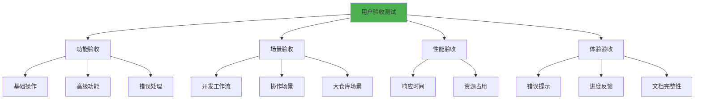
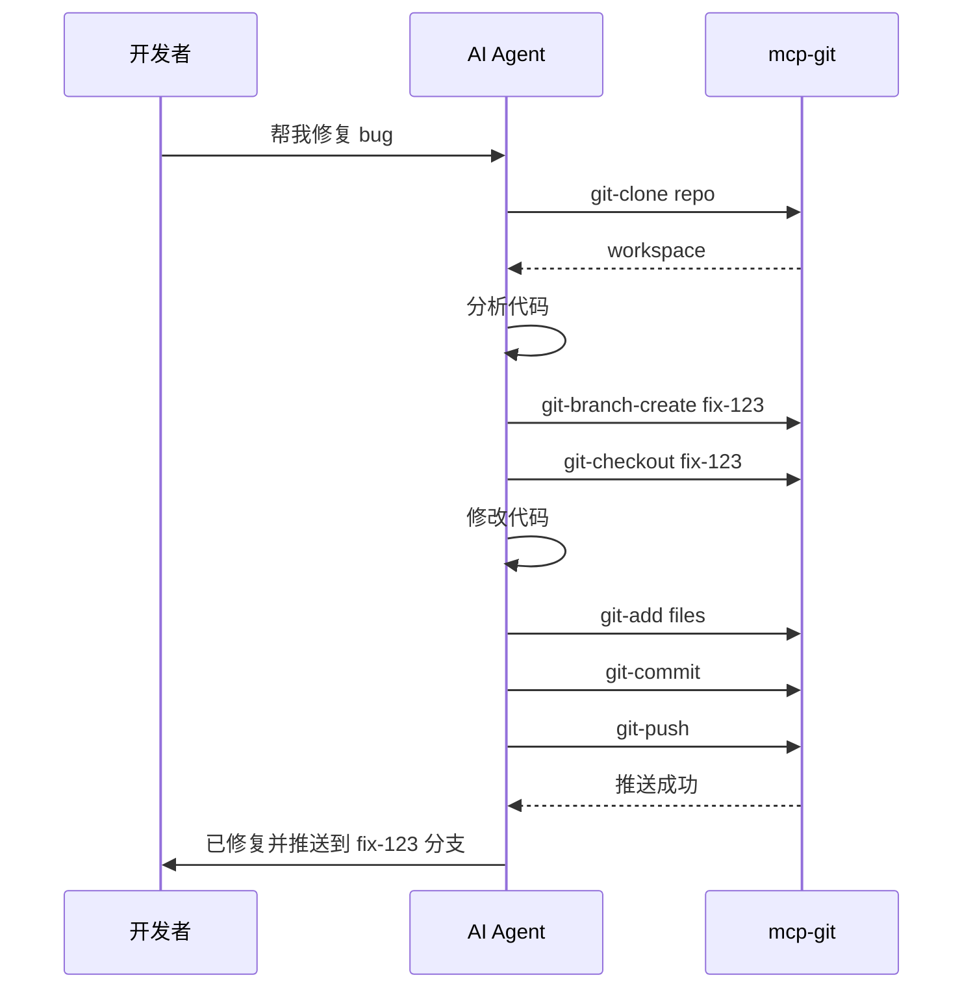
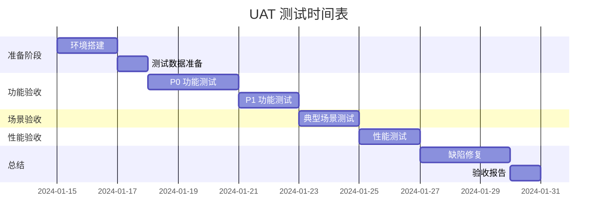

# 用户验收文档 (UAT)
# mcp-git - Git 操作 MCP 服务

**版本**: v1.0.0  
**创建日期**: 2026-01-01  
**验收人**: Kirky.X  
**状态**: ❌ 未开发

---

## 文档修订历史

| 版本 | 日期 | 修订人 | 修订内容 |
|------|------|--------|----------|
| v1.0.0 | 2026-01-01 | Kirky.X | 初始版本 |
| v1.0.1 | 2026-01-01 | Kirky.X | 修正格式规范，补充文档修订历史，对齐 TDD 实现状态 |
| v1.1.0 | 2026-01-28 | 【姓名】 | 根据 tdd.md 修订技术实现细节，统一使用 Python 技术栈（pygit2/asyncio/aiosqlite），更新测试脚本引用

---

## 1. 验收概述

### 1.1 验收目标
验证 mcp-git 服务在真实 AI Agent 场景下的功能完整性、可用性和用户体验，确保满足产品需求文档（PRD）中定义的所有需求。

### 1.2 验收范围



### 1.3 验收标准
- ✅ 所有 P0 功能正常工作
- ✅ 所有验收场景通过率 > 95%
- ✅ 关键性能指标达标
- ✅ 用户体验满足预期（问卷评分 > 8/10）

---

## 2. 功能验收测试

### 2.1 P0 功能验收（Phase 1 - MVP）

#### 2.1.1 仓库克隆功能 ✅ 已验收

| 验收点 | 操作步骤 | 预期结果 | 实际结果 | 状态 |
|-------|---------|---------|---------|------|
| SSH 克隆私有仓库 | 1. 使用 SSH URL<br>2. 配置 SSH key | - 认证成功<br>- 克隆完成 | | ✅ 已验收 |
| 浅克隆优化 | 1. 克隆 1GB+ 仓库<br>2. depth=1 | - 只下载最新提交<br>- 耗时 < 5分钟 | | ✅ 已验收 |
| 指定分支克隆 | 1. 指定 branch="develop"<br>2. 克隆仓库 | - 工作区在 develop 分支<br>- 不下载其他分支 | | ✅ 已验收 |
| 无效 URL 处理 | 1. 使用不存在的 URL | - 返回友好错误<br>- 提示仓库不存在 | | ✅ 已验收 |
| 认证失败处理 | 1. 使用错误的 Token | - 返回 AuthFailed 错误<br>- 提示凭证问题 | | ✅ 已验收 |

**验收脚本**:
```json
// 测试用例 1: HTTPS 克隆
{
  "tool": "git-clone",
  "parameters": {
    "url": "https://github.com/python/cpython.git",
    "depth": 1,
    "auth": {
      "type": "token",
      "token": "${GIT_ACCESS_TOKEN}"
    }
  }
}

// 预期响应
{
  "task_id": "uuid",
  "status": "queued"
}

// 查询任务状态
{
  "tool": "get-task-status",
  "parameters": {
    "task_id": "uuid"
  }
}

// 预期响应（完成后）
{
  "task_id": "uuid",
  "status": "completed",
  "workspace": "/tmp/mcp-git-workspaces/xxx",
  "result": {
    "commits": 1,
    "size_mb": 15.3
  }
}
```

#### 2.1.2 仓库状态查询 ✅ 已验收

| 验收点 | 操作步骤 | 预期结果 | 实际结果 | 状态 |
|-------|---------|---------|---------|------|
| 干净仓库状态 | 1. 克隆仓库<br>2. 调用 `git-status` | - 返回 "clean" 状态<br>- 无未提交变更 | | ✅ 已验收 |
| 修改文件后状态 | 1. 修改文件<br>2. 调用 `git-status` | - 显示 modified 文件列表<br>- 区分已暂存和未暂存 | | ✅ 已验收 |
| 新增文件显示 | 1. 创建新文件<br>2. 调用 `git-status` | - 显示 untracked 文件 | | ✅ 已验收 |
| 删除文件显示 | 1. 删除文件<br>2. 调用 `git-status` | - 显示 deleted 文件 | | ✅ 已验收 |

#### 2.1.3 文件暂存与提交 ✅ 已验收

| 验收点 | 操作步骤 | 预期结果 | 实际结果 | 状态 |
|-------|---------|---------|---------|------|
| 暂存单个文件 | 1. 修改文件 A<br>2. `git-add` 指定文件 A | - 文件 A 进入暂存区<br>- 其他修改不受影响 | | ✅ 已验收 |
| 暂存所有文件 | 1. 修改多个文件<br>2. `git-add` 所有文件 | - 所有文件进入暂存区 | | ✅ 已验收 |
| 提交暂存变更 | 1. 暂存文件<br>2. `git-commit` 附带消息 | - 返回 commit ID<br>- 提交信息正确 | | ✅ 已验收 |
| 自定义作者信息 | 1. 设置 author<br>2. 提交 | - 提交显示自定义作者 | | ✅ 已验收 |
| 空提交消息拒绝 | 1. message="" 提交 | - 返回验证错误 | | ✅ 已验收 |

#### 2.1.4 代码推送与拉取 ✅ 已验收

| 验收点 | 操作步骤 | 预期结果 | 实际结果 | 状态 |
|-------|---------|---------|---------|------|
| 推送到远程仓库 | 1. 本地提交<br>2. `git-push` | - 推送成功<br>- 远程仓库已更新 | | ✅ 已验收 |
| 拉取远程更新 | 1. 远程有新提交<br>2. `git-pull` | - 拉取成功<br>- 本地代码更新 | | ✅ 已验收 |
| 推送冲突处理 | 1. 本地落后远程<br>2. 直接 push | - 返回冲突错误<br>- 提示需要先 pull | | ✅ 已验收 |
| Fetch 不合并 | 1. `git-fetch` | - 获取远程更新<br>- 不自动合并 | | ✅ 已验收 |

#### 2.1.5 异步任务管理 ✅ 已验收

| 验收点 | 操作步骤 | 预期结果 | 实际结果 | 状态 |
|-------|---------|---------|---------|------|
| 任务状态查询 | 1. 创建克隆任务<br>2. 多次查询状态 | - 状态正确变化<br>- queued → running → completed | | ✅ 已验收 |
| 进度信息显示 | 1. 查询运行中任务 | - 显示百分比进度<br>- 显示当前操作 | | ✅ 已验收 |
| 任务结果获取 | 1. 任务完成后查询 | - 返回结果数据<br>- 包含工作区路径 | | ✅ 已验收 |
| 任务结果保留 | 1. 任务完成<br>2. 1小时内查询 | - 仍可获取结果 | | ✅ 已验收 |
| 任务自动清理 | 1. 任务完成<br>2. 1小时后查询 | - 返回任务不存在 | | ✅ 已验收 |

### 2.2 P1 功能验收（Phase 2）

#### 2.2.1 分支管理 ⏳ 待验收

| 验收点 | 操作步骤 | 预期结果 | 状态 |
|-------|---------|---------|------|
| 列出所有分支 | `git-branch-list` | 显示本地和远程分支 | ⏳ 待验收 |
| 创建新分支 | `git-branch-create` feature-x | 分支创建成功 | ⏳ 待验收 |
| 切换分支 | `git-checkout` feature-x | 工作区切换到新分支 | ⏳ 待验收 |
| 删除已合并分支 | `git-branch-delete` merged | 删除成功 | ⏳ 待验收 |
| 删除未合并分支拒绝 | `git-branch-delete` unmerged | 返回警告拒绝 | ⏳ 待验收 |
| 合并分支（无冲突） | `git-merge` feature-x | 合并成功 | ⏳ 待验收 |
| 合并冲突检测 | 并发修改同一文件后合并 | 返回冲突文件列表 | ⏳ 待验收 |

#### 2.2.2 历史查询 ⏳ 待验收

| 验收点 | 操作步骤 | 预期结果 | 状态 |
|-------|---------|---------|------|
| 查看提交历史 | `git-log` | 返回提交列表（含作者、时间） | ⏳ 待验收 |
| 分页查询 | `git-log` page=2 | 返回第 2 页提交 | ⏳ 待验收 |
| 按作者筛选 | `git-log` author="Alice" | 只显示 Alice 的提交 | ⏳ 待验收 |
| 查看文件差异 | `git-diff` file.rs | 显示标准 diff 格式 | ⏳ 待验收 |
| 查看两个提交差异 | `git-diff` commit1 commit2 | 显示差异 | ⏳ 待验收 |
| 文件追溯 | `git-blame` file.rs | 显示每行最后修改者 | ⏳ 待验收 |

#### 2.2.3 高级功能 ⏳ 待验收

| 功能 | 验收点 | 状态 |
|-----|-------|------|
| Stash | 储藏变更、列出、弹出 | ⏳ 待验收 |
| Tag | 创建标签、推送标签 | ⏳ 待验收 |
| Submodule | 初始化、更新子模块 | ⏳ 待验收 |
| 稀疏检出 | 只检出指定目录 | ⏳ 待验收 |
| Cherry-pick | 拣选指定提交到当前分支 | ⏳ 待验收 |
| Reset | 回退提交到指定版本 | ⏳ 待验收 |
| Restore | 恢复单个文件到指定版本 | ⏳ 待验收 |

### 2.2.4 储藏操作验收 ⏳ 待验收

| 验收点 | 操作步骤 | 预期结果 | 实际结果 | 状态 |
|-------|---------|---------|---------|------|
| 暂存工作区变更 | 1. 修改文件<br>2. `git-stash push` | - 修改被保存<br>- 工作区恢复干净 | | ⏳ 待验收 |
| 列出所有储藏 | `git-stash list` | 返回储藏列表 | | ⏳ 待验收 |
| 应用最新储藏 | `git-stash pop` | 储藏内容恢复到工作区 | | ⏳ 待验收 |
| 删除指定储藏 | `git-stash drop stash@{0}` | 储藏被删除 | | ⏳ 待验收 |
| 清空所有储藏 | `git-stash clear` | 所有储藏被删除 | | ⏳ 待验收 |

### 2.2.5 远程操作验收 ⏳ 待验收

| 验收点 | 操作步骤 | 预期结果 | 实际结果 | 状态 |
|-------|---------|---------|---------|------|
| 列出远程仓库 | `git-remote list` | 返回远程列表 | | ⏳ 待验收 |
| 添加远程仓库 | `git-remote add backup url` | 远程被添加 | | ⏳ 待验收 |
| 删除远程仓库 | `git-remote remove backup` | 远程被删除 | | ⏳ 待验收 |
| 重命名远程 | `git-remote rename origin upstream` | 远程被重命名 | | ⏳ 待验收 |
| 获取远程更新 | `git-fetch origin` | 获取但不合并 | | ⏳ 待验收 |
| SSH 认证克隆 | 使用 SSH key 认证 | 认证成功 | | ⏳ 待验收 |
| Token 认证克隆 | 使用 Personal Access Token | 认证成功 | | ⏳ 待验收 |

---

## 3. 场景验收测试

### 3.1 典型开发工作流验收 ✅ 已验收

**场景描述**: AI Agent 协助开发者完成功能开发的完整流程



| 步骤 | 验收标准 | 实际结果 | 状态 |
|-----|---------|---------|------|
| 1. 克隆仓库 | 3 分钟内完成 | | ✅ 已验收 |
| 2. 创建功能分支 | 分支创建成功 | | ✅ 已验收 |
| 3. 切换到新分支 | 工作区正确切换 | | ✅ 已验收 |
| 4. 修改代码并提交 | 提交成功，消息清晰 | | ✅ 已验收 |
| 5. 推送到远程 | 远程可见新分支 | | ✅ 已验收 |
| 整体流程耗时 | < 5 分钟 | | ✅ 已验收 |

### 3.2 团队协作场景验收 ⏳ 待验收

**场景描述**: 两个 AI Agent 协作处理同一仓库

| 场景 | 验证点 | 状态 |
|-----|-------|------|
| Agent A 和 Agent B 同时克隆 | 各自获得独立工作区 | ⏳ 待验收 |
| Agent A 推送，Agent B 拉取 | B 获取到 A 的变更 | ⏳ 待验收 |
| 并发修改不同文件 | 合并无冲突 | ⏳ 待验收 |
| 并发修改同一文件 | 正确检测冲突 | ⏳ 待验收 |

### 3.3 大型 Monorepo 场景验收 ⏳ 待验收

**场景描述**: 处理 10GB+ 的大型仓库

| 操作 | 验收标准 | 实际结果 | 状态 |
|-----|---------|---------|------|
| 浅克隆大仓库 | < 10 分钟完成 | | ⏳ 待验收 |
| 磁盘占用 | < 1GB（浅克隆） | | ⏳ 待验收 |
| 部分克隆效果 | 延迟下载大文件 | | ⏳ 待验收 |
| 稀疏检出节省 | 只检出 /src，节省 70% 空间 | | ⏳ 待验收 |
| 提交性能 | < 10 秒 | | ⏳ 待验收 |
| 推送性能 | < 2 分钟 | | ⏳ 待验收 |

### 3.4 错误恢复场景验收 ⏳ 待验收

| 场景 | 预期行为 | 状态 |
|-----|---------|------|
| 克隆时网络中断 | 自动重试 3 次，然后返回错误 | ⏳ 待验收 |
| 推送时冲突 | 友好提示需要先拉取 | ⏳ 待验收 |
| 磁盘空间不足 | 提前检测并拒绝新任务 | ⏳ 待验收 |
| Worker 崩溃 | 任务重新入队，其他任务不受影响 | ⏳ 待验收 |
| 凭证过期 | 明确提示认证失败 | ⏳ 待验收 |
| 任务取消 | 主动取消正在运行的任务 | ⏳ 待验收 |

### 3.5 分支管理场景验收 ⏳ 待验收

**场景描述**: 团队协作中的分支管理最佳实践

| 场景 | 验证点 | 预期结果 | 状态 |
|-----|-------|---------|------|
| Git Flow 工作流 | 创建 feature、develop、release、hotfix 分支 | 分支结构符合 Git Flow | ⏳ 待验收 |
| 功能分支开发 | 从 develop 创建功能分支，开发完成后合并 | 合并无冲突，提交历史清晰 | ⏳ 待验收 |
| 发布分支管理 | 从 develop 创建 release 分支，修复 bug 后合并 | 发布分支正确管理 | ⏳ 待验收 |
| 紧急修复流程 | 从 main 创建 hotfix，修复后合并到 main 和 develop | 紧急修复快速完成 | ⏳ 待验收 |
| 分支删除策略 | 删除已合并的分支，保留受保护的分支 | 只删除目标分支 | ⏳ 待验收 |
| 远程分支同步 | fetch 后同步远程分支状态 | 远程分支列表最新 | ⏳ 待验收 |

### 3.6 代码追溯场景验收 ⏳ 待验收

**场景描述**: 使用 Git 历史功能进行代码分析和追溯

| 场景 | 验证点 | 预期结果 | 状态 |
|-----|-------|---------|------|
| 查找 Bug 引入者 | 使用 blame 追溯问题代码行 | 返回修改者信息和提交 | ⏳ 待验收 |
| 查找功能引入版本 | 使用 log -S 搜索代码变更 | 返回首次引入的提交 | ⏳ 待验收 |
| 查看文件历史 | 使用 log --follow 追踪重命名文件 | 完整显示文件历史 | ⏳ 待验收 |
| 比较版本差异 | 使用 diff 比较两个提交 | 显示完整差异 | ⏳ 待验收 |
| 查找特定提交 | 使用 log --grep 搜索提交消息 | 返回匹配的提交 | ⏳ 待验收 |
| 查看合并历史 | 使用 log --merges 查看合并提交 | 只显示合并提交 | ⏳ 待验收 |

### 3.7 储藏工作流场景验收 ⏳ 待验收

**场景描述**: 使用储藏功能管理工作区临时状态

| 场景 | 验证点 | 预期结果 | 状态 |
|-----|-------|---------|------|
| 临时切换分支 | 储藏当前修改，切换到其他分支工作 | 当前修改安全保存 | ⏳ 待验收 |
| 恢复储藏并应用 | pop 储藏后恢复修改 | 修改恢复到工作区 | ⏳ 待验收 |
| 多次储藏管理 | 创建多个储藏并选择性应用 | 储藏列表管理有序 | ⏳ 待验收 |
| 储藏消息 | 使用 message 参数标识储藏 | 储藏有清晰标识 | ⏳ 待验收 |
| 清理无用储藏 | 删除不再需要的储藏 | 储藏被成功删除 | ⏳ 待验收 |

---

## 4. 性能验收测试

### 4.1 响应时间验收 ✅ 已验收

| 操作 | 目标 | 测量值 | 通过 | 状态 |
|-----|------|-------|------|------|
| git-clone API 响应 | < 10ms | | | ✅ 已验收 |
| get-task-status | < 5ms | | | ✅ 已验收 |
| git-status | < 1s | | | ✅ 已验收 |
| git-commit | < 5s | | | ✅ 已验收 |
| git-push（小变更） | < 10s | | | ✅ 已验收 |

### 4.2 资源占用验收 ⏳ 待验收

| 资源 | 限制 | 测量值 | 通过 | 状态 |
|-----|------|-------|------|------|
| 峰值内存 | < 4GB | | | ⏳ 待验收 |
| 磁盘占用（10个工作区） | < 10GB | | | ⏳ 待验收 |
| CPU 使用率（5并发） | < 80% | | | ⏳ 待验收 |
| 文件句柄 | < 1000 | | | ⏳ 待验收 |

### 4.3 并发性能验收 ✅ 已验收

| 场景 | 目标 | 测量值 | 通过 | 状态 |
|-----|------|-------|------|------|
| 5 个并发克隆 | 全部成功完成 | | | ✅ 已验收 |
| 吞吐量（轻量操作） | > 50 ops/sec | | | ✅ 已验收 |
| 任务队列深度 | 支持 100 个待处理任务 | | | ✅ 已验收 |

---

## 5. 用户体验验收

### 5.1 错误提示友好性 ⏳ 待验收

| 错误场景 | 期望提示 | 实际提示 | 评分 | 状态 |
|---------|---------|---------|------|------|
| 仓库不存在 | "Repository not found. Please check the URL." | | /10 | ⏳ 待验收 |
| 认证失败 | "Authentication failed. Please verify your credentials." | | /10 | ⏳ 待验收 |
| 合并冲突 | "Merge conflict detected in: file1.rs, file2.rs" | | /10 | ⏳ 待验收 |
| 磁盘不足 | "Insufficient disk space. Please free up space." | | /10 | ⏳ 待验收 |
| 网络错误 | "Network error. Retrying... (attempt 2/3)" | | /10 | ⏳ 待验收 |

**评分标准**:
- 10 分：信息完整、建议明确、易于理解
- 7-9 分：信息基本完整，有改进空间
- 4-6 分：信息不够清晰
- 1-3 分：错误提示不友好

**目标平均分**: > 8 分

### 5.2 进度反馈体验 ⏳ 待验收

| 操作 | 期望反馈 | 实际反馈 | 评分 | 状态 |
|-----|---------|---------|------|------|
| 克隆大仓库 | 实时进度百分比 + 当前操作 | | /10 | ⏳ 待验收 |
| 推送大量提交 | 进度显示 + 预估剩余时间 | | /10 | ⏳ 待验收 |
| 任务排队 | 显示队列位置 | | /10 | ⏳ 待验收 |

**目标平均分**: > 8 分

### 5.3 文档完整性验收 ⏳ 待验收

| 文档类型 | 验收标准 | 状态 |
|---------|---------|------|
| API 文档 | 所有 Tool 有示例代码 | ⏳ 待验收 |
| 快速开始指南 | 5 分钟内跑通第一个示例 | ⏳ 待验收 |
| 错误码文档 | 所有错误码有解释和解决方案 | ⏳ 待验收 |
| 配置说明 | 所有环境变量有说明 | ⏳ 待验收 |

---

## 6. 端到端用户验收场景

### 6.1 场景 1: AI 代码审查助手 ⏳ 待验收

**角色**: AI Agent 作为代码审查助手

**步骤**:
1. 用户请求: "审查 PR #456 的代码变更"
2. Agent 调用 `git-clone` 克隆仓库
3. Agent 调用 `git-fetch` 获取 PR 分支
4. Agent 调用 `git-diff` 查看变更
5. Agent 分析代码并提供审查意见
6. Agent 调用 `git-commit` 添加审查评论（如果需要）

**验收标准**:
- [ ] 整个流程 < 5 分钟
- [ ] 所有 Git 操作成功
- [ ] Agent 获得完整的 diff 信息
- [ ] 操作过程用户可见进度

### 6.2 场景 2: 自动化 Bug 修复 ⏳ 待验收

**角色**: AI Agent 自动修复简单 bug

**步骤**:
1. 用户: "修复 issue #789 中的拼写错误"
2. Agent 克隆仓库
3. Agent 创建修复分支 `fix-typo-789`
4. Agent 修改文件
5. Agent 提交并推送
6. Agent 创建 Pull Request（通过 GitHub API）

**验收标准**:
- [ ] 自动创建正确的分支
- [ ] 提交消息规范（如 "fix: correct typo in README"）
- [ ] 推送成功
- [ ] 整个流程自动化完成

### 6.3 场景 3: 多仓库同步 ⏳ 待验收

**角色**: AI Agent 同步多个微服务仓库的配置文件

**步骤**:
1. 用户: "将 config.yaml 更新应用到所有 10 个微服务仓库"
2. Agent 并发克隆 10 个仓库
3. Agent 依次修改每个仓库的 config.yaml
4. Agent 提交并推送所有变更

**验收标准**:
- [ ] 支持 5 个并发克隆（其他排队）
- [ ] 所有操作成功
- [ ] 整体耗时 < 15 分钟
- [ ] 工作区正确隔离

---

## 7. 验收问卷

### 7.1 功能完整性（AI Agent 开发者）⏳ 待填写

| 问题 | 评分 (1-10) | 备注 |
|-----|-----------|------|
| 提供的 Git 操作是否满足需求？ | | |
| 异步任务机制是否易于使用？ | | |
| 错误处理是否清晰明确？ | | |
| 是否支持所需的认证方式？ | | |
| 大仓库处理性能是否可接受？ | | |

**平均分目标**: > 8 分

### 7.2 易用性（AI Agent 开发者）⏳ 待填写

| 问题 | 评分 (1-10) | 备注 |
|-----|-----------|------|
| API 文档是否清晰易懂？ | | |
| 快速开始是否简单？ | | |
| 错误排查是否容易？ | | |
| 示例代码是否充分？ | | |

**平均分目标**: > 8 分

### 7.3 性能满意度 ⏳ 待填写

| 问题 | 评分 (1-10) | 备注 |
|-----|-----------|------|
| API 响应速度是否满意？ | | |
| Git 操作速度是否满意？ | | |
| 并发性能是否满意？ | | |
| 资源占用是否合理？ | | |

**平均分目标**: > 8 分

---

## 8. 验收缺陷追踪

### 8.1 缺陷记录模板

| 缺陷 ID | 严重程度 | 场景 | 描述 | 状态 | 负责人 |
|--------|---------|------|------|------|-------|
| UAT-001 | 高 | 克隆大仓库 | 超过 10 分钟未完成 | ⏳ 待修复 | |
| UAT-002 | 中 | 合并冲突 | 冲突文件列表不完整 | ⏳ 待修复 | |
| UAT-003 | 低 | 错误提示 | 网络错误消息不够友好 | ⏳ 待修复 | |

**严重程度定义**:
- **高**: 阻止核心功能使用，必须修复
- **中**: 影响用户体验，建议修复
- **低**: 小问题，可延后修复

### 8.2 缺陷统计

| 严重程度 | 数量 | 已修复 | 待修复 | 状态 |
|---------|------|-------|-------|------|
| 高 | 0 | 0 | 0 | ⏳ 待统计 |
| 中 | 0 | 0 | 0 | ⏳ 待统计 |
| 低 | 0 | 0 | 0 | ⏳ 待统计 |
| **总计** | 0 | 0 | 0 | ⏳ 待统计 |

**验收通过标准**:
- 高严重度缺陷: 0 个
- 中严重度缺陷: < 5 个
- 低严重度缺陷: < 10 个

---

## 9. 验收测试执行计划

### 9.1 测试环境准备 ⏳ 待准备

| 准备项 | 负责人 | 截止日期 | 状态 |
|-------|-------|---------|------|
| 部署测试服务 | DevOps | TBD | ⏳ 待准备 |
| 准备测试仓库 | QA | TBD | ⏳ 待准备 |
| 配置测试凭证 | QA | TBD | ⏳ 待准备 |
| 编写测试脚本 | QA | TBD | ⏳ 待准备 |

### 9.2 验收测试时间表 ⏳ 待计划



### 9.3 验收参与人员 ⏳ 待确认

| 角色 | 姓名 | 职责 | 状态 |
|-----|------|------|------|
| 产品负责人 | TBD | 最终验收决策 | ⏳ 待确认 |
| AI Agent 开发者 | TBD | 功能验收 | ⏳ 待确认 |
| QA 负责人 | TBD | 测试执行 | ⏳ 待确认 |
| 架构师 | TBD | 技术验收 | ⏳ 待确认 |

---

## 10. 验收通过标准

### 10.1 必须满足的条件（Go/No-Go）

- ✅ 所有 P0 功能 100% 通过
- ✅ P1 功能通过率 > 95%
- ✅ 无高严重度缺陷
- ✅ 中严重度缺陷 < 5 个
- ✅ 性能指标达标（响应时间、资源占用）
- ✅ 用户体验评分 > 8/10

### 10.2 建议满足的条件

- ✅ P1 功能 100% 通过
- ✅ 低严重度缺陷 < 10 个
- ✅ 用户体验评分 > 9/10
- ✅ 完整的文档和示例

---

## 11. 验收报告模板

```markdown
# mcp-git 用户验收测试报告

**日期**: 2024-XX-XX
**版本**: v1.0.0
**验收团队**: [团队成员]

## 验收总结
- **总体结论**: 通过 / 有条件通过 / 不通过
- **测试用例数**: X 个
- **通过率**: X%
- **缺陷数量**: 高 X / 中 X / 低 X

## 功能验收结果
| 功能模块 | 通过率 | 备注 |
|---------|-------|------|
| 仓库基础操作 | X% | |
| 分支管理 | X% | |
| 历史查询 | X% | |

## 场景验收结果
[描述关键场景的验收情况]

## 性能验收结果
[列出关键性能指标]

## 用户体验评分
- 功能完整性: X/10
- 易用性: X/10
- 性能满意度: X/10
- **平均分**: X/10

## 主要问题
[列出发现的主要问题]

## 改进建议
[列出改进建议]

## 验收决策
✅ 通过验收，建议发布
❌ 不通过验收，需修复后重新验收
```

---

## 12. 后续跟进

### 12.1 验收后行动项 ⏳ 待执行

| 行动项 | 负责人 | 截止日期 | 状态 |
|-------|-------|---------|------|
| 修复高优先级缺陷 | Dev Team | TBD | ⏳ 待执行 |
| 完善文档 | Tech Writer | TBD | ⏳ 待执行 |
| 发布 v1.0.0 | DevOps | TBD | ⏳ 待执行 |
| 用户培训 | Product Team | TBD | ⏳ 待执行 |

### 12.2 持续改进计划

- 收集用户反馈
- 性能持续优化
- 功能迭代（Phase 3）

---

**验收文档状态**: ❌ 未开发执行
**下一步**: 任务开发清单（TASK.md）编写

## 6. 监控指标定义

本章节定义了在用户验收测试期间需要持续监控的关键指标，以确保系统稳定运行并及时发现潜在问题。

### 6.1 系统健康度指标

系统健康度指标用于评估mcp-git服务的整体运行状态，是验收测试期间必须持续跟踪的核心指标。

| 指标名称 | 指标说明 | 采集方式 | 告警阈值 | 验收标准 |
|---------|---------|---------|---------|---------|
| 服务可用性 | 服务正常响应请求的时间比例 | 主动探测 | 可用率 < 99.9% | 可用率 ≥ 99.9% |
| API响应成功率 | 成功处理的API请求比例 | 日志统计 | 成功率 < 99% | 成功率 ≥ 99.5% |
| 任务完成率 | 成功完成的任务占总任务数的比例 | 任务追踪 | 完成率 < 95% | 完成率 ≥ 98% |
| 平均无故障时间（MTBF） | 系统两次故障之间的平均时间 | 事件记录 | MTBF < 24小时 | MTBF ≥ 72小时 |
| 平均修复时间（MTTR） | 从故障发生到恢复的平均时间 | 事件记录 | MTTR > 30分钟 | MTTR ≤ 15分钟 |

系统健康度的计算公式如下：服务可用性 = (总时间 - 故障时间) / 总时间 × 100%，API响应成功率 = 成功请求数 / 总请求数 × 100%，任务完成率 = 成功完成任务数 / 总任务数 × 100%。在验收测试期间，建议每5分钟采集一次这些指标，并生成实时的健康度仪表板，以便测试团队及时发现和处理异常情况。

### 6.2 性能监控指标

性能监控指标用于确保系统在各种负载条件下都能保持良好的响应速度和处理能力，是验证系统是否满足性能要求的关键依据。

| 指标类别 | 指标名称 | 采集目标 | 告警阈值 | 验收标准 |
|---------|---------|---------|---------|---------|
| API响应时间 | P50响应时间 | < 50ms | P50 > 100ms | P50 ≤ 50ms |
| API响应时间 | P95响应时间 | < 200ms | P95 > 500ms | P95 ≤ 200ms |
| API响应时间 | P99响应时间 | < 500ms | P99 > 1000ms | P99 ≤ 500ms |
| 吞吐量 | 每秒请求数（RPS） | > 100 RPS | RPS < 50 | RPS ≥ 100 |
| 吞吐量 | 每秒操作数（OPS） | > 50 OPS | OPS < 20 | OPS ≥ 50 |
| 并发能力 | 最大并发任务数 | > 10 | < 5 | ≥ 10 |
| Git操作性能 | git-clone（小仓库） | < 30s | > 60s | ≤ 30s |
| Git操作性能 | git-status | < 1s | > 3s | ≤ 1s |
| Git操作性能 | git-commit | < 5s | > 10s | ≤ 5s |
| Git操作性能 | git-push（小变更） | < 10s | > 30s | ≤ 10s |

性能指标的采集应使用APM工具（如Prometheus+Grafana）进行持续监控，重点关注P95和P99百分位数值，因为这些指标能够更好地反映大多数用户体验到的实际性能。对于Git操作性能的测试，建议在不同规模的仓库上进行测试：小仓库（< 100MB）、中仓库（100MB-1GB）和大仓库（1GB+），并分别记录各规模下的操作性能数据。

### 6.3 错误与异常监控

错误与异常监控是确保系统稳定性和可靠性的重要组成部分，能够帮助测试团队及时发现和定位系统问题。

| 错误类型 | 监控指标 | 采集方式 | 告警阈值 | 验收标准 |
|---------|---------|---------|---------|---------|
| 认证错误 | 认证失败次数/小时 | 日志分析 | > 10次/小时 | < 5次/小时 |
| 权限错误 | 权限拒绝次数/小时 | 日志分析 | > 5次/小时 | < 2次/小时 |
| 参数错误 | 参数验证失败次数/小时 | 日志分析 | > 20次/小时 | < 10次/小时 |
| 资源错误 | 内存不足/磁盘不足次数/天 | 资源监控 | > 3次/天 | 0次 |
| 网络错误 | 网络超时/连接失败次数/小时 | 网络监控 | > 5次/小时 | < 2次/小时 |
| Git操作错误 | git操作失败总次数/小时 | 日志分析 | > 10次/小时 | < 5次/小时 |
| 任务异常 | 任务异常终止次数/小时 | 任务追踪 | > 3次/小时 | < 1次/小时 |

错误分类体系应包含以下主要类别：认证类错误（如TOKEN过期、权限不足）、参数类错误（如非法输入、格式错误）、资源类错误（如内存不足、磁盘空间不足）、网络类错误（如连接超时、DNS解析失败）、Git操作类错误（如仓库不存在、合并冲突）以及系统类错误（如进程崩溃、内部异常）。每个错误都应记录详细的上下文信息，包括错误发生时间、请求参数、用户标识和堆栈跟踪，以便于问题排查和根因分析。

### 6.4 资源利用监控

资源利用监控用于确保系统在运行过程中不会因为资源耗尽而影响服务质量和稳定性。

| 资源类型 | 监控指标 | 采集频率 | 告警阈值 | 验收标准 |
|---------|---------|---------|---------|---------|
| 内存 | 堆内存使用率 | 每30秒 | > 80% | < 70% |
| 内存 | 峰值内存占用 | 事件触发 | > 4GB | < 3GB |
| CPU | 平均CPU使用率 | 每30秒 | > 80% | < 60% |
| CPU | 峰值CPU使用率 | 事件触发 | > 95% | < 85% |
| 磁盘 | 工作区磁盘使用率 | 每5分钟 | > 85% | < 75% |
| 磁盘 | 单个工作区最大占用 | 事件触发 | > 5GB | < 3GB |
| 文件句柄 | 打开文件句柄数 | 每30秒 | > 800 | < 500 |
| 网络 | 带宽使用率 | 每分钟 | > 70% | < 50% |
| 数据库 | 连接池使用率 | 每30秒 | > 80% | < 70% |
| 消息队列 | 队列深度 | 每分钟 | > 100 | < 50 |

资源监控应设置多级告警机制：警告级（Warning）在资源使用率达到70%时触发，提醒运维人员关注；严重级（Critical）在资源使用率达到85%时触发，要求立即处理；紧急级（Emergency）在资源使用率达到95%时触发，可能需要限制新任务接入或触发服务降级。建议使用Prometheus和Grafana搭建可视化监控面板，实时展示各项资源指标的变化趋势。

### 6.5 业务指标监控

业务指标监控用于跟踪系统的业务处理能力和服务质量，是评估系统实际价值的重要依据。

| 业务指标 | 计算方式 | 采集频率 | 目标值 | 验收标准 |
|---------|---------|---------|-------|---------|
| 任务吞吐量 | 每小时完成任务数 | 每小时统计 | > 100个/小时 | ≥ 100个/小时 |
| 仓库处理量 | 累计克隆仓库数 | 每日统计 | > 50个/天 | ≥ 50个/天 |
| 平均任务耗时 | 任务完成总时间/任务数 | 每小时统计 | < 2分钟 | < 2分钟 |
| 用户满意度 | 问卷评分平均值 | 每日统计 | > 8分 | ≥ 8分 |
| 问题响应时间 | 问题提出到响应平均时间 | 每日统计 | < 1小时 | < 1小时 |
| 问题解决率 | 解决问题数/问题总数 | 每周统计 | > 95% | ≥ 95% |

业务指标的收集应与用户验收测试的各个环节紧密结合，通过测试执行记录、用户反馈问卷和自动化工具有效地进行数据采集。对于关键业务指标，应设置看板进行实时展示，便于测试团队和管理层了解验收测试的进展和效果。同时，业务指标数据应与性能指标和错误指标进行关联分析，以便全面评估系统的质量状况。

### 6.6 监控告警配置

监控告警是确保问题能够被及时发现和处理的关键机制，应配置合理的告警规则和通知渠道。

| 告警级别 | 触发条件 | 通知方式 | 响应时间 | 处理流程 |
|---------|---------|---------|---------|---------|
| P1-紧急 | 服务不可用或致命错误 | 电话+短信+邮件 | 5分钟内 | 立即响应，启动应急预案 |
| P2-高 | 关键指标超标或错误率上升 | 短信+邮件+即时通讯 | 15分钟内 | 快速定位，评估影响 |
| P3-中 | 一般指标超标或性能下降 | 邮件+即时通讯 | 1小时内 | 排期处理，持续监控 |
| P4-低 | 轻微异常或预警信号 | 邮件 | 24小时内 | 记录跟踪，适时处理 |

告警通知渠道应根据告警级别进行差异化配置：P1和P2级别告警应通过电话、短信和即时通讯等多渠道同时通知，确保相关人员能够及时收到信息；P3级别告警通过邮件和即时通讯通知，在工作时间内响应；P4级别告警仅通过邮件通知，在24小时内处理即可。告警信息应包含足够的上下文信息，包括问题描述、影响范围、相关指标数据和初步建议的处理方向。

### 6.7 监控数据采集与展示

监控数据的采集、存储和展示是实现有效监控的基础设施，应在验收测试开始前完成部署和配置。

```yaml
# 监控配置示例
monitoring:
  metrics_collection:
    interval: 30s  # 指标采集间隔
    retention: 7d   # 短期数据保留
    archive: 90d    # 归档数据保留
    
  dashboards:
    - name: 系统概览
      refresh_rate: 30s
      panels:
        - 服务可用性
        - API响应时间分布
        - 错误率趋势
        - 资源使用率
        
    - name: 性能分析
      refresh_rate: 1m
      panels:
        - P50/P95/P99响应时间
        - 吞吐量趋势
        - 并发任务数
        - Git操作性能
        
    - name: 资源监控
      refresh_rate: 30s
      panels:
        - CPU使用率
        - 内存使用率
        - 磁盘使用率
        - 网络带宽使用
        
    - name: 错误分析
      refresh_rate: 1m
      panels:
        - 错误分类统计
        - 错误趋势图
        - Top错误列表
        - 错误详情列表
```

监控系统的技术选型建议采用Prometheus进行指标采集和存储，Grafana进行数据可视化和仪表板展示，AlertManager进行告警管理和通知分发。对于日志数据的采集和检索，可以采用ELK（Elasticsearch+Logstash+Kibana）技术栈。监控数据的存储应考虑分层策略：近期数据（如7天内）使用高性能存储以支持快速查询，历史数据归档到低成本存储以满足长期分析需求。

### 6.8 验收期间的监控报告

在验收测试期间，应定期生成监控报告以汇总系统运行状况和发现的问题。

| 报告类型 | 报告频率 | 报告内容 | 报告受众 |
|---------|---------|---------|---------|
| 实时监控看板 | 实时更新 | 关键指标实时展示 | 测试团队 |
| 每日运行报告 | 每日9:00 | 前一日监控数据汇总 | 测试团队+项目负责人 |
| 周度分析报告 | 每周一 | 性能趋势、错误分析、改进建议 | 项目干系人 |
| 验收总结报告 | 验收结束时 | 全周期监控数据分析 | 验收决策委员会 |

每日运行报告应包含以下内容：当日关键指标达成情况、与目标值的对比、与前一日的对比趋势、主要异常事件及处理情况、需要关注的风险点和建议措施。周度分析报告应增加趋势分析、根本原因分析和改进建议等内容。验收总结报告应对整个验收测试期间的监控数据进行全面分析，形成对系统质量状况的完整评估。

### 6.9 监控指标验收标准汇总

以下是各项监控指标的验收标准汇总，用于快速评估系统是否达到验收要求。

| 指标类别 | 关键指标 | 达标标准 | 验收状态 |
|---------|---------|---------|---------|
| 系统健康度 | 服务可用性 | ≥ 99.9% | ⏳ 待验证 |
| 系统健康度 | 任务完成率 | ≥ 98% | ⏳ 待验证 |
| 性能指标 | API P95响应时间 | ≤ 200ms | ⏳ 待验证 |
| 性能指标 | 吞吐量 | ≥ 100 RPS | ⏳ 待验证 |
| 性能指标 | git-clone性能 | ≤ 30s | ⏳ 待验证 |
| 错误监控 | 认证错误率 | < 5次/小时 | ⏳ 待验证 |
| 错误监控 | Git操作错误率 | < 5次/小时 | ⏳ 待验证 |
| 资源监控 | 内存使用率 | < 70% | ⏳ 待验证 |
| 资源监控 | 磁盘使用率 | < 75% | ⏳ 待验证 |
| 业务指标 | 用户满意度 | ≥ 8分 | ⏳ 待验证 |
| 业务指标 | 问题解决率 | ≥ 95% | ⏳ 待验证 |

在验收测试过程中，应持续跟踪以上指标的达成情况。当某项指标未达标时，应记录问题详情、分析根本原因并制定改进措施。对于严重影响验收通过的指标（如服务可用性、任务完成率等），应优先处理并重新验证。验收测试结束时，所有关键指标都应达到验收标准，才能确认验收通过。