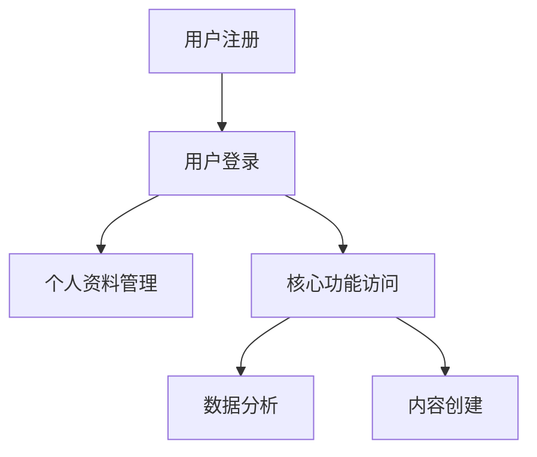
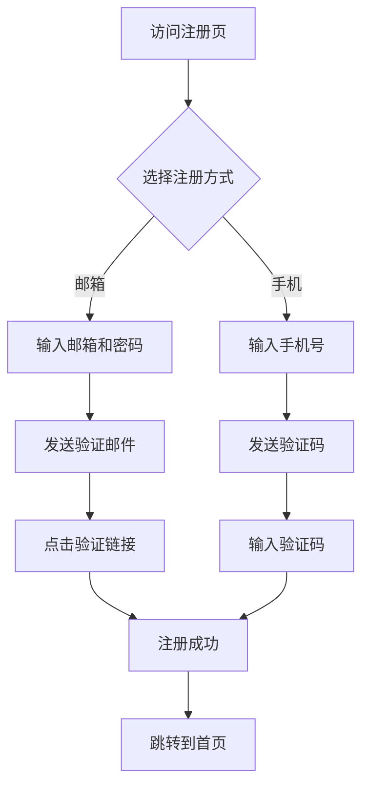
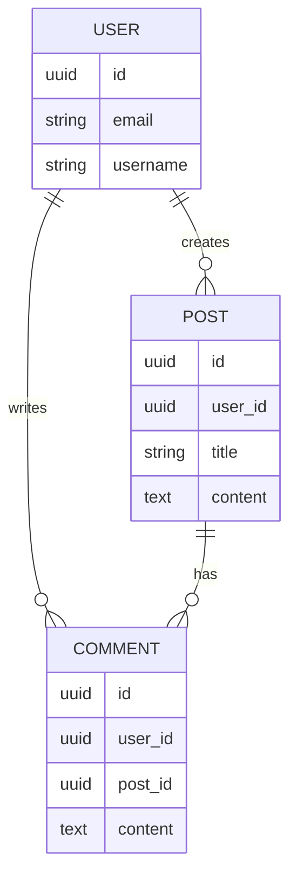

# 产品需求文档（PRD）

> **文档版本**：v1.0  
> **创建日期**：YYYY-MM-DD  
> **最后更新**：YYYY-MM-DD  
> **文档状态**：⏳ 草稿 / 📝 评审中 / ✅ 已批准  
> **负责人**：【姓名】  
> **评审人**：【姓名列表】

---

## 📋 文档修订历史

| 版本 | 日期 | 修订人 | 修订内容 |
|------|------|--------|----------|
| v1.0 | YYYY-MM-DD | 【姓名】 | 初始版本 |
| v1.1 | YYYY-MM-DD | 【姓名】 | 【修订说明】 |

---

## 1. 产品概述

### 1.1 产品背景

**市场现状**：
- 【描述当前市场情况、痛点、机会】

**目标用户**：
- **主要用户群体**：【描述核心用户画像】
- **次要用户群体**：【描述次要用户画像】

**业务价值**：
- 【说明产品对业务的价值和意义】

### 1.2 产品定位

**产品愿景**：
- 【一句话描述产品的长期愿景】

**产品定位**：
- 【清晰定义产品是什么，为谁服务，解决什么问题】

**核心竞争力**：
- 【列出产品的核心差异化优势】

### 1.3 产品目标

**业务目标**：
- 【例如：3 个月内获取 10,000 名用户】
- 【例如：提升转化率至 15%】

**产品目标**：
- 【例如：实现核心功能 MVP】
- 【例如：用户满意度达到 4.5/5.0】

---

## 2. 用户分析

### 2.1 目标用户画像

#### 用户角色 1：【角色名称】
- **人口统计特征**：
  - 年龄：【年龄范围】
  - 职业：【职业类型】
  - 收入水平：【收入范围】
  - 地域：【地理位置】

- **行为特征**：
  - 使用场景：【何时何地使用】
  - 使用频率：【日活/周活/月活】
  - 技术熟练度：【初级/中级/高级】

- **痛点与需求**：
  - 核心痛点：【最主要的问题】
  - 期望价值：【希望获得什么】
  - 使用动机：【为什么使用本产品】

#### 用户角色 2：【角色名称】
（同上结构）

### 2.2 用户旅程地图

```
【用户场景】→ 【触点 1】→ 【触点 2】→ 【触点 3】→ 【期望结果】
```

**示例**：
```
新用户注册 → 完善资料 → 首次体验核心功能 → 获得价值 → 成为活跃用户
```

---

## 3. 功能需求

### 3.1 功能优先级定义

| 优先级 | 说明 | 标识 |
|--------|------|------|
| P0 | 核心功能，MVP 必须包含 | 🔴 |
| P1 | 重要功能，首个版本应包含 | 🟡 |
| P2 | 次要功能，后续版本可加入 | 🟢 |
| P3 | 锦上添花，长期规划 | ⚪ |

### 3.2 功能清单

#### 3.2.1 用户认证与授权模块 🔴

**需求编号**：REQ-001  
**优先级**：P0  
**状态**：⏳ 待开发

**用户故事**：
```
作为【用户角色】
我想要【执行某个操作】
以便【达成某个目标】
```

**功能描述**：
- 【详细描述功能的作用和实现方式】

**功能点**：
- [ ] **用户注册**：
  - 支持邮箱注册
  - 支持手机号注册
  - 支持第三方登录（微信、Google）
  - 邮箱/手机验证
  
- [ ] **用户登录**：
  - 账号密码登录
  - 手机验证码登录
  - 第三方登录
  - 记住登录状态（7天）
  
- [ ] **密码管理**：
  - 忘记密码重置
  - 修改密码
  - 密码强度校验（至少 8 位，包含大小写字母和数字）

**验收标准**：
- ✅ 用户可在 30 秒内完成注册流程
- ✅ 登录成功率 > 99%
- ✅ 支持并发 1000+ 登录请求
- ✅ 密码采用加密存储（BCrypt）
- ✅ 登录失败 5 次后锁定账户 15 分钟

**依赖项**：
- 邮件服务（SendGrid/阿里云邮件）
- 短信服务（腾讯云/阿里云短信）
- OAuth 2.0 服务集成

**注意事项**：
- 需符合 GDPR 数据保护要求
- 敏感操作需二次验证

---

#### 3.2.2 【功能模块名称】 🟡

**需求编号**：REQ-002  
**优先级**：P1  
**状态**：⏳ 待开发

（按照上述结构填写）

---

#### 3.2.3 【功能模块名称】 🟢

**需求编号**：REQ-003  
**优先级**：P2  
**状态**：⏳ 待开发

（按照上述结构填写）

---

### 3.3 功能依赖关系图



---

## 4. 非功能需求

### 4.1 性能需求

| 指标 | 要求 | 优先级 |
|------|------|--------|
| 页面加载时间 | < 2 秒（首屏）< 1 秒（后续） | P0 |
| API 响应时间 | 95% 请求 < 200ms | P0 |
| 并发用户数 | 支持 10,000+ 同时在线 | P1 |
| 系统可用性 | 99.9% SLA（月度） | P0 |
| 数据库查询 | 95% 查询 < 100ms | P1 |

### 4.2 安全需求

- [ ] **数据安全**：
  - 敏感数据加密存储（AES-256）
  - 传输层加密（HTTPS/TLS 1.3）
  - 数据库连接加密
  
- [ ] **访问控制**：
  - 基于角色的访问控制（RBAC）
  - API 访问令牌机制（JWT）
  - 防止 SQL 注入、XSS、CSRF 攻击
  
- [ ] **审计与日志**：
  - 关键操作审计日志
  - 异常访问告警
  - 日志保留 90 天

### 4.3 可用性需求

- [ ] **多平台支持**：
  - Web（Chrome、Firefox、Safari、Edge）
  - 移动端（iOS 13+、Android 9+）
  - 响应式设计（适配 320px - 2560px）
  
- [ ] **可访问性**：
  - 符合 WCAG 2.1 AA 标准
  - 支持键盘导航
  - 支持屏幕阅读器

### 4.4 扩展性需求

- [ ] 支持水平扩展（Horizontal Scaling）
- [ ] 数据库读写分离
- [ ] 缓存层设计（Redis）
- [ ] CDN 加速静态资源

### 4.5 兼容性需求

| 平台 | 版本要求 |
|------|----------|
| Web 浏览器 | Chrome 90+, Firefox 88+, Safari 14+, Edge 90+ |
| iOS | iOS 13+ |
| Android | Android 9.0+ |
| 后端环境 | 【例如：Python 3.11+】 |

### 4.6 合规性需求

- [ ] GDPR（欧盟通用数据保护条例）
- [ ] CCPA（加州消费者隐私法案）
- [ ] 【国内：网络安全法、数据安全法、个人信息保护法】

---

## 5. 用户界面需求

### 5.1 界面原型

**主要页面列表**：
1. 登录/注册页
2. 首页/Dashboard
3. 【功能页面 1】
4. 【功能页面 2】
5. 个人设置页

**原型链接**：
- Figma：【链接】
- 或在此插入关键页面截图

### 5.2 交互流程

**核心流程 1：用户注册流程**



### 5.3 UI/UX 设计原则

- **简洁性**：减少用户认知负担，每屏最多 3 个主要操作
- **一致性**：统一的设计语言和交互模式
- **反馈性**：每个操作都有明确的视觉反馈
- **容错性**：提供撤销/重做功能，防误操作二次确认

---

## 6. 数据需求

### 6.1 核心数据实体

#### 用户实体（User）

| 字段名 | 类型 | 必填 | 说明 |
|--------|------|------|------|
| id | UUID | 是 | 用户唯一标识 |
| email | String | 是 | 邮箱（唯一） |
| phone | String | 否 | 手机号（唯一） |
| password_hash | String | 是 | 密码哈希 |
| username | String | 是 | 用户名（唯一） |
| avatar_url | String | 否 | 头像 URL |
| role | Enum | 是 | 角色（user/admin） |
| status | Enum | 是 | 状态（active/inactive/banned） |
| created_at | Datetime | 是 | 创建时间 |
| updated_at | Datetime | 是 | 更新时间 |

（继续添加其他核心实体）

### 6.2 数据关系图



### 6.3 数据量预估

| 数据类型 | 初期（3个月） | 6个月 | 1年 |
|---------|--------------|--------|------|
| 用户数 | 10,000 | 50,000 | 100,000 |
| 日活跃用户 | 2,000 | 10,000 | 20,000 |
| 每日新增数据 | 1,000 条 | 5,000 条 | 10,000 条 |
| 存储空间 | 10 GB | 50 GB | 100 GB |

---

## 7. 业务规则

### 7.1 核心业务逻辑

#### 规则 1：用户等级系统
- 新用户：0-100 积分
- 活跃用户：101-500 积分
- 高级用户：501+ 积分
- 积分获取规则：
  - 每日登录：+5 积分
  - 发布内容：+10 积分
  - 内容被点赞：+1 积分

#### 规则 2：内容审核机制
- 用户发布内容自动进入审核队列
- AI 初审：敏感词过滤、图片识别
- 人工复审：可疑内容由人工审核
- 审核时效：95% 的内容在 1 小时内完成审核

### 7.2 异常处理规则

| 异常场景 | 处理方式 |
|---------|----------|
| 用户重复注册 | 提示"该邮箱/手机号已注册"，引导登录或找回密码 |
| 支付失败 | 重试 3 次，失败则提示并保存订单供后续支付 |
| 网络超时 | 客户端重试 2 次，仍失败则提示用户检查网络 |
| 服务器错误 | 记录日志，返回友好错误提示，触发告警通知 |

---

## 8. 运营需求

### 8.1 数据统计需求

**必须追踪的关键指标**：
- DAU/MAU（日活/月活）
- 用户留存率（次日、7日、30日）
- 转化漏斗（注册 → 激活 → 留存 → 付费）
- 用户行为路径
- 功能使用频率

### 8.2 运营功能需求

- [ ] 管理后台（内容管理、用户管理、数据统计）
- [ ] 消息推送（邮件、短信、App Push）
- [ ] 活动配置（优惠券、积分活动）
- [ ] A/B 测试支持

---

## 9. 项目约束

### 9.1 时间约束

- **MVP 上线时间**：YYYY-MM-DD
- **里程碑节点**：
  - 设计评审完成：YYYY-MM-DD
  - 开发完成：YYYY-MM-DD
  - 测试完成：YYYY-MM-DD
  - 上线发布：YYYY-MM-DD

### 9.2 预算约束

- **开发成本**：【预算金额】
- **基础设施成本**：【预算金额】/月
- **第三方服务成本**：【预算金额】/月

### 9.3 技术约束

- 必须使用【指定技术栈】
- 部署环境：【云平台/自建】
- 数据库：【指定数据库】

### 9.4 法律与合规约束

- 必须符合【国家/地区】相关法律法规
- 用户协议和隐私政策必须在上线前准备完毕

---

## 10. 风险评估

| 风险项 | 严重程度 | 可能性 | 影响 | 应对策略 |
|-------|---------|--------|------|---------|
| 第三方服务不稳定 | 高 | 中 | 功能不可用 | 备用服务商方案 |
| 数据安全漏洞 | 高 | 低 | 数据泄露 | 安全审计、渗透测试 |
| 用户增长不达预期 | 中 | 高 | 业务目标失败 | 优化产品、加强推广 |
| 开发延期 | 中 | 中 | 上线推迟 | 合理排期、增加资源 |

---

## 11. 成功指标

### 11.1 产品指标（KPI）

| 指标 | 目标值 | 测量方式 | 达成时间 |
|------|--------|----------|----------|
| 注册用户数 | 10,000 | Google Analytics | 3 个月 |
| DAU | 2,000 | 后台统计 | 3 个月 |
| 用户留存率（7日） | 30% | 后台统计 | 3 个月 |
| NPS（净推荐值） | 40+ | 用户调研 | 6 个月 |
| 核心功能使用率 | 60% | 后台统计 | 3 个月 |

### 11.2 技术指标

| 指标 | 目标值 |
|------|--------|
| 系统可用性 | 99.9% |
| API 响应时间 P95 | < 200ms |
| 错误率 | < 0.1% |
| 代码测试覆盖率 | > 80% |

---

## 12. 后续迭代规划

### 版本 v1.0（MVP）
- 【核心功能清单】

### 版本 v1.1
- 【计划新增功能】
- 预计发布时间：YYYY-MM-DD

### 版本 v2.0
- 【计划新增功能】
- 预计发布时间：YYYY-MM-DD

---

## 13. 附录

### 13.1 术语表

| 术语 | 定义 |
|------|------|
| MVP | Minimum Viable Product，最小可行产品 |
| DAU | Daily Active Users，日活跃用户 |
| MAU | Monthly Active Users，月活跃用户 |

### 13.2 参考资料

- 【相关市场调研报告】
- 【竞品分析文档】
- 【用户调研结果】

### 13.3 相关文档链接

- 技术设计文档（TDD）：【链接】
- 测试文档（Test）：【链接】
- API 规范文档：【链接】

---

## 📝 文档变更审批

| 角色 | 姓名 | 审批意见 | 日期 |
|------|------|----------|------|
| 产品经理 | 【姓名】 | ✅ 批准 / ⚠️ 有条件批准 / ❌ 拒绝 | YYYY-MM-DD |
| 技术负责人 | 【姓名】 | ✅ 批准 / ⚠️ 有条件批准 / ❌ 拒绝 | YYYY-MM-DD |
| 项目经理 | 【姓名】 | ✅ 批准 / ⚠️ 有条件批准 / ❌ 拒绝 | YYYY-MM-DD |

---

**文档结束**